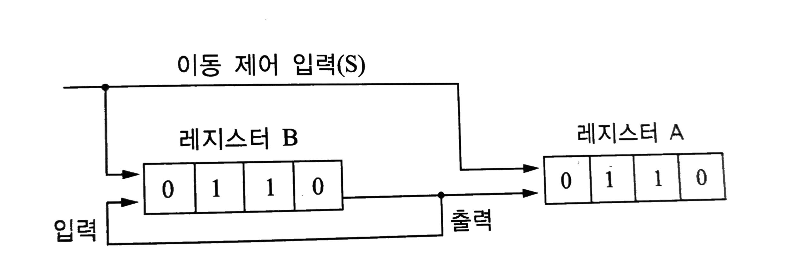
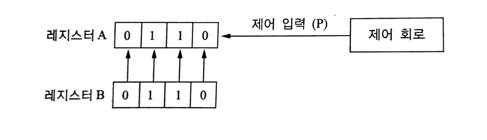
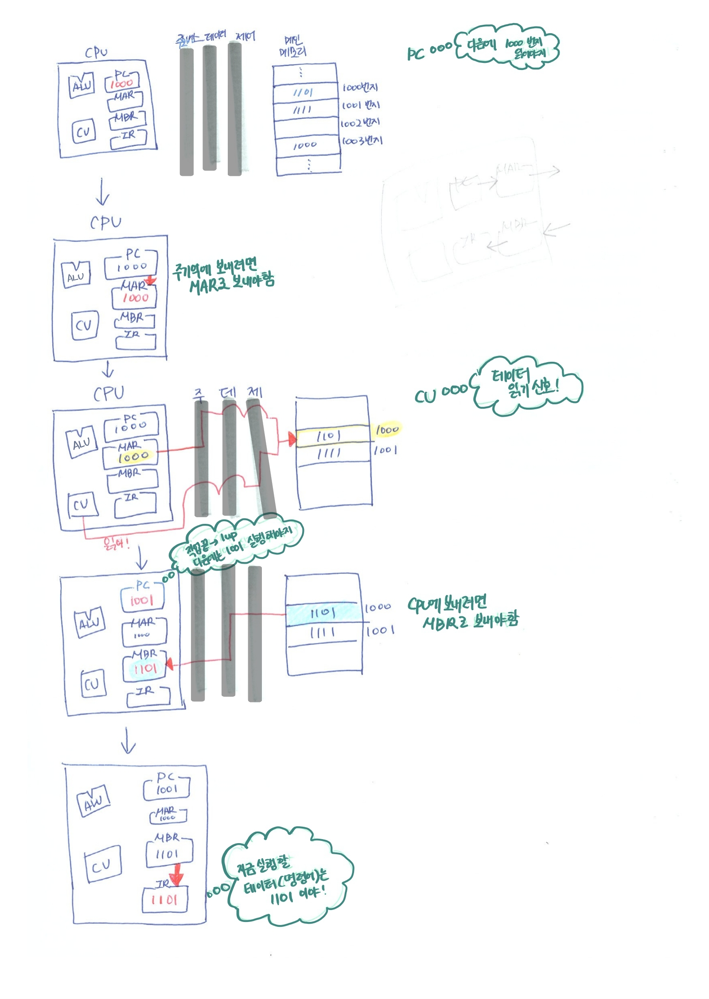

# 레지스터

# 0. 기억장치 계층구조
[컴퓨터의 구성요소](https://www.notion.so/667be8d378a34fc393340164594b4682?pvs=21) (깃허브에 올리면 링크수정)
  

# 1. 레지스터
(내용이 복잡한 것에 비해서 면접 비중이 크진않다! 개념/특징 정도만 이해하고 PC/AC/MAR/MBR/IR외 나머지는 레지스터 종류에 따른 설명이기 때문에 이런게 있다 정도로 넘어가고 필요시에 다시 찾아보는 것을 추천!)

## 개념
- CPU 내부에서 처리할 명령어, 연산 중간 결괏값 등을 일시적으로 보관하는 임시기억장치
- 적은 개수의 주소비트를 가지고 기억된 정보를 신속하게 접근 가능한 CPU 내부의 임시 기억장치
  
## 특징
- 컴퓨터 기억장치 중 속도가 가장 빠름
- (레지스터를 구성하는) 플립플롭은 저장하는 값을 임의로 설정하기 위해 별도의 입력단자를 추가할 수 있으며, 저장 값을 0으로 하는 것을 설정 해제(CLR;Clear)라고 함
- 레지스터의 크기는 각 워드를 구성하는 비트 개수 만큼의 플립플롭으로 구성되며, 여러 개의 플립플롭은 공통의 클록의 입력에 따라 동시에 여러 비트의 자료가 저장됨
(ex) 위드크기가 16bit이면 레지스터는 16개의 플립플롭으로 구성됨.
    - **플립플롭(Flip-Flop)** : 전원이 공급되고 있는 한, 상태의 변화를 위한 외부신호가 발생할 때까지 현재의 상태를 그대로 유지하는 논리회로
  
## 전송방식
### 1) 직렬 전송방식(Serial Transfer)

- 1 clk 펄스 동안 하나의 비트를 전송하고, 이러한 비트 전송 단위 전송이 모여 워드를 구성하는 방식
- 전송하는 레지스터의 내용을 보존하려면 자신의 직렬 출력을 다시 직렬로 입력하여 모든 비트가 원래 위치에 있도록 해야함.
- 병렬 전송보다 전송 속도가 느리다.

### 2) 병렬 전송방식(Parallel Transfer)

- 1clk 펄스 동안 레지스터 내의 모든 비트(즉, 워드)가 동시에 전송되는 방식.
- 직렬 전송방식보다 속도가 빠르지만 그만큼 결선의 수가 많다.
    
    
    

### 3) 버스 전송방식(Bus Transfer)

- 공통의 통신로(버스)를 이용하는 방식. 병렬 전송방식보다 결선의 수가 적다.

  

## 레지스터 종류

목적에 따라 레지스터를 구분한다. / 전조기 기준 용도에 따른 설명

### 1) 제어 레지스터(Control Register)
프로그램 실행 순서를 결정하는 레지스터

1. PC; Program Counter; 프로그램 계수기 : 다음에 실행할 명령어의 주소를 저장하는 레지스터
2. IR; 명령어 레지스터; Instruction Register : 현재 실행중인 명령의 내용을 기억하는 레지스터. 인출된 명령어가 적재되어 명령코드(OPcode)와 피연산자(Operand)로 분석됨.
3. AC; Accumulator; 누산기 : 연산 결과를 일시적으로 저장하는 레지스터, 연산의 중심
4. MAR; 기억장치 주소 레지스터; Memory Address Register : 기억장치를 출입하는 데이터의 주소를 기억하는 레지스터. PC의 내용이 MAR로 전달됨.
5. MBR; 기억장치 버퍼 레지스터; Memory Buffer Register : I/O장치와 프로그램이 데이터를 주고받을 때 중간에서 데이터를 임시로 저장하는 레지스터
    **cf) CPU 동작원리(PC, MAR, MBR, IR)**

    💡 MAR, MBR을 따로 두는 이유 :  
    CPU에서는 한 번에 하나의 명령어씩 가져와서 수행하는데 메인 메모리에서 바로 가져와서 사용할 수 없다. (연결되어 있지 않으므로) 
    또한 CPU에는 연산의 결과를 저장하거나 데이터를 불러올 때 저장할 범용레지스터가 많이 있는데, 
    마찬가지로 메인 메모리에서 바로 사용할 수 없다. 
    CPU와 레지스터들을 모두 연결하려면 경우가 너무 많기 때문에 설계하기 복잡해지고 어려워진다.
    **따라서 CPU에는 메모리에 대한 최소한의 연결 정보만을 저장하기 위해 MAR, MBR을 사용한다.** 

    

6. SR; 상태 레지스터; Status Register = PSWR; Program Status Word register = Flag Register 
    - 프로그램 상태워드(PSW)를 저장하고 있는 레지스터
    - 시스템 상태를 기록하기 위한 것으로 프로그램의 제어와 밀접한 관계가 있다.
    - 명령어를 수행할 때마다 CPU의 산술 논리연산의 결과와 인터럽트 등을 각 1bit로 나타내고 분기를 결정하는 역할을 한다.
    - 연산 결과를 나타나는 조건 플래그(Condition flag)와 그 외 CPU를 제어하기 위한 제어 플래그로 나눠진다.
    - PSW : CPU의 시스템 내부의 순간 상태를 기록하고 있는 정보
    1. S; Sign Flag; 부호 플래그 : 가장 최근 수행 산술연산 결과의 부호. 1-음수 / 0-양수
    2. Z; Zero Flag; 제로 플래그 : 가장 최근 수행 산술 결과가 0이면 1로 세트. 레지스터 값을 비교할 때 많이 사용됨.(두 레지스터 값을 뺀 후 0여부 확인)
    3. C; Carry Flag; 자리올림수 플래그 : 최상단 비트에서 캐리 발생시 1로 세트
    4. N; Negative Flag; 음수 플래그 : 음수-1/양수-0
    5. P; Parity Flag; 패리티 플래그 : 가장 최근 연산 결과에 대한 짝수(또는 홀수)패러티를 정하는 비트
    6. V;oVerflow Flag; 오버플로우 플래그 : 오버플로우 발생하면 1로 세트
    7. IE; Interrupt Enable Flag; 외부 인터럽트 발생 허용을 제어, 1로 세트되면 외부 인터럽트 요청을 인식할 수 있음.
    8. SV; Supervisor Mode Flag : CPU가 운영체제모드와 사용자 모드 중 어느 모드에서 프로그램을 실행 중인지.
  
### 2) 명령어 실행용 레지스터

실행단계에서 명령어의 동작을 실행하기 위해서 사용.

1. Base Register : (상대주소 지정방식에서)베이스레지스터 값과 명령을 더해 주소를 지정하는 시작번지를 기억하는 레지스터 ➡️주소지정방식 추가 설명
2. Index Register : 주소의 변경, 서브루틴 연결 및 프로그램에서의 연산 횟수를 세는 레지스터. 메모리 주소를 지정하는데 사용되며, 지정된 메모리 주소로부터 유효주소를 계산하기 위한 정보를 기억.
3. Data Register : 연산에 사용될 데이터를 기억
4. Shift Register : 저장된 값을 왼쪽(또는 오른쪽)으로 1bit씩 자리를 이동시키는 레지스터
    1. 논리 시프트(Logical Shift) : 데이터 직렬 전송에 사용, 빈공간 0삽입
    2. Rotate : 밀려나가는 비트 값이 반대편 값으로 입력. 문자위치 변환,검색, 위치 교환 등에 사용
    3. 산술 시프트(Arthmetic Shift) : 부호고려, 2^n 곱하거나 나눈값. 보수법에 따라 패딩 규칙 달리함.
5. Major State Register : CPU의 메이저 상태(Fetch, Indirect, Execute, Interrupt )를 저장
6. General Purpose Register; 범용 레지스터 : 레지스터 계산, 메모리 주소 지정, 임시저장 공간 등 다양한 역할을 수행
7. Segment Register : 세그먼트 영역의 메모리 주소를 지정하는 레지스터. 일반 응용 프로그램이 직접 접근 불가능.
8. SP; Stack Pointer : 기억장치 주소지정에 사용되는 레지스터로 반복 루프에서 1씩 증가/감소하여 주소 변경을 자동으로 계산.

## cf)운영체제 개발 관점에서 중요한 범용/세그먼트/컨트롤 레지스터 자세하게 살펴보기

[https://plummmm.tistory.com/113](https://plummmm.tistory.com/113)

## cf) 코드 실행시 Register, PCB, 메모리 구조

- [https://eunjinii.tistory.com/40](https://eunjinii.tistory.com/40)

# 2. 캐시

➡️[캐시_지역성.md](https://github.com/psyStudy/CS_study/blob/main/OS/%EC%BA%90%EC%8B%9C_%EC%A7%80%EC%97%AD%EC%84%B1.md)

---

## 면접질문

- 레지스터 자체만 가지고 질문하는 경우는 거의 없는 것 같다!
- 메모리 계층에 대해 설명해보시오.
    
    메모리 계층은 레지스터, 캐시, 주기억장치, 보조기억장치로 구성되어 있습니다. 레지스터는 CPU안에 있는 작은 메모리로 휘발성이고 속도가 가장 빠르고 기억용량이 가장 낮습니다. 캐시는 L1,L2캐시를 지칭하며 휘발성이고, 속도는 빠르고 기억용량이 낮습니다. (참고로 L3캐시도 있음) 주기억장치는 주로 RAM을 가리키고 휘발성이며, 속도와 용량이 보통입니다. 보조기억장치는 HDD,SSD를 일컬으고, 비휘발성이며 속도는 느리지만 기억용량이 높습니다.
    

## 출처

- [https://eunjinii.tistory.com/40](https://eunjinii.tistory.com/40)
- [책]2023 수제비 전자계산기조직응용기사 실기
- [https://velog.io/@zooneon/CS-시스템의-요소-및-명령-수행](https://velog.io/@zooneon/CS-%EC%8B%9C%EC%8A%A4%ED%85%9C%EC%9D%98-%EC%9A%94%EC%86%8C-%EB%B0%8F-%EB%AA%85%EB%A0%B9-%EC%88%98%ED%96%89)
