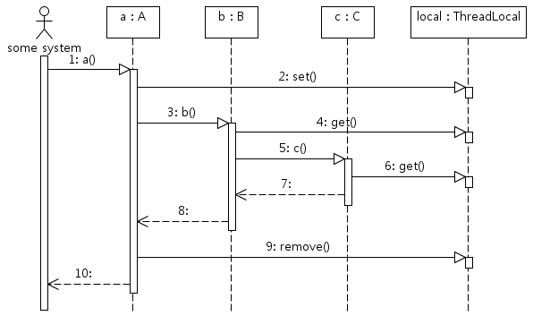

# [JAVA]ThreadLocal

자바의 클래스 중 하나로(JDK1.2부터 제), 오직 하나의 스레드에 의해서 읽고 쓰여질 수 있는 변수.

두 스레드가 같은 코드를 실행하고 이 코드가 하나의 ThreadLocal 변수를 참조하더라도 서로의 ThreadLocal변수를 볼 수 없다.

멀티 스레드 환경에서 각 스레드마다 독립적인 변수를 가지고 접근할 수 있게 된다.

> **ThreadLocal은 변수를 공유하는 방법 중 하나이다.**
ThreadLocal은 Thread안에서 파라미터 또는 리턴 값으로 정보를 제공하는 것이 아닌 다른 방법으로 thread안에서의 값을 공유하는 방법을 제공한다. > Stack영역에 변수를 선언하는 것의 단점을 해소!
> 
> - 변수 공유 방식 이해 (메모리 관점 / JAVA class, stack, heap 이해)
>     
>     ```java
>     public class UserService {
>     
>       private final UserRepository userRepository;
>     
>       public UserServiceV1(UserRepository userRepositoryV1) {
>           this.userRepository = userRepository;
>       }
>     
>       @Transactional
>       public void signUp(SignUpRequest request) {
>         userRepository.save(request.toUser());
>     }
>     ```
>     
>     위 코드의 UserRepository변수는 Heap영역에 만들어진 객체를 가리키므로 다른 곳에서도 해당 객체를 바로 접근할 수 있다. 
>     
>     만약 UserRepository가 설정 정보를 가지고 있고 이를 변경하면 사용하고 있는 모든 곳에 영향을 받는다.
>     
>     ```java
>     public SignInResponse signIn(SignInRequest request) {
>     
>         String email = request.getEmail();
>         String password = request.getPassword();
>     
>         return new SignInResponse(email, pasword);
>     }
>     ```
>     
>     반면 위 코드처럼 한 메서드안에 변수를 사용하면 Stack메모리에 올라갈 것이며 이 변수의 값은 thread에 안전한 변수로 사용된다. (하나의 스레드에 한정적으로 사용할 수 있기 때문)
>     
>     SignInRequest 파라미터를 받아 String 변수인 email, password에 할당한 후 SignInResponse객체를 생성하여 리턴한다. 이 경우 email, password 객체에 대해서는 외부에서 접근을 할 수 없기 때문에 외부 thread에 안전한 변수로 사용할 수 있다.
>     
>     하지만 변수 공유를 위해 파라미터로 받아서 사용해야하며 자신의 변수를 다른 곳에 사용하기 위해서는 리턴 값으로 제공해야한다.
>     

ThreadLocal의 내부는 thread정보를 key로 하여 값을 저장해두는 Map구조를 가지고 있다. 

# 사용법

1. ThreadLocal 객체를 생성한다.
2. ThreadLocal.set()로 현재 스레드의 로컬 변수에 값을 저장한다.
3. ThreadLocal.get()로 현재 스레드의 로컬 변수값을 읽어온다.
4. ThreadLocal.remove()로 현재 스레드 로컬 변수를 삭제한다.

## 예시

```java
public class Context {
    public static ThreadLocal<Date> local = new ThreadLocal<Date>();
}
```

```java
class A {
    public void a() {
        Context.local.set(new Date());
       
        B b = new B();
        b.b();

        Context.local.remove();
    }
}

class B {
    public void b() {
        Date date = Context.local.get();

        C c = new C();
        c.c();
    }
}

class C {
    public void c() {
        Date date = Context.local.get();
    }
}
```

A.a() 메서드를 호출하면 다음 그림과 같은 순서로 메서드가 실행된다.



- 2 - A.a() 메서드에서 현재 쓰레드의 로컬 변수에 Date 객체를 저장한다.
- 4 - B.b() 메서드에서 현재 쓰레드의 로컬 변수에 저장된 Date 객체를 읽어와 사용한다.
- 6 - C.c() 메서드에서 현재 쓰레드의 로컬 변수에 저장된 Date 객체를 읽어와 사용한다.
- 9 - A.a() 메서드에서 현재 쓰레드의 로컬 변수를 삭제한다.

위 코드에서 중요한 건 A.a()에서 생성한 Date 객체를 B.b() 메서드나 C.c() 메서드에 파라미터로 전달하지 않는다는 것이다. 즉, 파라미터로 객체를 전달하지 않아도 한 쓰레드로 실행되는 코드가 동일한 객체를 참조할 수 있게 된다.

## 활용

ThreadLocal은 한 스레드에서 실행되는 코드가 동일한 객체를 사용할 수 있도록 하므로 스레드와 관련된 코드에서 파라미터를 사용하지 않고 객체를 가져다 쓸때 사용한다. 한 스레드를 기준으로 동작해야 하는 기능을 구현할 때 ThreadLocal을 유용하게 사용한다.

- • 사용자 인증 정보 Spring Security 에서 사용자마다 다른 인정 정보를 사용할때 & Session정보
- 트랜잭션 컨텍스트 전파 - 트랜잭션 매니저는 트랜잭션 컨텍스트를 전파하는 데 ThreadLocal을 사용
- 스레드에 안전해야 하는 데이터 보관

## 주의사항

스레드 로컬은 메무리 누수의 주범이 됨으로 주의해서 사용해야함.

Thread pool 환경에서 ThreadLocal을 사용하는 경우 ThreadLocal변수에 보관된 데이터의 사용이 끝나면 반드시 해당 데이터를 삭제해 주어야 한다. 그렇지 않으면 재사용되는 스레드가 올바르지 않은 데이터를 참조할 수 있다.

---

# 면접질문
- JAVA ThreadLocal이 무엇입니까?
- ThreadLocal의 내부구조는 어떻습니까?
- ThreadLocal의 내부는 thread 정보를 key로 하여 값을 저장해두는 Map 구조를 가지고 있습니다. 기본적인 사용에는 get, set 메서드를 이용합니다.
- ThreadLocal을 사용할 때 주의해야할 점이 있습니까?

# 출처

- [https://javacan.tistory.com/entry/ThreadLocalUsage](https://javacan.tistory.com/entry/ThreadLocalUsage)
- [https://yeonbot.github.io/java/ThreadL](https://yeonbot.github.io/java/ThreadL)
- [https://sabarada.tistory.com/163](https://sabarada.tistory.com/163)
- [https://www.baeldung.com/java-threadlocal](https://www.baeldung.com/java-threadlocal)