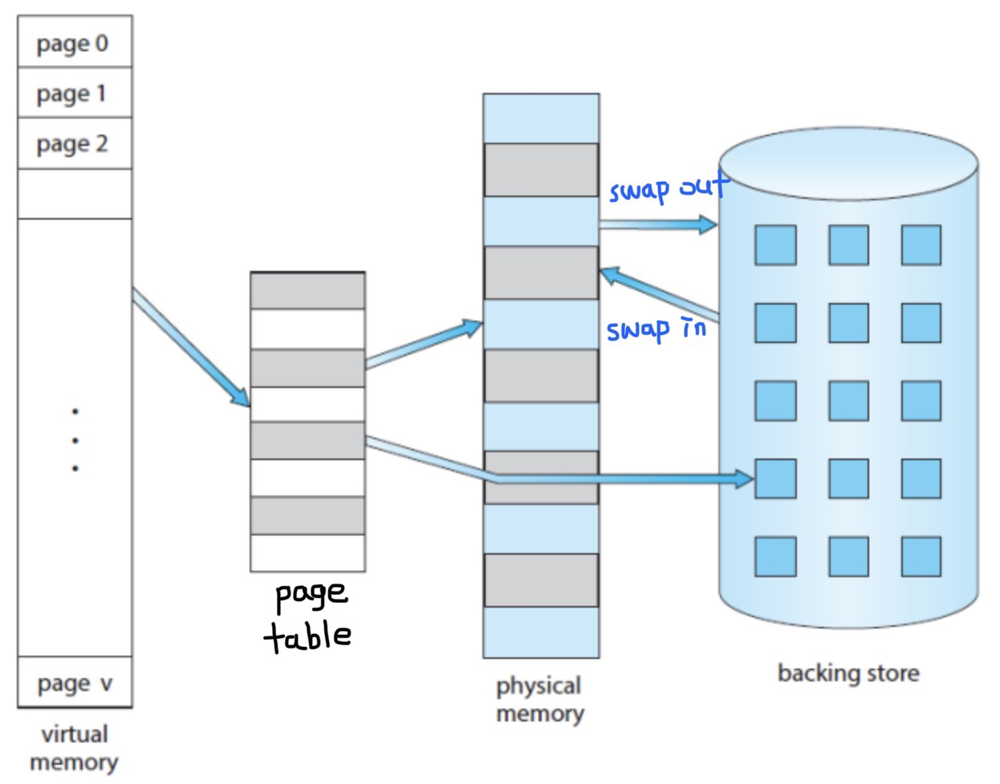
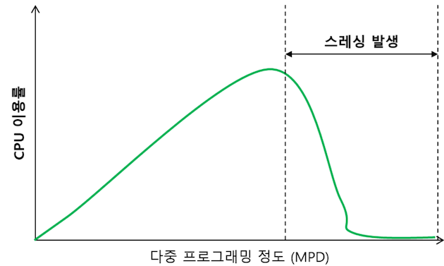
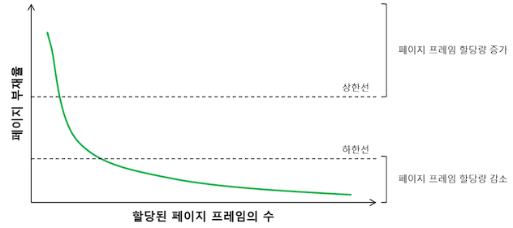

# 가상 메모리
## 개념

메인 메모리는 CPU가 직접 접근할 수 있는 기억장치로, 프로세스가 실행되려면 프로그램 코드를 메인 메모리에 적재해두어야 함 
→ 만약 프로그램 용량이 메인 메모리보다 크다면, 초창기 컴퓨터에서는 "메모리 부족" 오류에 의해 해당 애플리케이션을 실행할 수 없었음

이 문제를 해결하기 위해, 가상 메모리가 등장함

애플리케이션이 실행될 때, **실행에 필요한 일부분만 메인 메모리에 올라가며,** 애플리케이션의 나머지는 보조 기억장치에 남게 됨   

**_결국 빠르고 작은 기억장치(RAM)을 크고 느린 기억장치(디스크)와 병합하여, 하나의 크고 빠른 기억장치(가상 메모리)처럼 동작하게 하는 것 → 각 프로그램에는 실제 메모리 주소가 아닌 가상 메모리 주소를 제공함_** 


<br></br>
### 프레임 & 페이지
메모리를 일정한 크기의 공간으로 나누어 관리하는 단위   
**프레임**은 메인 메모리를 일정한 크기로 나눈 블록이고, **페이지**는 가상 메모리를 일정한 크기로 나눈 블록임
<br></br>
### 장점
- 실제 메모리 크기에 제약받지 않고 프로그램을 실행할 수 있음
- 더 많은 프로그램을 동시에(순차적으로) 실행할 수 있음 → 적절한 응답 시간 보장, CPU 이용률, 처리율 상승
- 프로그램의 일부분만 메모리에 올라가기 때문에, I/O 횟수가 줄어 프로그램이 더 빨리 실행됨

<br></br>

## 구현


- 가상 메모리의 크기는 이론적으로는 무한대이지만 실제로는 메인 메모리의 크기와 CPU비트 수로 결정됨 (32비트 CPU의 경우에는 표현할 수 있는 주소 크기가 2^32이므로 총 4GB의 가상 메모리크기를 가짐)
- 가상 메모리 시스템에서는 **운영체제 영역을 제외한 나머지 영역을 일정한 크기로 나누어서 프로세스에게 할당**
→ 가변 분할 방식과(세그멘테이션) 고정 분할 방식(페이징)으로 나뉨
→ 세그멘테이션은 외부 단편화문제. 페이징은 내부 단편화문제와 같은 단점이 존재함
```java
page table(매핑 테이블) - 가상 주소와 실제 주소가 매핑되어 있는 테이블 (주로 메모리에 있지만, 운영체제마다 다름)
MMU(메모리 관리 장치, Memory Management Unit) - CPU가 메모리에 접근하는 것을 관리하는 컴퓨터 하드웨어 부품으로, 가상 메모리 주소를 실제 메모리 주소로 변환함
    즉, 가상주소가 물리주소로 변환되어야 할 때, TLB라는 캐시에서 우선 검색되고, TLB에 없을 경우 페이지 테이블에서 매핑이 존재하는지 찾음
    페이지 테이블에도 없으면 디스크에서 찾음 
```

<br></br>

### Swapping

CPU에서 시행되지 않는 프로세스, 즉 ready상태이거나 waiting상태에 있는 프로세스들 중 일부를 메모리 안에 보관하지 않고 하드디스크 같은 저장장치에 보관하는 것
- 하지만 이러한 표준 스와핑은 프로세스 전체를 이동시키는 것이 힘들기 때문에 요즘엔 잘 사용하지 않고, 페이지 단위로 스와핑 함


<br></br>

## 요구 페이징 **(Demand Paging)**
CPU가 해당 페이지를 요구할 때까지 그 페이지를 메모리에 올리지 않는 방식 (즉, 한번도 접근되지 않는 페이지는 메인 메모리에 전혀 적재되지 않음)
- **페이지 부재(page fault)가 발생하면** 운영체제가 해당 페이지를 메인 메모리에 적재함
- 참조 지역성 때문에 요구 페이징은 만족할 만한 성능을 보임 (프로세스는 메모리 내 일부분만 집중적으로 참조한다는 특성)


- page table엔 유효-무효비트(valid-invalid bit)를 통해 접근 가능 여부를 판단 가능함
    - v(valid) : legal하면서 메인 메모리에 있음
    - i(invalid): not valid 이거나 secondary storage(보조 기억장치)에 있음

<br></br>

## 페이지 폴트 (Page Fault)
페이지 폴트는 인터럽트의 한 종류이며, **어떤 페이지가 메인 메모리에 없을 때 발생하는 인터럽트**로 페이지 폴트가 발생하면 운영체제에서 해당 페이지를 메인 메모리에 올림


> **트랩**     
> 어떤 프로세스가 특정 시스템 기능을 사용하려고 할 때, 그 기능을 운영체제에게 요청하는 방법
> 트랩과 인터럽트의 개념은 유사하지만, 인터럽트는 하드웨어적인 용어이고 트랩은 소프트웨어적인 용어임 

- Page 접근 시 valid-invalid부터 확인함
- valid시 페이지에 접근함, invalid시 page fault가 발생
    - 만약 무효한 페이지에 대한 참조라면, 프로세스가 중단됨
- page fault 발생 시 페이지를 실제 메모리에 적재하는 작업을 시행함
    - 물리 메모리에서 빈 공간(가용 프레임)을 찾음
    - 운영체제가 backing store에 있는 페이지를 읽어서 가용 프레임에 페이지를 할당함
    - 할당된 페이지가 이제는 메모리에 있다는 것을 알리기 위해 페이지 페이블을 갱신함 (프레임번호 할당 및 i -> v)
    - 트랩에 의해 중단되었던 명령어를 다시 수행함

<br></br>

## 스레싱 (thrashing)
    

**페이지 폴트가 많이 발생하여, CPU 이용률이 급격히 떨어지는 현상**
-> CPU 이용률이 낮다는 것은, 메모리에 올라와 있는 프로세스의 수가 너무 적어 프로세스가 모두 I/O 작업을 함으로써 준비 큐가 비는 현상  
-> CPU 이용률이 낮으면 운영체제는 메모리에 올라가는 프로세스의 수(MPD, 다중 프로그래밍의 정도)를 늘리게 됨 
<br></br>
### 스레싱 발생 원인
1. 운영체제는 CPU 이용률이 낮으면 MPD를 높임
2. 과도하게 MPD가 높아지면 각 프로세스에게 할당되는 메모리의 양이 감소하게 됨 (많은 프로세스에게 메모리를 할당해줘야 하므로)
3. 각 프로세스는 수행에 필요한 최소한의 메모리도 할당받지 못하게 되며, 페이지 폴트가 빈번하게 발생하게 됨
4. 페이지 폴트가 발생하면 스왑 영역에서 해당 페이지를 메모리로 가져오기 위해 디스크 I/O 작업이 발생하고, 문맥교환을 통해 다른 프로세스에게 CPU가 이양됨
5. CPU를 받은 다른 프로세스들도 페이지 폴트가 발생하며, 시스템은 페이지 폴트를 처리하느라 분주해지고 CPU 이용률은 급격히 감소함
6. 이러한 상황에서 운영체제는 메모리에 올라와 있는 프로세스의 수가 적어 이러한 현상이 발생했다고 판단하고, MPD를 높여 또 다른 프로세스를 메모리에 추가함
7. 악순환!!!!!
   
<br></br>

### 해결방법
MPD를 적절히 조절하여 CPU 이용률을 높여 스레싱이 발생하는 것을 방지해야 함  

**1. 워킹셋 알고리즘**      
프로세스는 일정 시간 동안 집중적으로 특정 주소 영역을 참조하는 경향이 있는데, 이를 **지역성 집합**이라고 함       
워킹셋 알고리즘은 지역성 집합이 메모리에 동시에 올라갈 수 있도록 보장하는 메모리 관리 알고리즘       
-> 프로세스의 워킹셋(한꺼번에 메모리에 올라가야 하는 페이지들의 집합)을 구성하는 페이지들이 한꺼번에 올라갈 수 있을 메모리 공간이 있을 때만 동작함      
   공간이 없으면 기존 메모리에 존재하는 안쓰는 페이지를 디스크로 스왑 아웃 시켜 공간을 확보함)      
<br></br>
**2. 페이지 부재 빈도 알고리즘**     
각 프로세스의 페이지 폴트율을 주기적으로 조사하고 이 값에 근거해서 각 프로세스에 할당할 메모리 양을 동적으로 조절하는 알고리즘      
시스템이 미리 정해 놓은 상한값을 넘어가거나 하한값 이하로 페이지 폴트율이 떨어지게 되면, 운영체제가 메모리에 올라가 있는 프로세스의 수를 조절하게 됨    



<br></br>
<br></br>

### 출처
[https://velog.io/@kyungwoon/TIL-항해99-가상메모리가-뭐죠](https://velog.io/@kyungwoon/TIL-%ED%95%AD%ED%95%B499-%EA%B0%80%EC%83%81%EB%A9%94%EB%AA%A8%EB%A6%AC%EA%B0%80-%EB%AD%90%EC%A3%A0)   
[https://ko.wikipedia.org/wiki/가상_메모리](https://ko.wikipedia.org/wiki/%EA%B0%80%EC%83%81_%EB%A9%94%EB%AA%A8%EB%A6%AC)   
[https://marmelo12.tistory.com/371](https://marmelo12.tistory.com/371)   
[https://luv-n-interest.tistory.com/478](https://luv-n-interest.tistory.com/478)     
https://about-myeong.tistory.com/35    
https://ko.wikipedia.org/wiki/%ED%8A%B8%EB%9E%A9_(%EC%BB%B4%ED%93%A8%ED%8C%85)    
https://zangzangs.tistory.com/144
