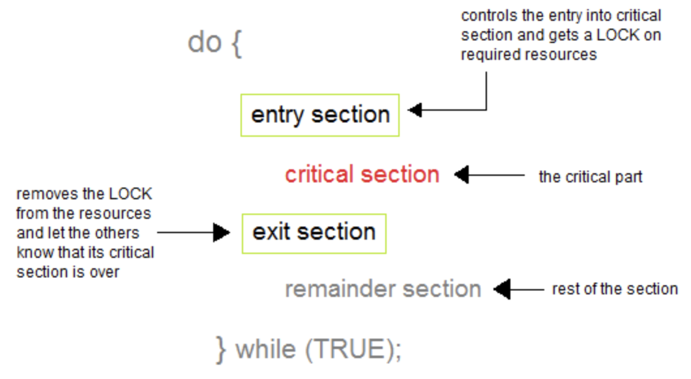
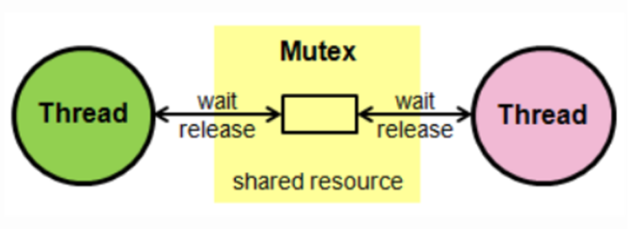
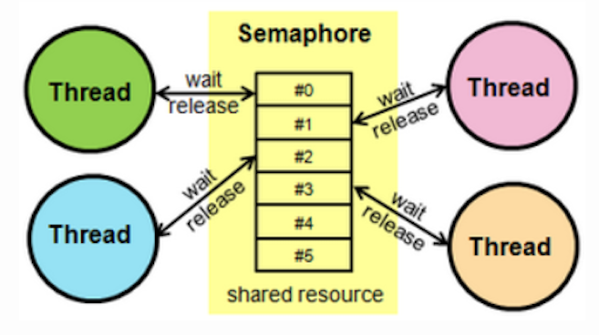
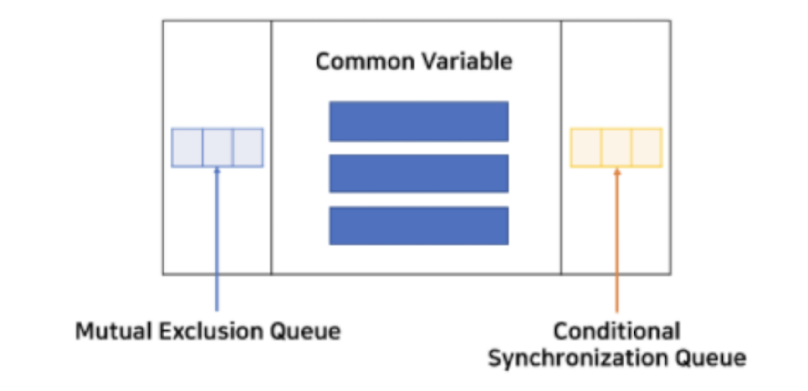
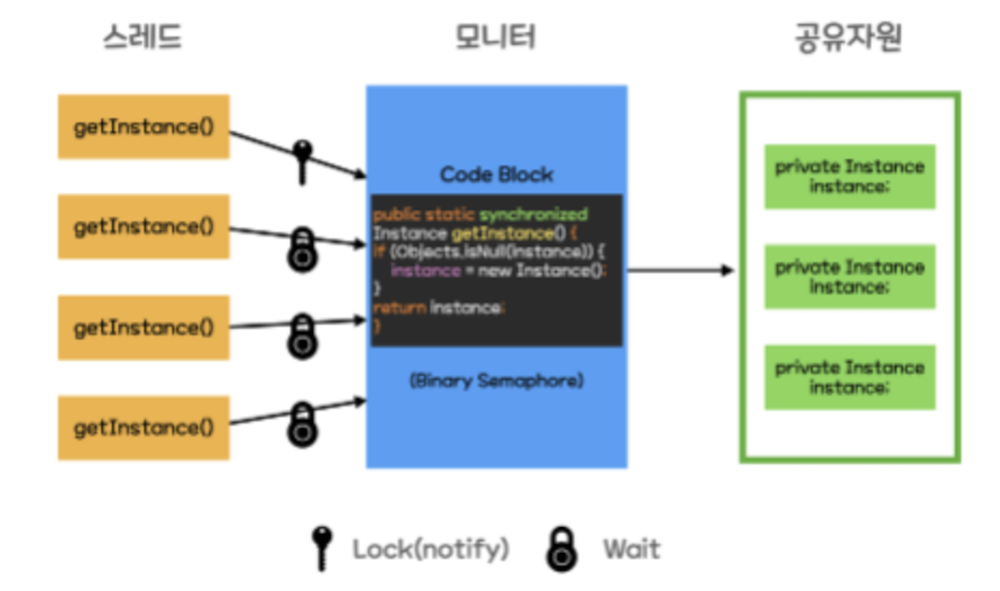

## 동기화 (Synchronized)
여러 프로세스들이 공유 자원에 동시에 접근하려고 하는 상황(IPC의 shared memory 등)을 **경쟁 상태**라고 하는데, 경쟁 상태에서는 어떤 프로세스가 마지막으로 데이터를 접근했는지에 따라 데이터의 상태가 달라지게 됨 -> 데이터의 일관성을 보장할 수 없어짐!

> 프로세스들의 실행 순서를 정하여 **공유 자원의 일관성을 보장하는 것**을 동기화라고 함

물론 스레드 동기화도 존재함
멀티 스레드 프로세스의 경우, 두 개 이상의 스레드가 공유 데이터에 동시에 접근하게 되면 예상과 벗어난 결과가 나타날 수 있음

-> 이때 공유 자원에 접근하는 임계영역을 동기화 기법으로 잘 제어해 의도한 대로 동작하는 것을 **Thread-Safe**라고 함 

​
### 임계영역
2개 이상의 프로세스가 공유 자원에 접근해서 실행 결과가 달라지게 될 수 있는 영역
즉, 프로세스 실행 순서에 따라 결과가 달라질 수 있으므로 임계 영역에서는 **단 하나의 프로세스만 실행**하도록 보장해야 함 



- **entry section(진입 영역)** - 임계 영역에 들어가기 위해 요청하는 영역 (동기화 객체가 요구됨)
- **critical section(임계 영역)** - 데이터의 일관성이 중요하기 때문에 하나의 프로세스만 접근해야 하는 영역
- **exit section(퇴장 영역)** - 임계 영역이 끝났음을 알리는 영역 (동기화 객체를 해제하게 됨)


<br></br>
임계 영역에서 단 하나의 프로세스만 실행하기 위해서는 다음 3가지 조건을 충족해야 함 

1. **상호배제 (Mutual Exclusion)**
한 프로세스가 임계 영역에 들어가면 다른 프로세스는 임계 영역에 들어갈 수 없어야 함
해당 조건이 지켜지지 않으면 경쟁 상태에 빠지게 됨 


2. **한정 대기 (Bounded Waiting)**
한 프로세스만 계속 임계 영역을 수행하는 기아 문제를 방지하기 위해, 한 번 임계 영역에 들어간 프로세스는 한정(bound)를 두어 다른 프로세스도 해당 임계 영역을 수행할 수 있도록 함 


3. **진행 (Progress)**
어떠한 프로세스도 임계 영역을 수행하고 있지 않을 때, 임계 영역에 접근하고자 하는 프로세스가 있다면 해당 프로세스를 임계 영역에 들어갈 수 있게 해야 함
(아무도 임계 영역에 없는데 프로세스가 임계 영역에 못 들어 가면 안됨)
해당 조건이 지켜지지 않으면 교착 상태가 발생할 수 있음 


<br></br>
## 뮤텍스 (Mutex)


**임계 영역에 진입하기 위해서는 락을 획득해야 하고, 빠져나올 때는 반드시 락을 반환해야 함**
뮤텍스 락은 기본적으로 acquire 함수를 통해 락을 획득하고 release 함수를 통해 락을 반환하며, available이라는 변수를 가지고 락의 사용 가능 여부를 표시함 

```
예시) 화장실이 하나밖에 없는 식당
화장실을 가기 위해서는 카운터에서 열쇠를 받아가야 할 때, 카운터에 열쇠가 없다면 화장실에 사람이 있다는 
뜻이므로 사람이 나올 때까지 기다려야 함. 사람이 나오면 맨 앞 사람이 키를 받아 화장실에 갈 수 있음 
```

<br></br>
## 세마포어 (Semaphore)



- 사용하고 있는 스레드/프로세스의 수를 공통으로 관리하는 하나의 값을 이용해 상호배제를 달성함
- **공유 자원에 접근할 수 있는 프로세스의 최대 허용치만큼 동시에 사용자가 접근할 수 있음** 
- 각 프로세스는 세마포어의 값을 확인하고 변경할 수 있음 
```
예시) 화장실이 여러 개 있는 식당
화장실에는 여러 개의 칸이 있고 화장실 입구에는 현재 화장실의 빈 칸 개수를 보여주는 전광판이 있을 때 
```

- 세마포어 S는 wait()와 signal()로만 접근이 가능하며, wait()는 S의 값을 감소시키고, signal은 S의 값을 증가시킴 (S가 0이 되면 모든 자원이 사용 중인 것!)
- 이진 세마포어는 0과 1 값만 가지기 때문에 뮤텍스와 유사하게 동작하지만, 카운팅 세마포어는 제한 없는 값을 사용함 


<br></br>
## 뮤텍스와 세마포어의 차이점
- 뮤텍스는 동기화 대상이 오직 1개일 때만 사용할 수 있지만, 세마포어는 동기화 대상이 1개 이상일 경우에도 사용 가능함
- 뮤텍스는 소유하고 있는 스레드 본인만이 뮤텍스 락을 해제할 수 있지만, 세마포어는 세마포어를 소유하지 않은 스레드가 세마포어를 해제할 수 있음 
- 뮤텍스는 프로세스의 범위를 가지며 프로세스 종료될 때 자동으로 초기화되지만, 세마포어는 시스템 범위에 걸쳐 있고, 파일 시스템 상의 파일로 존재함 


<br></br>
## 모니터 (Monitor)
mutex락 혹은 세마포어를 사용할 때에도 타이밍 오류는 여전히 발생할 수 있음  
ex) wait()과 signal() 연산의 순서가 뒤바뀌는 경우 등
이러한 오류를 방지하기 위해, **자바에서는** 고급 언어 구조물인 모니터를 제공함 



- **하나의 데이터(객체)마다 하나의 모니터를 결합**할 수 있으며, 모니터는 **결합된 객체가 동시에 두 개 이상의 스레드에 의해 접근할 수 없도록 막는 잠금 기능을 제공함**으로써 동기화를 수행함
- 자바에서는 synchronized 메소드가 선언된 객체와 synchronized 블럭에 의해 동기화되는 모든 객체에 고유한 모니터가 결합이 되어 동기화 작업을 수행하게 됨 -> wait(), notify(), notifyAll()은 모두 synchronized 블록에만 유의미함 

### 구현
공유 자원, 공유 자원 접근 함수로 이루어져 있고, 2개의 큐를 가지고 있음 
- 상호 배타 큐(Mutual Exclusion Queue) - 공유 자원에 하나의 프로세스만 진입하도록 하기 위한 큐로, **공유 자원을 사용하는 스레드**가 존재함
- 조건 동기 큐(Conditional Synchronization Queue) - **공유 자원의 락이 해제되기를 기다리는 스레드**가 대기하는 큐
<br></br>
- wait() - 락을 가진 프로세스가 다른 프로세스에 락을 넘겨준 다음 대기해야 할 때 사용함
- notify() - 대기하고 있는 프로세스 중 하나를 깨움
- notifyAll() - 대기하고 있는 프로세스 모두를 깨움 

<br></br>
<br></br>
#### 출처
https://code-lab1.tistory.com/50   
https://murphymoon.tistory.com/entry/동기화-경쟁-조건Race-Condition-임계-구역Critical-Section-운영체제OS-면접질문-5   
https://heeonii.tistory.com/14   
https://chelseashin.tistory.com/40   
https://prefer2.tistory.com/entry/운영체제-동기화-도구들-뮤텍스-세마포어-모니터    
https://steady-coding.tistory.com/557
