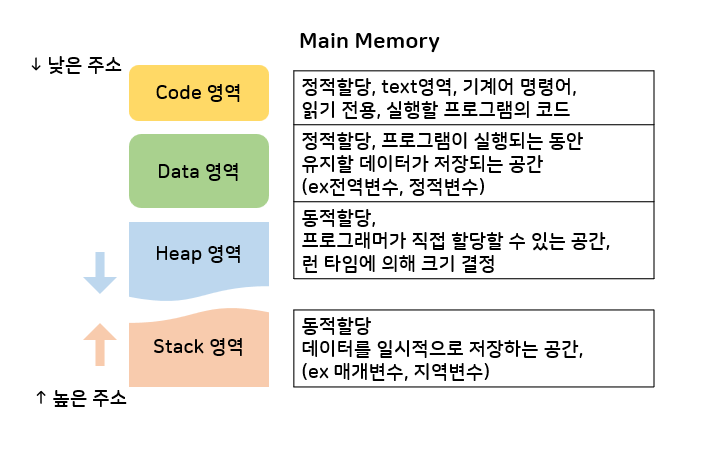
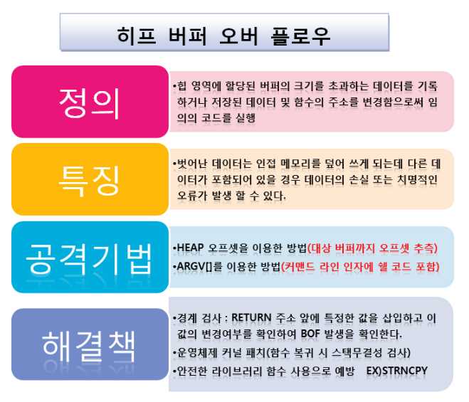

# 메모리 구조

## 메모리

- 일반적으로 Memory = Main memory = 주기억장치 = RAM
- 현재 실행되는 프로그램(프로세스)의 명령어와 데이터를 저장하는 부분
- 프로그램이 실행되려면 반드시 메모리에 적재(=저장=load)되어야 함

## 메모리 구조 Memory Structure

책이나 레퍼런스마다 메모리구조를 나누는 방식이 다양하지만, 공통적이고, 대표적이고, 필수적으로 알아야하는 부분은 Code영역, Data영역, Heap영역, Stack영역임

### 커널 영역

시스템 운영에 필요한 메모리, 사용자는 커널영역에 접근할 수 없음. 커널이 존재하는 곳

커널영역(모드)와 사용자영역(모드)를 구분하는 이유는 커널 영역을 보호하기 위해서

CPU는 커널모드와 사용자모드를 왔다갔다하며(시스템 콜 이) 작업을 수행

운영체제 또한 하나의 프로세스이기 때문에 code, data, stack 영역이 존재한다.

- Code: system call, 인터럽트 처리, 자원 관리, 인터페이스 제공 코드 등이 있다.
- Data: Process Controll Block, 현재 수행 중인 프로세스의 상태를 저장하는 자료구조인 PCB가 저장된다.
- Stack: 각 프로세스의 커널 스택을 저장한다.
    - 프로세스는 기본적으로 유저 스택과 커널 스택을 각각 가지고 있다.
    - 커널 스택의 첫번째 목적은 커널 모드에서 유저 모드로 전환하기 위해 필요한 정보를 저장한다.
    - 커널 스택의 두번째 목적은 커널 모드에서 함수를 호출하게 되면 그 함수의 지역변수는 커널 모드 스택 영역에 할당된다(유저 모드에서 함수를 호출하면 지역변수가 유저 모드 스택 영역에 할당되는 것과 같다).
    - 자세히 말하면, 프로세스가 운영체제에 시스템 콜을 호출하면 프로세스의 프로그램 카운터(PC)가 커널 주소 공간의 코드를 가리키게 된다. 그리고 커널의 함수들을 호출하며 커널 스택에 관련된 정보가 쌓인다.
- 커널은 힙 영역이 존재하지 않는지? ❓커널에 대한 이해가 더 필요할
    - 커널은 Linux 운영 체제(OS)의 주요 구성 요소(’커널 = 운영체제'로 많이 이해하지만, 엄밀히 따지면 완전히 동일한 것은 아님, 커널은 운영체제의 심장이지만 운영체제 그 자체는 아니니까!)이며 컴퓨터 하드웨어와 프로세스를 잇는 핵심 **인터페이스** 입니다. 그리고 두가지 관리 리소스에서 최대한 효과적으로 통신한다.
    - 커널은 운영체제(리눅스)에서 동적메모리 할당을 위해 필요한 기능들을 커널이 제공하는데, 운영체제는 커널에서 제공하는 기능을 사용해서 메모리 풀(memory pool)을 관리한다.
    - 리눅스로 예를들어 설명하면, 커널은 메모리 관리, 프로세스 관리, 하드웨어와 프로세스 사이에서 인터프리터 역할을 수행하거나 시스템의 호출이나 보안등의 기능을 수행한다. 즉, 리눅스에서(다른 OS는 다를 수 있음) 커널은 하나의 프로세스가 아니라 컴퓨터 하드웨어와 프로세스를 잇는 인터페이스로 봐야한다.
    

### 사용자 영역

코드영역, 데이터영역, 스택영역, 힙영역 4가지로 나눠진다

#### Code 영역(텍스트 영역)

- 실행할 프로그램의 코드가 저장되는 영역 (= 작성한 코드가 binary 형태로 저장되는 공간)
- **기계어 형태로 저장**, 읽기전용(코드가 변경되면 안되니까!)
- 실행파일을 구성하는 명령어들이 올라감 (**함수, 제어문, 상수 등이 저장됨**)
- CPU가 코드영역에 저장된 명령어들을 하나씩 가져가 처리함

#### Data 영역

- 프로그램이 실행되는 동안 유지해야 할 데이터(전역변수, 정적변수 등)가 저장되는 공간
    - 전역변수(global variable) : 어떤 변수 영역 내에서도 접근할 수 있는 변수, 함수의 외부에서 선언된 변수, 프로그램 어디서나 접근할 수 있고, 프로그램이 종료되어야만 메모리에서 사라짐. 자동으로 default값(0) 초기화
    - 정적변수(static variable) : 지역변수와 전역변수의 특징을 모두 가짐.
    프로그램이 종료되기전까지 소멸되지않음. default값 초기화
      

          
더 자세하게

          

            전역변수와 차이점 ⇒ 초기화가 처음 한 번만 진행된다.
            프로그램이 시작될 때 생성 및 초기화, 프로그램이 끝날때 사라짐.
            함수의 매개변수로 사용할 수 없음
            - 정적 지역변수(static local variable) : 블록 내에서만 사용, 한 번 초기화 되면 이후에 함수 호출 시 값의 초기화를 무시함.
            - 정적 전역변수(static global variable) : 자신이 선언된 소스 파일에서만 사용할 수 있고, 외부에서는 가져다 슬 수 없음.
            <table>
                <th></th>
                <th>지역변수</th>
                <th>전역변수</th>
                <th>정적변수</th>
                <tr>
                    <td>메모리 생성 시점</td>
                    <td>중괄호 내부</td>
                    <td>프로그램 시작</td>
                    <td> 프로그램 시작</td>
                </tr>
                <tr>
                    <td>메모리 소멸 시점</td>
                    <td>중괄호 탈출</td>
                    <td>프로그램 종료</td>
                    <td>프로그램 종료</td>
                </tr>
                <tr>
                    <td>디폴트 초깃값 (초기화하지 않을 시)</td>
                    <td>쓰레기값 저장</td>
                    <td>자동 0초기화</td>
                    <td>자동 0초기화 (초기화는 한번만 진행)</td>
                </tr>
                <tr>
                    <td>사용범위</td>
                    <td>중괄호 내부</td>
                    <td>프로그램 전체</td>
                    <td>- 정적 지역변수: 중괄호 내부 
                        - 정적 전역변수: 선언된 소스 파일</td>
                </tr>
                <tr>
                    <td>메모리 할당공간</td>
                    <td>Stack 영역</td>
                    <td> Data 영역 (초기화) 
                        BSS 영역 (비초기화)</td>
                    <td>Data 영역 (초기화) 
                        BSS 영역 (비초기화)</td>
                </tr>
            </table>
            - 프로그램이 시작되면 할당되고 프로그램이 종료되면 소멸됨 
          

      

        
#### Stack 영역

- 데이터를 일시적으로 저장하는 공간, 프로그램이 자동으로 사용하는 임시 메모리 영역
- 함수 호출 시 지역변수, 매개변수, 리턴 값 등이 저장되고, 함수가 종료되면 저장된 메모리도 해제됨
    - 지역변수(local variable) : ‘블록’ 내에서 선언된 변수, 변수가 선언도니 블록 내에서만 유효, 블록이 종료되면 메모리에서 사라짐(매개변수도 실질적으로 지역변수와 같은 취급). 쓰레기값 초기화
- 컴파일 타임에 의해 결정되기 때문에 무한히 할당할 수 없음
- PUSH로 저장, POP으로 인출, LIFO(스택) =💡메모리의 높은 주소에서 낮은 주소 방향으로 할당

#### Heap 영역

- 필요에 의해 동적으로 할당되는 영역
- 프로그래머가 직접 할당(malloc)/해제(calloc)해야하는 공간! 메모리 해제 안하면 메모리 누수 발생
- 런타임 시 결정되는 영역 → 데이터 크기가 확실하지 않을 때 사용
- 메모리의 낮은 주소에서 높은 주소 방향으로 할당💡
- 객체의 참조값(Object Reference), 자바의 class❓와 그 객체, 클로저가 저장되는 공간

> 💡 **Heap 영역과 Stack 영역은 같은 메모리 영역을 공유**
> - 각 영역이 상대 공간을 침범할 수 있음 = Heap overflow / Stack overflow
> - 스택 영역이 크면 힙 영역이 작아지고 힙 영역이 크면 스택 영역이 작아짐

##### ❓메모리 간 상호작용(Java의 Stack과 Heap)
###### 1) Stack
- Heap 영역에 생성된 Object 타입의 데이터 참조값이 할당된다.
- **원시타입**의 데이터가 값과 함께 할당된다. 원시타입의 데이터는 Heap 메모리에 할당되지 않는다.
- 원시타입: byte, short, int, long, double, float, boolean, char 타입
- 지역변수들은 scope에 따른 visibility를 가진다.
- 각 Thread는 자신만의 stack을 가진다.
    
###### 2) Heap    
- Heap 영역에는 주로 긴 생명주기를 가지는 데이터들이 저장된다(대부분의 객체는 크기가 크고 서로 다른 코드블럭에서 공유되는 경우가 많다.).
- 애플리케이션의 모든 메모리 중 stack에 있는 데이터를 제외한 부분이라고 보면 된다.
- 모든 Object 타입(Integer, String, ArrayList, ...)의 참조값은 데이터 타입과 함꼐 heap 영역에 생성된다.
- 자바에서 Wrapper class에 해당하는 Integer, Character, Byte, Boolean, Long, Double, Float, Short 클래스는 모두 Immutable이다. Wrapper class는 아니지만 String 클래스 역시 Immutable하므로 heap에 있는 같은 오프젝트를 레퍼런스하고 있더라도 새로운 연산이 적용되는 순간 새로운 객체가 heap에 재할당된다. 새로운 객체가 heap에 할당되더라도 stack에서 이를 참조하지 않으면 가비지 컬렉션의 대상이 된다.
- 스레드의 개수와 관계없이 단 하나의 heap 영역만 존재한다.
- Heap 영역에 있는 객체들을 가리키는 참조 변수는 stack에 올라가게 된다(위의 0-3) 참고).

###### 3) 버퍼 오버플로우 (공격)

힙/스택 모두 오버플로우가 발생하면 잘못된 데이터값을 읽는 등의 문제가 발생할 수 있음.  
이 취약점을 이용해 인가되지 않은 메모리 영역을 침범하여 루트권한을 탈취하는 등 보안문제 발생

- **Heap buffer overflow** ([https://m.blog.naver.com/PostView.naver?isHttpsRedirect=true&blogId=2000sky2&logNo=220626020503](https://m.blog.naver.com/PostView.naver?isHttpsRedirect=true&blogId=2000sky2&logNo=220626020503))

- **Stack buffer overflow**
    - 스택에 할당된 메모리 주소를 넘치게 사용하면 메모리를 다루는 데 오류가 발생하여 잘못된 동작을 하게되고 프로그램의 취약점이됨.
    - 대표적인 공격 방식 : NOP썰매 공격과 환경 변수 공격
    - 방어방식  유형 ([https://ko.wikipedia.org/wiki/스택_버퍼_오버플로](https://ko.wikipedia.org/wiki/%EC%8A%A4%ED%83%9D_%EB%B2%84%ED%8D%BC_%EC%98%A4%EB%B2%84%ED%94%8C%EB%A1%9C))
        - 스택 카나리스 : 발생한 스택 버퍼 오버플로를 탐지하고 악의적인 코드로의 명령어 포인터 리다이렉션을 방지한다.
        - 실행 불가능한 스택 : 직접적으로 스택 버퍼 오버플로를 탐지하지 않고, 악의적인 코드가 스택에서 실행되는 것을 방지한다.
        - 랜덤화 : 실행 가능한 코드를 찾는 것을 신뢰하지 못하게 메모리 공간을 랜덤화한다.
    

> 일단은 여기까지만 준비했는데, 주로 JAVA질문에서 많이 나오는 영역이니 GC내용도 추가로 함께 적으면 좋을 것 같음 **→ 시간 남으면 자바 부분에서 다루기**
> 
---

## 면접 예상질문
- Stack과 Heap의 차이점?(특히 자바에서)
- GC(Garbage Collecter)란? ([https://beforb.tistory.com/6](https://beforb.tistory.com/6))
- 자바의 메모리 영역에 대해 설명해주세요?
- 각 메모리 영역이 할당되는 시점은 언제 인가요?([https://dev-coco.tistory.com/153](https://dev-coco.tistory.com/153))

## 출처

- [https://velog.io/@seungho1216/CS-메모리-구조](https://velog.io/@seungho1216/CS-%EB%A9%94%EB%AA%A8%EB%A6%AC-%EA%B5%AC%EC%A1%B0)
- [https://dev-leeyang.tistory.com/23](https://dev-leeyang.tistory.com/23)
- [https://jinshine.github.io/2018/05/17/컴퓨터 기초/메모리구조/](https://jinshine.github.io/2018/05/17/%EC%BB%B4%ED%93%A8%ED%84%B0%20%EA%B8%B0%EC%B4%88/%EB%A9%94%EB%AA%A8%EB%A6%AC%EA%B5%AC%EC%A1%B0/)
- 혼자 공부하는 컴퓨터구조+운영체제 (강민철, 한빛미디어)
- 2021 시나공 정보처리기사 필기
- 신입개발자 기술면접준비-자바([https://dev-coco.tistory.com/153](https://dev-coco.tistory.com/153)) **다른CS, 개발자 면접질문들도 잘 정리 되어 있음!
- 변수의 유효범위 [http://www.tcpschool.com/c/c_function_variableScope](http://www.tcpschool.com/c/c_function_variableScope)
- [https://code4human.tistory.com/128](https://code4human.tistory.com/128)
- [https://m.blog.naver.com/dd1587/221106199316](https://m.blog.naver.com/dd1587/221106199316)
- 커널영역 [https://zangzangs.tistory.com/107](https://zangzangs.tistory.com/107)
- 프로세스의 메모리 구조 [https://kariskan.tistory.com/52](https://kariskan.tistory.com/52)
- 힙 버퍼 오버플로우 [https://m.blog.naver.com/PostView.naver?isHttpsRedirect=true&blogId=2000sky2&logNo=220626020503](https://m.blog.naver.com/PostView.naver?isHttpsRedirect=true&blogId=2000sky2&logNo=220626020503)
- 스택 오버플로우 [https://m.blog.naver.com/2000sky2/220607488638](https://m.blog.naver.com/2000sky2/220607488638)
- 스택 오버플로우 [https://ko.wikipedia.org/wiki/스택_버퍼_오버플로](https://ko.wikipedia.org/wiki/%EC%8A%A4%ED%83%9D_%EB%B2%84%ED%8D%BC_%EC%98%A4%EB%B2%84%ED%94%8C%EB%A1%9C)
- JAVA 메모리 구조 [https://devkingdom.tistory.com/226](https://devkingdom.tistory.com/226)
- [https://inpa.tistory.com/entry/JAVA-☕-그림으로-보는-자바-코드의-메모리-영역스택-힙](https://inpa.tistory.com/entry/JAVA-%E2%98%95-%EA%B7%B8%EB%A6%BC%EC%9C%BC%EB%A1%9C-%EB%B3%B4%EB%8A%94-%EC%9E%90%EB%B0%94-%EC%BD%94%EB%93%9C%EC%9D%98-%EB%A9%94%EB%AA%A8%EB%A6%AC-%EC%98%81%EC%97%AD%EC%8A%A4%ED%83%9D-%ED%9E%99)
