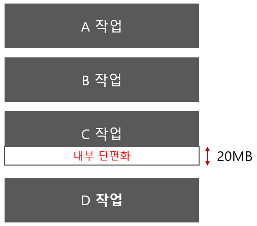
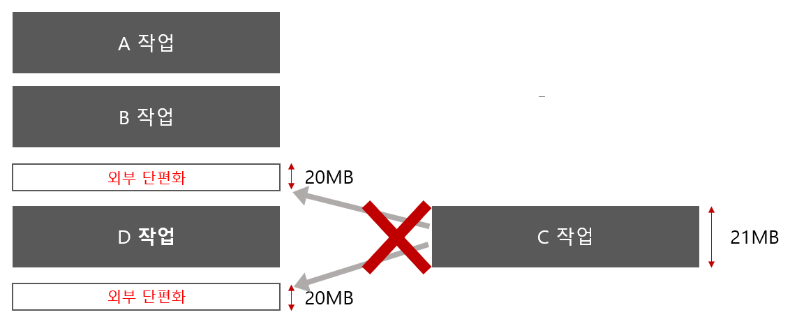
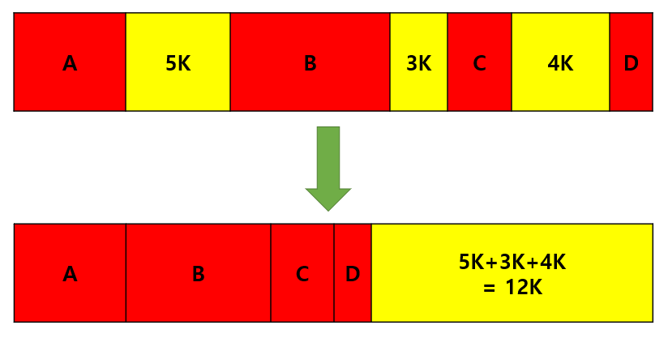
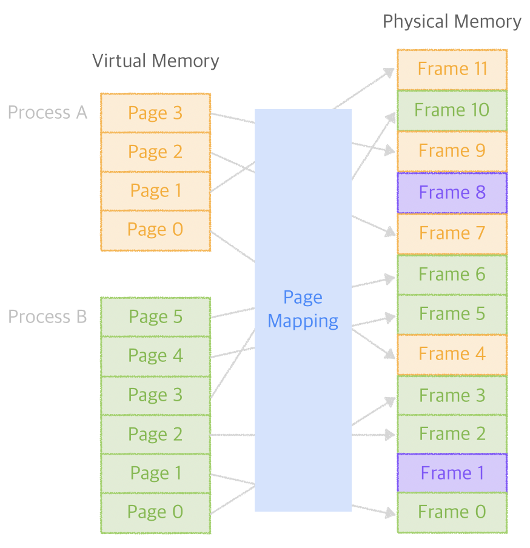
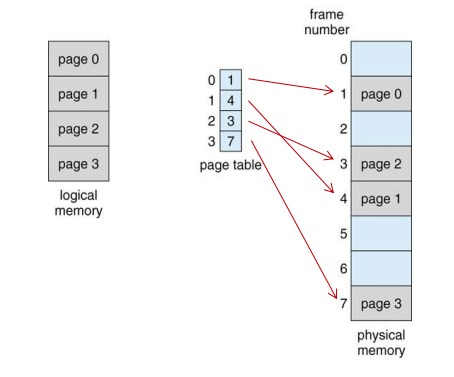
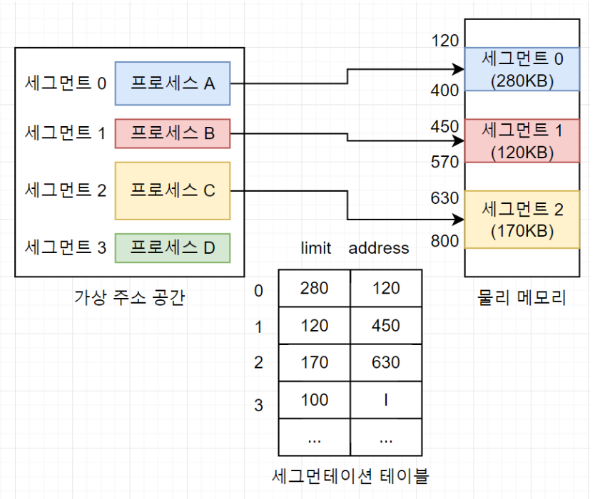
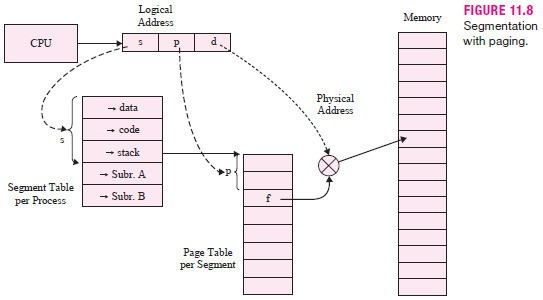
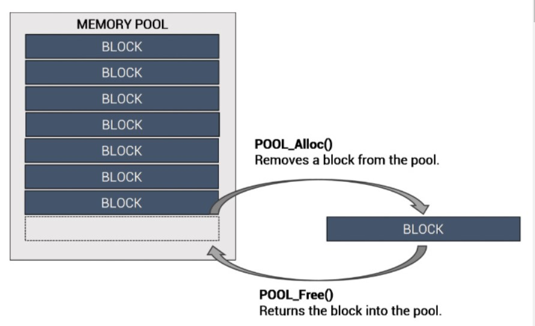

# 메모리 단편화

# 정의

### RAM에서 메모리의 공간이 작은 조각으로 나뉘어져  사용가능한 메모리가 충분히 존재하지만 할당(사용)이 불가능한 상태

- 메모리 단편화로 일어날 수 있는 현상
    - 총 메모리 공간은 충분하지만 실제 사용이 불가능할 수 있다
    - 실제 사용 가능한 공간이 줄어들어 시스템 성능 저하를 일으킬 수 있다
        
        -실제 사용할 수 있는 공간을 찾는 과정 필요
        
        -잦은 페이지 교체
        
        -swapping
        

## 내부 단편화

: 주기억장치 내의 실행 프로그램보다 사용자 영역이 커서 메모리 할당 후 사용되지 않고 남아있는 공간

ex) 

메모장을 실행시키고 OS가 4KB만큼의 메모리를 할당해주었지만 사실상 1KB만큼만 사용하고 있을 때 필요 이상으로 프로세스가 메모리를 할당받았기 때문에 내부 단편화가 3KB만큼 생김

## 외부 단편화

: 주기억장치 내의 사용자 영역보다 실행 프로그램이 커서 프로그램이 메모리가 할당되지 않고 남아있는 공간을 의미

- 메모리가 할당되고 해제되는 작업이 반복적으로 일어날 때 발생

ex)

메모리 처음 주소에 프로세스를 4KB만큼 할당하고 바로 이어서 8KB만큼의 메모리를 또 다른 프로세스에게 할당했다고 가정할 때, 4KB만큼의 메모리를 할당하고 있던 프로세스를 종료시키면 메모리의 처음 주소부터 4KB만큼의 공간이 생기게 되고 이런 식으로 계속해서 빈 메모리 공간 생기게 되면 전체적으로 메모리 여유는 있지만 메모리를 많이 잡아먹는 프로세스를 실행시킬 수 없는 현상

# 해결방법

## 1. 압축(Compaction)

: 메모리 공간들을 재배치하여, 단편화로 인해 분산되어 있는 메모리 공간들을 하나로 합치는 기법

ex) 디스크 조각 모음

## 2. 통합(Coalescing)

: 단편화로 인해 분산된 메모리 공간들을 인접해 있는 것끼리 통합시켜 큰 메모리 공간으로 합치는 기법

<aside>
💡 압축은 재배치되는 것, 통합은 인접 공간끼리 통합된다는 것에서 차이가 있다!

</aside>

## 3. 페이징(Paging)
> **💛 특징 3줄정리**
>- 가상 메모리 사용
>- 외부 단편화 해결
>- 내부 단편화 존재

- 프로세스의 주소 공간(=주기억에 있다)을 페이지(고정사이즈)로 나누어 물리적 메모리에 불연속으로 저장하는 방식
- 실제 프로세스가 실행될 때는 각각의 페이지들이 실제 메모리의 어디에 있는지를 빠르게 알 수 있어야 함.
- 프로세스 입장에선 자신이 사용하고 있는 메모리 공간이 흩어져있는 페이지들이 아니라 하나의 연속된 메모리 공간으로 이해할 수 있어야 프로그램 실행에 효율적이게 됨
- 사용하지 않는 프레임을 페이지에 옮기고(swap-out), 필요한 메모리를 페이지 단위로 프레임에 옮기는(swap-in) 기법

> **💡용어 다시 복습하기**
> - 페이지(page) : 보조기억장치를 이용한 가상 메모리에서 사용하는 **크기가 같은** 블록 단위, 논리 주소 공간 단
> - 프레임(frame) : 주기억장치에서 사용하는 블록 단위, 페이지와 같은 크기로 나눈 것, 물리 메모리(주기억) 위치 영역 단위

<!---->

- 페이지와 프레임을 대응시키기 위해 page mapping과정이 필요해서 paging table을 만든다.
- CPU는 논리주소로 프로그램이 설정한대로 연속적인 주소값으로 명령을 내리고 이는 메모리로 가기 전에 각 페이지이 실제 메모리 주소가 저장되어 있는 테이블에서 물리 주소로 변경되어야한다.
- 논리 주소와 물리주소가 분리되어 동적으로 논리주소가 물리주소에 재배치되면서 할당되는 것을 허용해야 하고, 모든 메모리 참조에서 주소변환이 필요하기 때문에 MMU가 필요하다.
- 연속적이지 않은 공간도 활용할 수 있기 때문에 외부 단편화 문제를 해결할 수 있다.

#### 페이징의 한계
- 페이지 단위에 알맞게 꽉채워 쓰는게 아니므로 내부 단편화 문제는 여전히 존재.
- **페이지 단위를 작게하면 내부 단편화 문제가 감소하지만, 대신 페이지 매핑 과정이 많아져 오히려 효율이 떨어질 수 있고 페이지 테이블 크기 또한 증가한다.**
- 페이징에서는 내부단편화를 완벽히 해결할 수 없지만, 외부 단편화에 비해 낭비되는 메모리 공간이 매우적다.
- (내부단편화 최대 낭비 크기는 page size -1 / 외부단편화는 최대 전체 메모리의 1/3이 낭비된다.)
- 페이지의 크기를 결정하는 기준
    - 내부 단편화
    - Page-in, Page-out 시간 - I/O Overhead
    - 페이지 테이블(Page Table) 크기
    - 메모리 해상도(Memory resolution) - 필요한 내용만 메모리에 담을 수 있는 정도
    - 페이지 부재(Page Fault) 발생 확률
      
    >- _페이지 크기가 작을 수록 좋은 기준_
    >  
    >    - 내부 단편화 : 페이지가 작을 수록 버려지는 메모리의 내부 공간(내부 단편화)도 작아짐
    >    
    >    - 메모리 해상도 : 페이지가 크면 불필요한 영역까지 함께 적재될 수 밖에 없다. 반대로 적을 수록 필요한 부분만 메모리에 적재되는 정밀도가 증가한다.
    >    
    >- _페이지 크기가 클 수록 좋은 기준_
    >   
    >    - Page-in, Page-out 시간 : I/O시간은 대부분 디스크의 헤드 이동시간이다. 페이지가 클 수록 한 번 이동해서 많은 데이터를 읽어올 수 있는 장점이 있다.
    >   
    >    - Page Table Size : 페이지의 크기가 클 수록 테이블의 row 수는 적게 된다.
    >   
    >    - Page Fault 발생 확률 : 페이지가 클 수록 하나의 페이지 내에 많은 내용을 담고 있기 때문에 페이지 재사용 가능성이 높게 되고 메모리 지역성에 의해 페이지 부재도 덜 발생하게 된다.
    

## 4. 세그먼테이션(Segmentation)
> 💛 특징 3줄 정리
>- 가상 메모리 사용
>- 내부 단편화 해결
>- 외부 단편화 존재

- 가상 메모리를 **서로 크기가 다른 논리적 단위인 세그먼트**로 분할해서 메모리를 할당하여 실제 메모리 주소로 변환하게 하는 방법
- 돼지 한마리를 보관한다고 생각하면, 페이징은 돼지를 모두 같은 크기로 슬라이스해서 보관하는 거고, 세그먼테이션은 부위별로 잘라서 보관하는것.
- 

- 프로세스를 어떻게 나누는가(고정/가변크기)를 제외하고는 메모리에 할당하는 방법측면에서는 페이징과 동일하다.
- 각 세그먼트는 연속적인 공간에 저장되어 있다.
- 세그먼트들의 크기가 다르기 때문에 미리 분할해 둘 수 없고, 메모리에 적재될 때 빈 공간을 찾아 할당한다.
- 매핑을 위해 세그먼트 테이블 필요 -> 각 세그먼트의 시작 주소와 크기 정보 수록
- 프로세스가 필요한 메모리만큼 할당해주기 때문에 내부 단편화는 일어나지 않으나 여전히 중간에 프로세스가 메모리를 해제하면 생기는 구멍(hole), 즉 외부 단편화 문제는 여전히 존재한다.

### 페이징과 세그먼테이션 한계극복
- 두 기법을 모두 사용하여 장점마을 가져와 단편화 문제를 효과적으로 해결하는 방법을 생각해볼 수 있다.
- 세그멘테이션은 보호와 공유 면에서 효과적이고 페이징은 외부 단편화 문제를 해결하는 데 효고적이다.

1. 프로세스를 처음에 세그먼트 단위로 자른다.
2. 잘라진 세그먼트를 일정한 간격인 페이지 단위로 자른다.(페이징)
3. 이후 메모리에 적재하면 페이징의 일정단위로 다시 잘렸기 때문에 외부단편화가 발생하지 않는다.
- 테이블을 두 가지 모두 거쳐야 하므로 속도면에서 조금 떨어진다.

## 5. 메모리 풀(Memory pool)

- 내부 단편화, 외부 단편화 해결
  

: 필요한 메모리 공간을 필요한 크기, 개수만큼 사용자가 직접 지정하여 미리 할당받아 놓고 필요할 때마다 사용하고 반납하는 기법

- 이런 동적할당 방식은 데이터를 위한 메모리 공간을 만들어주는 건데 그 공간 전체를 메모리 풀이라고 생각하면 된다.
- 동적할당은 RAM의 힙영역을 사용한다.(힙영역에서 따로 구분되어 있다.)

#### 메모리풀을 사용하는 이유
- 메모리 풀 없이 동적할당과 해제를 반복하면 메모리의 랜덤한(실제로는 알고리즘에 의한) 위치에 할당과 해제가 반복되면서 단편화를 일으킨다.
- 하지만 미리 공간을 할당해놓고 가져다 쓰고 반납하기 때문에 할당과 해제로 인한 외부 단편화가 발생하지 않는다.
- 또한 필요한 크기만큼 할당을 해놓기 때문에 내부 단편화 또한 생기지 않는다.
- **하지만 메모리 단편화로 인한 메모리 낭비량보다 메모리 풀을 만들었지만 쓰지 않았을 때 메모리 양이 커질 경우 사용하지 않아야 한다.**
- 
- 메모리의 할당, 해제가 잦은 경우에 메모리 풀을 쓰면 효과적이다.
- 단점 : 미리 할당해놓고 사용하지 않는 순간에도 계속 할당해놓으므로 메모리 누수가 있는 방식이다.
- ps) 요즘에는 기술이 발전해서 malloc()이나 new()를 사용해 생기는 메모리 단편화는 신경쓸 정도는 아니다.
- 동적할당=성능저하, 하지만 메모리 풀을 사용하므로써 성능향상
- 
  >-  C++기준에서 new()의 동적할당은 메모리할당(c의 malloc()), 생성자 호출, 가상함수 목록 설정의 일을 한다.
  >   메모리 풀을 사용하면 메모리할당을 확살하게 줄일 수 있다.
  >- 풀에서 메모리 할당 시 객체 타입으로 operator new를 호출하면 세 가지를 다하고, 필요한 바이트들만 할당 받으면 메모리 할당만 하게 된다.
  >- 메모리 할당은 시스템콜로 하는데, 운영체제와 상호작용하여 유효한 메모리를 할당받는다 . -> 이과정에 소요하는 cpu비용이 큼.
  >- 하지만 한 번의 시스템 콜로 메모리를 풀에 미리 할당 받으면, 풀에서 메모리를 꺼낼 때는 시스템콜이 발생하지 않으므로 cpu가 훨씬 적은 동작을 해 성능이 향상된다.

#### 구현 방법
    1. 큰 메모리블록(페이지)을 힙으로부터 할당
    2. 할당 받은 페이지를 각 객체의 크기의 블록으로 나눔
    3. 각 객체를 위한 블록을 순차적으로 링크
    4. 이 때 현 시점에서 할당할 블록을 특정 포인터가 가리키게 함
    5. 메모리 요청이 생기면 현재 헤더 포인터가 가리키는 블록을 돌려준다
    6. 할당이 일어난 후 헤더 포인터는 할당 직전에 가리키던 블록이 가리키던 블록을 가리킨다.
    7. 사용되던 메모리가 해제되어 메모리 풀로 돌아올 경우 헤더 포인터는 그 블록을 가리키고 방금 전까지 헤더 포인터가 가리키던 블록을 돌아온 블록의 다음 포인터가 가리키게 한다.

#### 유사 개념 : 오브젝트 풀 Object Pool
- 할당된 메모리 자체로는 작업을 할 수 없음. 메모리에 객체=의미있는 데이터를 써놓아야 활용할 수 있음 = 객체 생성
- 오브젝트 풀은 이미 "생성되어 있는 객체"를 반환하고, 메모리 풀은 "생성에 필요한 메모리"를 반환하도록 만들어진다.
- 메모리 풀이 오브젝트 풀의 상위 개념이다.
- 자유도는 메모리 풀이 높지만, 구현이 간편한 것은 오브젝트 풀. = 메모리 확보와 객체 생성을 분리할 필요가 없으므로
---
## 출처
- [https://jeong-pro.tistory.com/91](https://jeong-pro.tistory.com/91)
- [https://cocoon1787.tistory.com/859](https://cocoon1787.tistory.com/859)
- [https://velog.io/@hanhs4544/메모리-단편화Memory-Fragmentation](https://velog.io/@hanhs4544/%EB%A9%94%EB%AA%A8%EB%A6%AC-- %EB%8B%A8%ED%8E%B8%ED%99%94Memory-Fragmentation)
- [https://bellog.tistory.com/159](https://bellog.tistory.com/159)
- [https://blog.naver.com/ruvendix/221333044853](https://blog.naver.com/ruvendix/221333044853)
- [https://jartlife.tistory.com/59](https://jartlife.tistory.com/59)
## 면접 질문
1. 메모리 단편화란 무엇인가요?
2. 페이징과 세그먼테이션의 차이점에 대해 알려주세요
