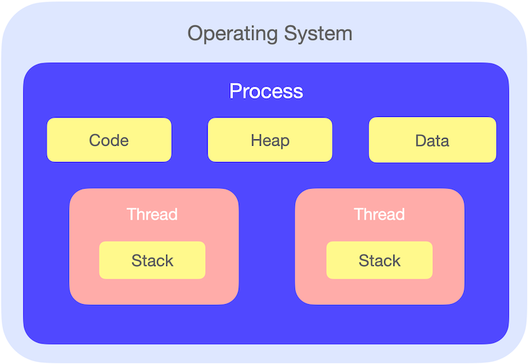
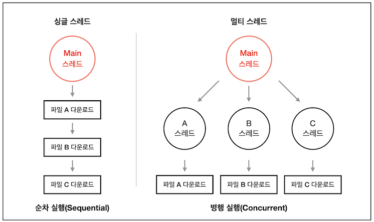
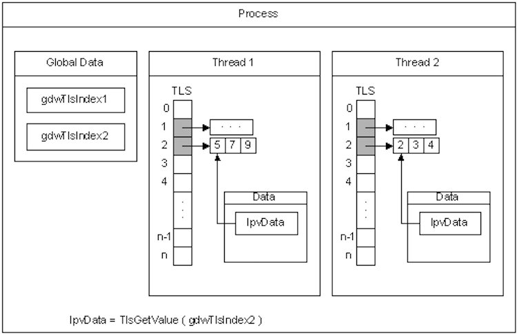

# 스레드
## 스레드란

프로세스 내에서 실제로 작업을 수행하는 주체를 의미함

- 모든 프로세스에는 한 개 이상의 스레드가 존재하여 작업을 수행함 → 프로세스는 스레드에 대한 일종의 컨테이너 역할을 함
- 두 개 이상의 스레드를 가지는 프로세스를 멀티 스레드 프로세스라고 함
- 즉, 스레드는 프로세스 내에서 실행되는 여러 흐름의 단위
  
### 스레드의 구조

스레드는 프로세스 내에서 독립된 Stack 영역을 할당받고, Code, Data, Heap 영역은 다른 스레드와 공유함

❓**Stack 영역만 따로 할당받는 이유**

- 각 스레드는 각각의 코드 및 실행 순서를 가질 수 있으므로, 함수가 호출되고 반환될 때 각각의 PC를 push/pop 해야 함
    - PC(Program Counter) = 다음에 실행할 명령어 주소를 저장하는 레지스터
    - 여러 스레드가 수행될 때 각 스레드의 PC는 명령어가 어디까지 수행되었는지 저장함

  

### TCB(Thread Control Block)

PCB처럼 TCB는 각 스레드마다 운영체제에서 유지하는 스레드에 대한 정보를 담고 있음

- TCB는 PCB 안에 들어 있음
- 스레드ID, 스택 레지스터, 프로그램 카운터, 스레드의 상태(running, ready, waiting, start, done), PCB  포인터가 들어감
- 스레드가 생성될 때 운영체제에 의해 생성되며, 스레드가 실행을 마치고 소멸될 때 함께 소멸됨

  

## 멀티 스레드

CPU의 최대 활용을 위해 프로세스가 두 개 이상의 스레드를 동시에 실행하는 것 

문맥 교환이 엄청 빠르게 일어나면서, 사용자의 시선에서는 스레드가 동시에 실행되는 것처럼 보임 

[프로세스 스케줄링](https://github.com/psyStudy/CS_study/blob/main/OS/프로세스%20스케줄링(Process%20Schedulling).md)
  
### **장점**
- 응답성이 향상됨
    - 스레드 중 일부가 중단되거나 긴 작업을 수행하더라도 프로그램의 수행이 계속 되어 사용자에 대한 응답성이 증가함
- 자원을 효율적으로 사용할 수 있음
    - 프로세스 내에서 자원을 공유하기 때문에 멀티 프로세싱에 비해 자원 소모가 적음. 스레드 간 통신이 필요한 경우에도 쉽게 데이터를 주고 받을 수 있음
- 프로세스의 문맥 교환에 비해 스레드의 문맥 교환이 더 빠름
    - TCB에는 Stack 및 간단한 포인터 정보만을 저장하기 때문에 PCB보다 TCB가 가벼워 더 빨리 읽고 쓸수 있음
    - 프로세스 문맥교환의 경우, 다른 프로세스의 실행으로 인해 CPU가 새로운 명령어와 데이터를 로드해야 하기 때문에 CPU 캐시 메모리를 초기화 하여야 함
    - 하지만 스레드 문맥교환의 경우, 프로세스 내 스레드 간에 스택과 레지스터 값 등 일부 컨텍스트 정보만 변경되므로 CPU 캐시 메모리는 초기화되지 않음

### **단점**

- 동기화에 주의해야 함
    - 프로세스와 달리 스레드는 데이터와 힙 영역을 공유하기 때문에, 특정 스레드가 다른 스레드에서 사용 중인 데이터에 접근하여 엉뚱한 값을 읽어오거나 수정할 수 있음
    - 동기화를 위해서 락을 과도하게 사용하면 성능 저하가 발생할 수 있음
- 교착상태가 발생하지 않도록 주의해야 함

  

## 스레드 안전(Thread-Safety)
멀티 스레드 프로그래밍에서 일반적으로 어떤 함수나 변수, 혹은 객체가 여러 스레드로부터 동시에 접근이 이루어져도 프로그램의 실행에 문제가 없는 것 
  
### 스레드 안전 여부 확인 방법
아래 세 가지를 통해 스레드 안전 상태인지 판단할 수 있음

- 전역 변수나 힙, 파일과 같이 여러 스레드가 동시에 접근할 수 있는 자원을 사용하는가
- 핸들과 포인터를 통한 데이터의 간접 접근이 가능한가
- 부수 효과를 가져오는 코드가 있는가

  
### 스레드 안전을 지키기 위한 설계 방법
- **상호 배제(Mutual Exclusion)**
    - 공유 자원에 하나의 스레드만 접근할 수 있도록 세마포어/뮤텍스로 락을 통제하는 방법

- **원자 연산(Atomic Operation)**
    - 공유 자원에 접근할 때는 원자 연산을 이용함
    - 공유 자원 변경을 수행하는 연산을 원자적으로 분리한 뒤에, 실제로 데이터의 변경이 이루어지는 시점에 락을 걸고 데이터를 변경하는 시간 동안 다른 스레드의 접근이 불가능하게 함

- **스레드 로컬 저장소(TLS, Thread-Local Storage)**
    
    
    
    - TLS는 스레드가 각각 가지고 있는 저장소임
    - 공유 자원의 사용을 최대한 줄이고 각각의 스레드에서만 접근 가능한 저장소들을 사용함으로써 동시 접근을 막는 방법
    - 일반적으로 공유 상태를 피할 수 없을 때 사용하는 방식

  
  

### 면접질문
1. 멀티스레드 프로그래밍에 대해 설명해보세요
2. Thread-safe 하다는 의미와 설계하는 법을 설명해보세요
3. 프로세스와 스레드의 차이를 설명해보세요

  
### 출처
[https://show400035.tistory.com/170](https://show400035.tistory.com/170)       
[https://velog.io/@nnnyeong/OS-프로세스와-스레드-Process-VS-Thread](https://velog.io/@nnnyeong/OS-%ED%94%84%EB%A1%9C%EC%84%B8%EC%8A%A4%EC%99%80-%EC%8A%A4%EB%A0%88%EB%93%9C-Process-VS-Thread)      
[https://en.wikipedia.org/wiki/Thread_control_block](https://en.wikipedia.org/wiki/Thread_control_block)      
[https://velog.io/@gil0127/싱글스레드Single-thread-vs-멀티스레드-Multi-thread-t5gv4udj](https://velog.io/@gil0127/%EC%8B%B1%EA%B8%80%EC%8A%A4%EB%A0%88%EB%93%9CSingle-thread-vs-%EB%A9%80%ED%8B%B0%EC%8A%A4%EB%A0%88%EB%93%9C-Multi-thread-t5gv4udj)     
[https://mgyo.tistory.com/456](https://mgyo.tistory.com/456)      
[https://developer-ellen.tistory.com/205](https://developer-ellen.tistory.com/205)       
[https://inpa.tistory.com/entry/👩‍💻-프로세스-⚔️-쓰레드-차이#프로세스_컨텍스트_스위칭_vs_스레드_컨텍스트_스위칭](https://inpa.tistory.com/entry/%F0%9F%91%A9%E2%80%8D%F0%9F%92%BB-%ED%94%84%EB%A1%9C%EC%84%B8%EC%8A%A4-%E2%9A%94%EF%B8%8F-%EC%93%B0%EB%A0%88%EB%93%9C-%EC%B0%A8%EC%9D%B4#%ED%94%84%EB%A1%9C%EC%84%B8%EC%8A%A4_%EC%BB%A8%ED%85%8D%EC%8A%A4%ED%8A%B8_%EC%8A%A4%EC%9C%84%EC%B9%AD_vs_%EC%8A%A4%EB%A0%88%EB%93%9C_%EC%BB%A8%ED%85%8D%EC%8A%A4%ED%8A%B8_%EC%8A%A4%EC%9C%84%EC%B9%AD)
