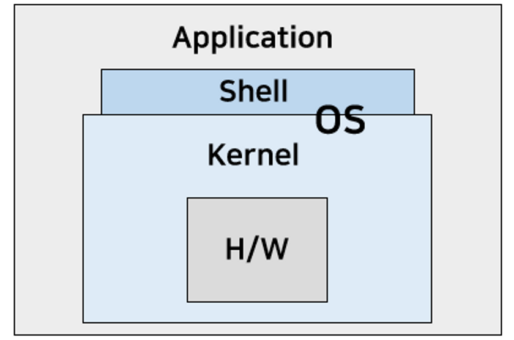
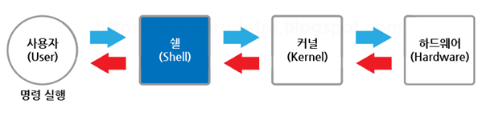
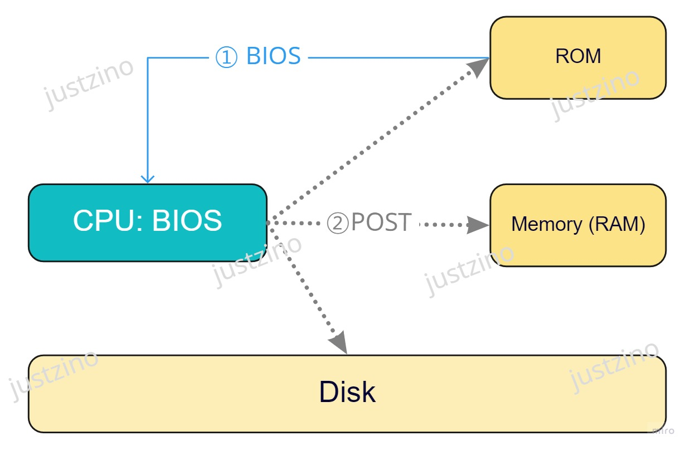
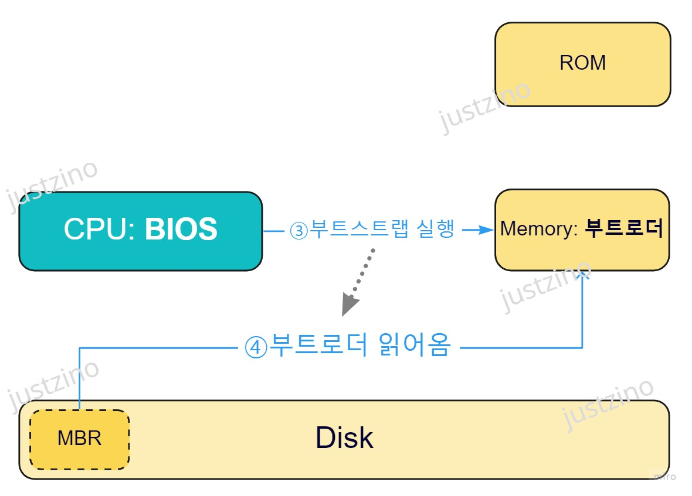
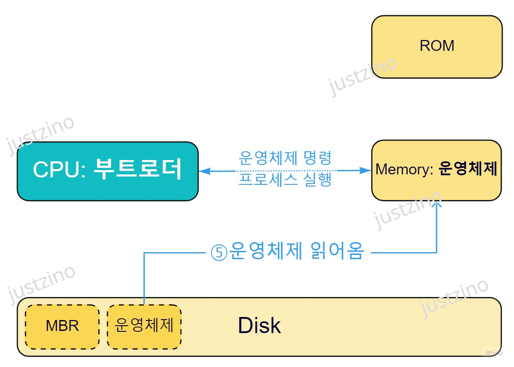
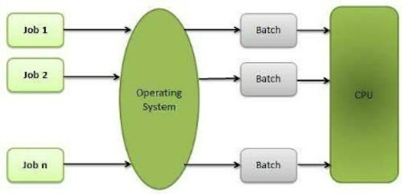
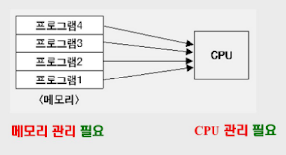
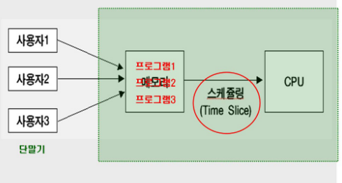
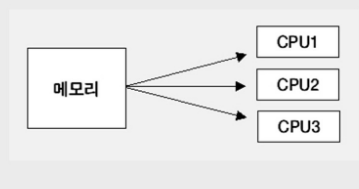
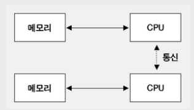

# 운영체제 개념 및 발달과정

# 1. 운영체제 개념

컴퓨터 시스템의 자원을 관리하고, 사용자 및 응용 프로그램에게 서비스를 제공하는 소프트웨어

- 사용자가 컴퓨터의 하드웨어를 쉽게 사용하룻 있도록 인페이스를 제공하는 소프트웨어

# 2. 운영체제 주요기능

1. 자원관리
    - 컴퓨터 시스템 자원을 효율적으로 관리한다.
    - 커널의 주요기능 참
2. 자원 보호
    - 프로그램이나 다른 사용자가 데이터를 삭제하거나 중요 파일에 접근하지 못하게 자원들을 보호
3. 인터페이스 제공
    - 하드웨어 인터페이스와 사용자 인터페이스를 제공하여 편리하게 사용하도록 지원
    - 쉘을 제공함을 의미

# 3. 운영체제 목적

운영체제는 경과시간 감소, 빠른 응답시간, 사용 가능도 향상, 신뢰성 향상, 처리량 향상을 목표로 하며, 이것이 곧 운영체제 성능 평가의 기준이 된다.

- 경과시간 = 반환시간 Turnaround Time
    - 운영체제에 작업을 의뢰한 시간 부터 처리가 완료될 때까지 걸린 시간
- 응답 시간 = 반응시간 Response Time
    - 작업이 입력되어 서비스를 요청하고 반응하기 시작할 때까지 걸리는 시간
- 사용 가능도 Availability
    - 시스템을 사용할 필요가 일을 때 즉시 사용 가능한 정도 (얼마나 빠르게 사용할 수 있는지)
- 신뢰성 Reliability
    - 시스템이 주어진 문제를 정호가하게 해결하는 정도
- 처리능력=처리량 Throughput
    - 일정시간 내에 시스템이 처리하는 일의 양

# 4. 구조

커널과 인터페이스(=쉘)로 나눌 수 있다.

- 핵심 시기능이 커널에 모여있고, 쉘은 커널을 사용자가 편리하게 사용할 수 있도록하는 역할을 한다.

## 4-1) 쉘 Shell

- 사용자가 입력시킨 명령어 라인을 읽어 필요한 시스템 기능을 실행 시키는 명령어 해석기
- 시스템과 사용자 간의 인터페이스 제공
- 여러가지 내장 명령어를 갖고 있음

### 쉘의 주요기능

1. 명령어 해석기 : 가장 기본 기능, 사용자가 입력한 명령어를 기계어로 해석 및 번역하여 커널에 전달하고 커널이 수행한 결과를 다시 번역하여 사용자에게 전달
2. 프로그래밍 : Shell script를 작성하여 반복적으로 수행하는 작업을 하나의 프로그램으로 만들 수 있음.
3. 사용자 환경 설정 : 파일의 권한 설정, 명령어를 찾아오는 경로 설정 등을 초기화 파일에 저장하여 사용자가 로그인할 때 초기 설정이 반영되도록 할 수 있다.

## 4-2) 커널

- 운영체제의 핵심이 되는 기능들이 모여있는 컴퓨터 프로그램
- 컴퓨터가 부팅될 때 주기억장치에 전재도니 후 상주하면서 실행하며, 프로그램과 하드웨어 간의 인터페이스 역할
- 프로세스 관리, 기억장치 관리, 주변장치 관리, 파일 관리 기능을 한다.

### 커널의 주요기능

1. CPU스케줄링을 통해 프로세스(스레드) 마다 CPU를 사용할 수 있는 시간을 분배하고 관리.
2. 기억장치(메모리) 관리
    - 프로세스에게 기억공간을 할당하고 회수하는 방법을 결정
    - 물리적인 자원인 메모리는 추장적 자원인 page, segment로 제공
3. 주변장치(I/O Device) 통신 관리
    - 디바이스 드라이버 관리를 통해 각종 외부 장치에 접근가능
4. IPC(Inter Process Communication) : 한 컴퓨터 내부의 프로세스끼리 통신을 도움
5. 네트워킹 : 다른 컴퓨터와 통신을 가능하게 함
    - 물리적 자원인 네트워크 장치를 추상적 자원인 socket으로 제공
    - TCP/IP 기반의 인터넷에 연결하거나, 응용프로그램이 네트워크를 사용하려면 운영체제에서 네트워크 프로트콜을 지원해야한다.
6. 파일 관리 (파일 시스템)
    - 물리적 자원인 디스크를 추상적 자원인 file로 제공
7. 인터럽트 핸들

# 5. 운영체제 실행방식

- 커널을 메인메모리에 적재하여 컴퓨터를 시작하는 과정을 부팅(부트스트래핑)이라고 함.
- (참고로 bootstap가 자동으로 설정되어지게 함이라는 일반적인 용어로도 쓰임으로 구분해야)
1. 전원을 키면 ROM에 있는 BIOS가 로드 된다.
    - BIOS : 컴퓨터의 입출력을 처리하는 펌웨어(HW에 포함된 SW). 가장 기본적인 SW프로그램
2. BIOS는 POST(Power on self test)를 진행하여 하드웨어의 장상적인 작동을 검사함.

3. POST 에 이상이 없으면 BIOS는 *컴퓨터에 연결된 저장매체에서 설정된 부팅 순서*대로 부트로더를 메모리로 불러온다. 
    - 부트로더 : 커널이 올바르게 작동하기 위해 필요한 모든 관련 작업을 마무리하고 최종적으로 운영체제를 작동시키기 위한 프로그램
    - 시스템적으로는 Disk의 MBR에 저장된 부팅 정보를 RAM으로 읽어온다.
    - MBR; Master Boot Record : Disk의 첫 번째 섹터.
    - *컴퓨터에 연결된 저장매체에서 설정된 부팅 순서를 가지고 있는 프로그램을 Bootstrap, 부팅 프로그램이라고 함.*
    
    
    
4. 부트로더가 BIOS에서 제어권을 받으면 아래 과정을 수행한다.
    - RAM을 초기화
    - 루트 파일 시스템 준비
    - HW초기화
5. 부트로더가 커널을 RAM에 로드한 후  제어권을 커널에 넘겨준다.
    - 커널이 메모리에 상주해있게 된다.(운영체제는 상주하지 않음)
6. 커널 = 운영체제가 실행된다. 
    - 읽어 온 운영체제 명령에 의해 CPU는 첫 프로세스(Demon)을 즉시 실행한다.
    - 이후 인터럽트가 발생하면 CPU가 각종 작업을 처리한다.
    
    
    
---

# 6. 운영체제 발달과정

일괄처리 시스템 → 시분할시스템&다중처리 시스템&다중프로그래밍&실시간처 → 범용 시스템 → 분산처리 시스템

### 1. 일괄처리 시스템 (Batch Processing System)

- 유사한 작업들끼리 일정량 또는 일정 시간 묶어서 처리하는 방식
- 컴퓨터 시스템을 효율적으로 사용할 수 있지만, 하나의 작업이 모든 자원을 독점하므로 CPU 유휴 시간이 줄어듦
- ex) 학생들의 OMR 답안지를 모아 한꺼번에 OMR판독기를 통해 입력한 후 성적을 처리힘

### 2. 다중 프로그래밍 시스템

- 하나의 CPU와 주기억 장치(RAM)를 이용하여 여러 개의 프로그램을 동시에 처리하는 방식
- 메모리에 여러개의 프로그램이 동시에 상주한다.
- 하나의 프로그램이 CPU를 사용하다가 입출력 동작을 하게되면 상대적으로 느린 입출력 장치를 수행하는 동안 CPU로 하여금 다른 프로그램을 수행하여 컴퓨터의 효율을 증대시키는 방법
- CPU와 대화하면서 처리(= 작업 스케줄링과 cpu스케줄링을 한다)하여 CPU 사용률과 처리량이 증가함

### 3. 시분할 시스템 (= 대화형 시스템, Interactive 시스템)

- 시간을 분할하여 여러 사용자들에게 컴퓨터 자원을 번갈아가며 할당하는 방식
- 모든 컴퓨터 사용자에게 똑같은 서비스를 제공하는 것이 목표
- 하나의 컴퓨터 시스템을 복수의 사용자가 대화식으로 이용하는 형태

+) 라운드로빈 알고리즘 사용 

[프로세스 스케줄링](https://www.notion.so/e96727ed7e0246daaefd224e1efca8dd?pvs=21)

### 4. 실시간 시스템

- 외부의 제어 대상으로부터 입력되는 데이터를 짧은 시간, 또는 특정시간 내에 결과를 출력하거나 응답
- 데이터가 무작위로 갑자기 날아오기 때문에 빠른 입출력장치 필요
- 동시에 데이터가 날아오는 것을 예방하여 우선순위를 잘 짜놓아야 함

### 5. 다중처리 시스템

- 여러 대의 CPU와 하나의 주기억장치를 이용하여 여러 개의 프로그램을 동시에 처리하는 방식
- 단일 운영체제에 의해 관리되며, 하나의 CPU가 고장 나더라도 시스템의 신뢰성과 안정성 보장 가능

### 6. 분산 처리 시스템

- 각 시스템은 자신의 운영체제와 메모리, 프로세스를 가지고 있어서 독립적으로 운영되지만, 필요할 때 서로 통신하는 시스템
- 사용자의 접근을 제어하면서 CPU, 입출력장치 등 동시에 사용하는 자원을 편리하게 공유함
- ex) 네트워크 안 프린터 서버에 연결된 프린터
- 파일 서버에 연결된 DB

---

# 면접질문

- 운영체제란 무엇입니까?
- 운영체제의 주요 목적은 무엇입니까?
    1. 컴퓨터 시스템의 계산 활동을 관리하여 컴퓨터 시스템이 제대로 작동하도록 한다.
    2. 프로그램 개발 및 실행을 위한 환경을 제공한다.
- 커널이 무엇인지 설명해주세요.

# 출처

- [https://hyonee.tistory.com/95](https://hyonee.tistory.com/95)
- [https://hoons-dev.tistory.com/95](https://hoons-dev.tistory.com/95)
- [부팅 - 위키백과, 우리 모두의 백과사전 (wikipedia.org)](https://ko.wikipedia.org/wiki/%EB%B6%80%ED%8C%85)
- [커널 (컴퓨팅) - 위키백과, 우리 모두의 백과사전 (wikipedia.org)](https://ko.wikipedia.org/wiki/%EC%BB%A4%EB%84%90_(%EC%BB%B4%ED%93%A8%ED%8C%85))
- 운영체제(Operating System Concepts, 10th Edition), Abraham Silberschatz, Peter Baer Galvin, Greg Gagne
- [정보통신기술용어해설 : 부트 로더 (ktword.co.kr)](http://www.ktword.co.kr/test/view/view.php?m_temp1=2658)
- [부트로더에 대한 이해 (tistory.com)](https://heeyamsec.tistory.com/19)
- [https://justzino.tistory.com/2](https://justzino.tistory.com/2)
- [https://velog.io/@bahar-j/커널Kernel의-기능](https://velog.io/@bahar-j/%EC%BB%A4%EB%84%90Kernel%EC%9D%98-%EA%B8%B0%EB%8A%A5)
- [https://minkwon4.tistory.com/295](https://minkwon4.tistory.com/295)
- [https://velog.io/@byunji_jump/운영체제-프로세스와-스레드](https://velog.io/@byunji_jump/%EC%9A%B4%EC%98%81%EC%B2%B4%EC%A0%9C-%ED%94%84%EB%A1%9C%EC%84%B8%EC%8A%A4%EC%99%80-%EC%8A%A4%EB%A0%88%EB%93%9C)
- [https://cocoon1787.tistory.com/685](https://cocoon1787.tistory.com/685)