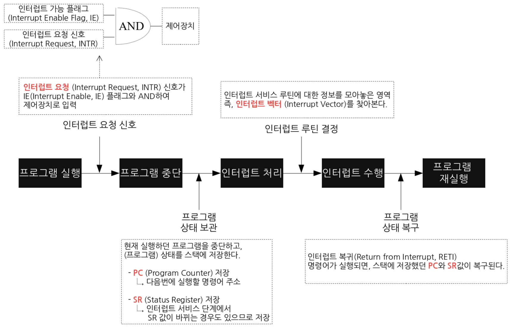
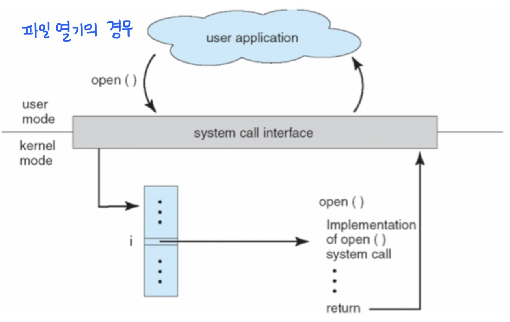

# 인터럽트, 오버헤드, 시스템 콜
## 인터럽트
**CPU가 특정 기능을 수행하는 도중에 급하게 다른 일을 처리하고자 할 때 사용**   
(CPU는 한 순간에는 하나의 일 밖에 처리할 수 없기 때문에 어떤 일을 처리하는 도중에 우선순위가 급한 일을 처리할 필요가 생김)
<br></br>
### 과정




1. 명령어 사이클은 인출과 실행, 두 가지 단계를 반복해서 수행하며, 실행 단계를 마칠 때마다 CPU는 반복적으로 인터럽트 요청이 있는지 계속해서 확인함 
2. 인터럽트가 발생하면, 현재 컴퓨터는 처리하던 일을 중지하고 현재의 컴퓨터 상태(CPU 내부의 레지스터, 메인 메모리 내용 등)을 저장함
3. 해당하는 인터럽트를 처리해주기 위한 인터럽트 서비스 루틴(인터럽트 핸들러)을 처리함

```c
* 인터럽트 서비스 루틴(인터럽트 핸들러) - 실제 인터럽트를 처리하기 위한 루틴, 운영체제의 코드 영역에는 인터럽트별로 처리해야할 내용이 이미 프로그램 되어 있음
* 인터럽트 벡터 - 인터럽트 발생 시 처리해야 할 인터럽트 핸들러의 주소를 인터럽트 별로 보관하고 있는 테이블
```

4. 인터럽트 처리 이후 저장되었던 이전 작업의 상태를 복구하고 이전 작업 수행을 재개함

+) 여러 개의 인터럽트가 동시에 발생할 경우, **인터럽트 우선순위**에 따라 인터럽트를 처리함 
(전원 공급의 이상 > CPU의 기계적인 오류 > 외부 신호에 의한 인터럽트 > 입출력 전송 요청/완료/오류 > 프로그램 검사 > 수퍼바이저 호출)
<br></br>
### 종류

1. **외부 인터럽트** - 입출력 장치, 타이밍 장치, 전원 등의 외부적인 요인에 의해 발생하는 인터럽트
    - 전원 이상 인터럽트 - 정전이나 전원에 이상이 있는 경우
    - 기계 고장 인터럽트 - CPU 등에 기능적인 동작 오류가 발생한 경우
    - 입출력 인터럽트 - 입출력 준비가 완료되었음을 알리기 위해 인터럽트를 요청
  
2. **내부 인터럽트** - 잘못된 명령이나 데이터를 사용할 때 발생하는 인터럽트 
    - 0으로 나누는 경우
    - 오버플로우, 언더플로우
    - 프로그램 상의 오류

<br></br>

## 오버헤드
**어떤 처리를 하기 위해 들어가는 간접적인 처리 시간 및 메모리**
ex) A 작업을 단순하게 실행한다면 10초가 걸리지만, 안전성을 고려하고 부가적인 B 처리를 추가한 결과 처리시간이 15초가 걸렸다면 오버헤드는 5초가 됨    

즉, 오버헤드는 반드시 존재하지만 오버헤드를 줄이는 것이 좋은 것!

<br></br>

## 오버플로우
**컴퓨터의 정수 연산의 계산 결과가 허용 범위를 초과할 때 발생하는 오류** 

- **양수이든 음수이든 범위를 벗어나면 모두 오버플로우임!**
- 산술 언더플로우는 부동소수점 연산에서 지수부가 타입의 한계를 넘어 작아지면 0에 가까워지다가 결국 0이 되어버리는 현상임

ex) 부호 없는 8비트의 데이터를 저장할 수 있는 메모리라면, 1111 1111에서 1을 증가시키면 최댓값의 범위를 넘어서기 때문에 최소값인 0000 0000으로 되돌아가게 됨 

1. 스택 오버플로우 - 메인 메모리 내 스택 영역에서 스택 메모리가 모자라는 순간 생기는 오류 
2. 버퍼 오버플로우 - 버퍼란 데이터가 저장되는 메모리 공간. 프로그램이 실행될 때 버퍼의 크기보다 많은 입력을 받는다면 버퍼 오버플로우가 발생하게 됨 (이 경우 해커가 특정 메모리 값을 임의로 변조할 수 있게 됨)
3. 힙 오버플로우 - 메인 메모리 내 힙 영역에서 발생하는 버퍼 오버플로우의 한 종류

<br></br>

## 시스템 콜
운영체제의 커널이 제공하는 서비스에 대해, **응용 프로그램의 요청에 따라 커널에 접근하기 위한 인터페이스**

> 일반적인 프로그램들은 사용자 모드에서 실행되므로 커널 모드에 대한 직접적인 접근이 불가능하지만, 커널에 접근할 수 없으면 사용자 모드의 프로세스들이 파일을 쓰거나 불러올 수 없고 그래픽 처리와 같은 거의 모든 작업을 할 수 없음
→ 커널에 요청하여 커널 모드에서 처리하고 그 결과를 사용자 모드의 프로그램에게 전달하는 것
> 


<br></br>
### 유형
- 프로세스 컨트롤 - 프로세스 생성/종료, 메모리에 로드/실행, 프로세스 속성 값 확인/지정, wait/signal, 메모리 할당
- 파일 매니지먼트 - 파일 생성/삭제, 열기/닫기, 읽기/쓰기, 파일 속성 값 확인
- 디바이스 매니지먼트 - 디바이스 요청/해제, 읽기/쓰기, 디바이스 속성 확인
- 정보 관리 - 시간 확인/지정, 시스템 데이터 확인/지정, 프로세스/파일/디바이스 속성 가져오기
- 통신 - 커뮤니케이션 연결 생성/삭제, 메시지 송수신, 상태 정보 전달, remote 디바이스 해제 및 장착
- 보안 - Permission 획득/설정
<br></br>
### CPU 모드
CPU는 **사용자 애플리케이션이 시스템을 손상시키는 것을 방지하기 위해** 2가지 모드를 제공함
CPU에 있는 Mode bit로 모드를 구분하며 0은 커널 모드, 1은 사용자 모드를 나타냄

- **사용자 모드** - 사용자 애플리케이션 코드 실행. 사용자가 접근할 수 있는 영역에 제한이 있기 때문에 해당 모드에서는 하드웨어에 직접적으로 접근할 수 없음 → 접근을 위해서 **시스템 콜을 사용**해야 함
- **커널 모드** - 운영체제가 CPU를 사용하는 모드. 하드웨어를 제어하는 명령어를 실행함


<br></br>
### 과정
1. 실행 코드
```c
int main(void) {
	...
	printf("Hello");   
	// printf는 stdio.h에 있는 라이브러리 함수
	// = printf() { write(...) }와 같음 -> write는 시스템 콜 함수임(커널 모드 I/O)
	...
}
```

2. 컴파일
```c
...   <- (1) 매개변수 관련 명령어
movl 5, %eax   <- (2) EAX 레지스터에 시스템 콜 정보 저장 
int $0x80   <- (3) 인터럽트를 발생시키는 명령어 
```

3. 인터럽트가 발생하면 CPU는 커널 모드로 넘어가고 모드 비트도 1로 바뀜 
4. 인터럽트 핸들러는 어떤 시스템 콜인지를 약속된 레지스터에서 확인하고 시스템 콜 함수를 실행함
5. 작업이 다 끝나면 유저모드로 되돌아감 

<br></br>
<br></br>

### 출처
[https://namu.wiki/w/인터럽트](https://namu.wiki/w/%EC%9D%B8%ED%84%B0%EB%9F%BD%ED%8A%B8)   
[https://whatisthenext.tistory.com/147](https://whatisthenext.tistory.com/147)    
[https://velog.io/@adam2/인터럽트](https://velog.io/@adam2/%EC%9D%B8%ED%84%B0%EB%9F%BD%ED%8A%B8)    
[https://ko.wikipedia.org/wiki/오버헤드](https://ko.wikipedia.org/wiki/%EC%98%A4%EB%B2%84%ED%97%A4%EB%93%9C)    
[https://namu.wiki/w/오버플로](https://namu.wiki/w/%EC%98%A4%EB%B2%84%ED%94%8C%EB%A1%9C)     
[https://she11.tistory.com/123](https://she11.tistory.com/123)     
[https://namu.wiki/w/시스템 콜](https://namu.wiki/w/%EC%8B%9C%EC%8A%A4%ED%85%9C%20%EC%BD%9C)    
[https://velog.io/@nnnyeong/OS-시스템-콜-System-Call](https://velog.io/@nnnyeong/OS-%EC%8B%9C%EC%8A%A4%ED%85%9C-%EC%BD%9C-System-Call)     
[https://hasensprung.tistory.com/176](https://hasensprung.tistory.com/176)        
[https://codybuilder.com/41](https://codybuilder.com/41)    
