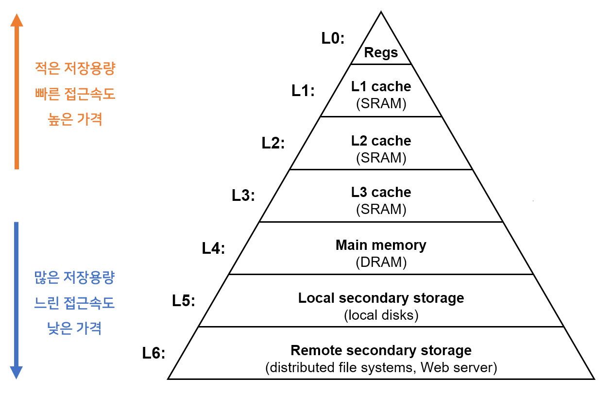
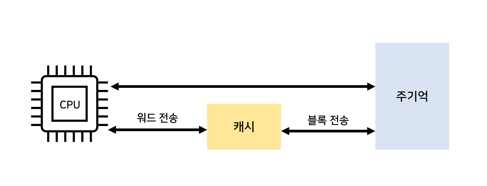
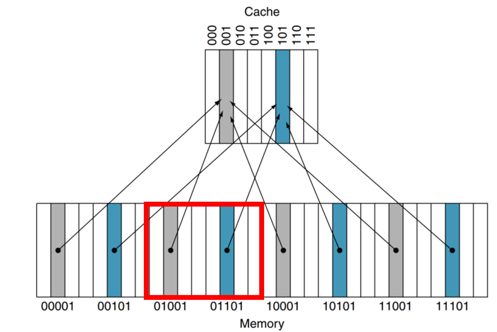
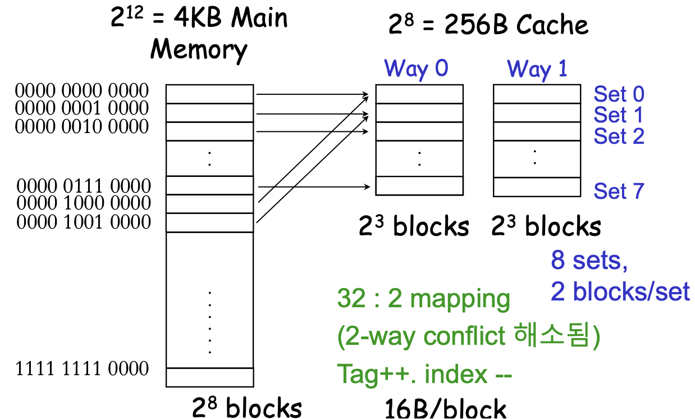

# 캐시

## A. 개념

- CPU와 주기억장치 사이의 속도 차이에 따른 성능 저하를 줄이기 위해 설치하는 초고속 기억장치.
- 주기억장치(RAM)에 저장된 명령어(데이터)일부를 저장하고 있다가 CPU에 빠른 속도로 제공한다.
- CPU가 자주 접근하거나 최근에 접근한 메모리 블록을 저장하는 초고속 기억장치.
- 하드웨어에 의해 모든 처리가 이뤄진다.
- 주로 SRAM기반이기 때문에 (상대적으로) SDRAM보다 지연시간이 거의 없다.
    
    
    
- SRAM vs SDRAM 간단 비교(➡️RAM 종류)
    - SRAM(Static RAM) : 플립플롭으로 이뤄짐, 소비전력⬆️집적도⬇️가격⬆️, 대용량으로 할 필요는 없지만 빠른 속도가 필요할때.
    - SDRAM(Synchronous Dynamic RAM) :  커패시터 이용, 제어장치 입력을 clk 펄스와 동시에 일어나도록함(동기식), = 클럭마다 cpu와 정보를 주고받는 DRAM(대용량, 집적도⬆️, 가격⬇️, 주기억)

## B. 동작원리

1. CPU는 명령어(데이터)를 인출하기 위해 주기억장치보다 캐시 기억장치를 먼저 조사함.
2. CPU는 캐시에 원하는 데이터가 있는지 조사하고 없으면 캐시는 주기억에서 블록단위로 데이터를 가져옴. 이후 캐시는 워드 단위로 CPU로 데이터 전송

3. 캐시는 CPU가 필요로 하는 명령어와 데이터를 가지고 있다가 필요할 때 전송하여 신속하게 처리함. > 참조 지역성 성질 때문
- CPU가 주기억에서 데이터를 읽을 때, 해당 데이터를 포함, 참조지역성에 따라 선택된 많은 데이터를 읽어와 캐시에 미리 Load함.
- 그러면 다음에 주기억에 접근할걸 캐시에서 불러오므로 메모리 접근에 필요한 지연시간을 크게 줄일 수 있다.
- 캐시가 가득 차면, 새로운 데이터를 쓰기 위해 일부 데이터를 지우는데, 지울 내용이 CPU에 의해 바뀌어 있다면 같은 SDRAM메모리 주소를 참조하는 다른 CPU와의 캐시 일관성을 위해 데이터를 업데이트

### (참조) 지역성

짧은 시간 동안 CPU가 주기억장치를 참조할때, 제한 영역에서만 참조가 이루어지는 것.

1. 시간지역성 (temporal locality) : CPU는 최근에 접근했던 메모리 공간에 다시 접근하려는 경향이 있음.
2. 공간지역성 (spatial locality) : CPU는 접근한 메모리 공간 근처를 접근하려는 경향이 있음.
- 큰 의미에서 공간지역성의 특수한 경우가 시간지역성

## C. 캐시 사상(Mapping)기법

- 주기억과 캐시 사이의 정보를 옮기는 기법
- 어떤 주기억 블록들이 어느 캐시라인을 공유할 것인지 결정해주는 방법
- 캐시라인의 수가 주기억의 블록수보다 적기 때문에 주기억 블록을 캐시라인으로 매핑해주는 사상함수가 필요하다.
- 사상함수 : 주기억정차의 한 개의 블록을 캐시라인에 배정하는 규칙을 제공하는 알고리즘.

### 1) 직접 매핑(Direct Mapping)

- 주기억장치 블록이 지정된 하나의 캐시라인으로만 적재(1:1대응)
- 하드웨어 구성이 간단, 구현비용 적음 (교체방식 신경 쓸 필요x)
- 캐시 위치가 고정되므로 적중률이 낮다.
- 캐시 블록사이즈가 8이므로 메모리를 8개로 나눠 매핑함.
- 메모리 주소 00001이 캐시의 001에 이미 위치하면 다른 메모리가 들어가기위해 교체가 필요.
(캐시블록비트가 3bit = 메모리 블록 하위 3bit를 인덱스로 사용
캐시블록 범위는 000(2)~111(2) 이고 00000, 01000, 10000, 등 하위3비트가 000이면 캐시000에 매핑)
    
    
    

### 2) 연관 매핑(Associative Mapping)

주기억 블록이 캐시의 어떤 라인으로든 적재가능 (캐시 라인번호와 메모리 블록번호가 무관)

저장 속도가 빠르고, 새로운 블록이 캐시로 읽힐때 교체 융통성 있음.

가격이 높은 연관기억장치와 복잡한 주변회로 필요 (교체 방식 고려해야함)

CPU가 요청한 태그를 모든 태그와 비교하므로 병렬비교가 필수이고 고가의 메모리 필요. 

### 3) 세트-연관 매핑(Set-Associate Mapping)

블록을 여러 집합을 이루어, 집합 내에서 어떤라인으로든 적재가능

연관매핑+직접매핑 합친 방식.

N개 이상 블록으로 구성된 집합방식 = N-방향 집합 연관 사상

캐시 집합번호 = 메모리 블록번호 % 집합수

- 캐시블록 8개, 2-방향 연관사상
- 집합크기2개 = 캐시집합수 4개(2^2) = 메모리 블록 하위 2비트를 인덱스 필드로 사용.
- 00000, 00100, …11100은 하위 비트가 00이므로 동일 캐시 집합에 매핑

일부 태그에 대해 탐색을 수행하므로 비교횟수가 적다.

- 2^5=32메인메모리블록이 2-연관 세트 매핑
- tag:5bit(각 32개 구분), index : 3bit(캐시가 2^3=8set) , offset:4bit

## D. 쓰기(기록) 정책(Write Policy)

프로세스가 수행될 때 나타나는 지역성을 응용해서, 캐시 메모리에서 변화된 캐시의 내용을 주기억장치에 기록하는 방법

서비스 특성에 따라 어떤 정책을 쓸지 결정함.

캐시 구현 예제 ➡️ [Google Guava Cache](https://wnsgml972.github.io/database/2020/12/13/Caching/)

### 1) Write-Through

- 쓰기 동작이 이뤄질 때마다 캐시 메모리와 주기억장치의 내용을 동시에 갱신하는 방식
- 캐시에 적재된 블록 내용과 주기억에 저장된 블록 내용이 항상 같다.
- 모든 쓰기 동작이 주기억장치에 쓰는 동작을 포함하므로, 쓰기 동작에 걸리는 시간이 길다.
    - 이를 방지하기 위해  Write buffer를 추가하는 방식이있음(Write-back에서도 사용)
- 데이터 loss가 발생하면 안되는 상황에서 사용
- write-through 정책을 사용하는 서비스 예) AWS DynamoDB Accelerator(DAX) : 

### 2) Write-Back

- 우선 캐시에만 데이터를 Write해 사용하다가 캐시 메모리가 새로운 데이터 블록으로 교체 될 때 데이터를 주기억장치에도 저장하는 방식
- 캐시 메모리에 있는 데이터를 여러번 overwite하여 사용후, 캐시가 해제될 때 메인 메모리에 데이터 업데이트
- 캐시 와 주기억에 내용이 서로 다른 경우 발생가능([캐시 일관성](#e-캐시-일관성) 불일치 문제)
- 속도는 빠르지만 구현이 어렵다.  > 빠른 서비스를 요구하는 상황에서 사
- 캐시에 데이터가 overwite 될때마다 새로운 Status Bit 또는 Dirty Bit를 설정하며 실제 메모리 저장소에 데이터가 Write되는 동작이 늦다보니 Lazy Write라고도 함.

### 3) Write-Once

- 캐시에 쓰기 동작이 이루어질때 한 번만 기록하고 그 이후의 기록은 모두 무시하는 방식

## E. 캐시 일관성

- 멀티 코어 시스템에서는 다른 코어에 의해 메모리 데이터가 변경될 수 있으므로, 현재 캐시에 저장되어 있는 데이터가 메모리의 최신 상태와 같다고 보장할 수 없다. > 데이터 일관성 유지x
- 메모리 내용을 갱신하는 경우 이 사실을 다른 코어들에게 전달하고 각 코어의 기존 데이터를 무효화하는 과정
- 캐시 일관성이 끼지는 경우는 주로 DMA와 CPU간의 동일한 메모리 주소를 참조하는 데이터를 동시에 바라보고 있을 시 발생. > Cache Flush, Cache clean, MMU의 Page table을 Cacheable/Non-Cacheable로 구분하는 방법 등으로 해결
- (DMA에 이용하는 메모리 속성이 Cacheable이라서 캐시 일관성이 캐지므로 메모리 속성을 Non-Cacheable로 변경하면 해결된다.)
- DMA : 직접메모리접근 ➡️I/O 제어유형
- MMU : 메모리 관리 장치 , CPU가 메모리에 접근하는 것을 관리하는 컴퓨터 하드웨어 장치

## F. 기억장치 평균 접근시간

- 캐시 적중(Cache Hit) : CPU가 원하는 데이터가 이미 캐시에 있는 상태
- 캐시 미스(Cache Miss) : CPU가 원하는 데이터가 캐시에 없는 상태
- 캐시 적중률(Cache Hit Ratio) : 캐시 적중횟수 / 전체 기억장체 액세스 횟수
- 캐시 실패율(Cache Miss Ratio) : 1 - 캐시 적중률
- 기억장치 평균접근시간 = 액세스시간 : 캐시 적중률 X 캐시 접근시간 + 캐시 실패율 X 주기억 접근시간

>💡 **추가 내용**   
>연관기억장치(Asscociative )   
>복수모듈 기억장치 (메모리 인터리빙)  

---

# 면접질문

캐시가 무엇인가요?

캐시 Hit Rate를 높이기 위한 지역성 원리에 대해 설명해주세요.

    
(참고)[웹]캐시, 쿠기, 세션의 차이점은?

    

    소프트웨어적 캐시로 웹 브라우저의 쿠키, 로컬스토리지, 세션 스토리지가 있다.<bt>
    <ul>
    <li> 캐시 : 사이트를 불러 올 때 사진등을 접속 때마다 불러오면 데이터 낭비이므로 데이터나 값을 미리 복사해 임시로 저장해두는 저장소를 포괄하여 캐시라고 한다.</li>
    <li>쿠키 : 만료기한이 있는 키-값 저장소, same site 옵션을 strict로 설정하지 않았을 경우 다른 도메인에서 요청했을 때 자동전송, 4KB까지 데이터 저장가능, 만료기한 정할 수 있음. ex) 특정 웹서버에 접속시 생성되는 아이디, 비밀번호 등 방문한 사이트 정보를 담은 임시파일</li>
    <li>로컬 스토리지 : 만료기한이 없는 키-값 저장소. 10MB 까지 저장가능, 웹브라우저를 닫아도 유지되고, 도메인단위로 저장, 생성</li>
    <li>세션 스토리지 : 만료기한이 없는 키-값 저장소, 탭 단위로 세션 스토리지 생성, 탭을 닫을 때 해당 데이터 삭제. 5MB까지 저장가능. 로그인 정보를 유지하는 것에 사용</li>
    </ul>
    

    
# 출처
- [https://shuu.tistory.com/49](https://shuu.tistory.com/49)
- 직접매핑 [https://hi-guten-tag.tistory.com/282](https://hi-guten-tag.tistory.com/282)
- [https://brorica.tistory.com/entry/11-캐시-메모리-24-사상mapping](https://brorica.tistory.com/entry/11-%EC%BA%90%EC%8B%9C-%EB%A9%94%EB%AA%A8%EB%A6%AC-24-%EC%82%AC%EC%83%81mapping)
- [https://gofo-coding.tistory.com/entry/5-Set-Associative-Mapping](https://gofo-coding.tistory.com/entry/5-Set-Associative-Mapping)
- [책]2023수제비 전자계산기조직응용기사 실기책
- [https://milkcaramel66.tistory.com/33](https://milkcaramel66.tistory.com/33)
- [책]면접을 위한 CS전공지식 노트
- [write-through](https://wnsgml972.github.io/database/2020/12/13/Caching/)
