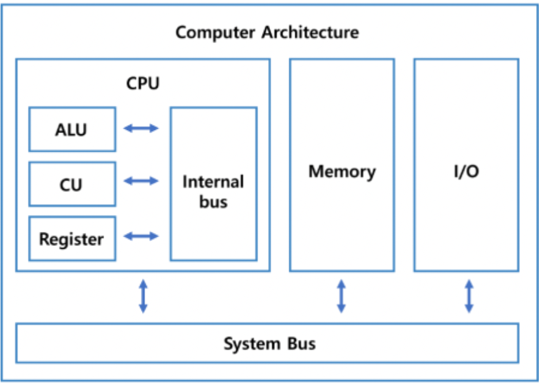
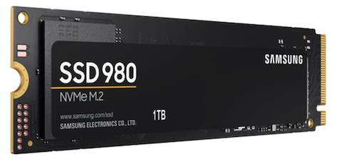
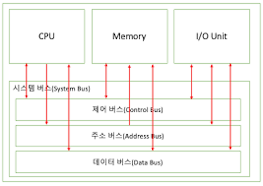

# 컴퓨터의 구성요소

## 컴퓨터의 구성요소

- 하드웨어
- 소프트웨어

# 하드웨어

### 1. CPU(중앙처리장치)

프로그램의 실행과 데이터 처리를 담당하는 핵심 장치 (=프로세서)

- **제어장치 CU**(Control Unit) - 데이터의 흐름 제어
- **연산장치 ALU**(Arithmetic and Logic Unit) - 데이터 처리를 위한 산술연산과 논리연산 담당
- **레지스터 Register** - CPU 내부에서 처리할 명령어나 연산에 필요한 임시 데이터 저장
- **Internal Bus** - 데이터 이동

### 2. 기억장치(Memory)

프로그램, 데이터 등을 저장

### 2-1. 보조기억장치

- 컴퓨터에게 필요한 모든 정보를 반영구적으로 저장
- 대용량 데이터를 저장할 수 있지만, 데이터를 읽고 쓰는 속도가 느림
- CPU와 직접적으로 소통할 수 없음
- 예시 - SSD, HDD

<aside>
👉🏻 **SSD(Solid-state drive)**

</aside>

- 전기적으로 데이터를 저장하여 물리적으로 회전하거나 움직이는 요소가 없음
- HDD에 비해 훨씬 빠름
- 비싸다는 단점

<aside>
👉🏻 **HDD(Hard Disk Driver)**

</aside>

- 물리적인 디스크를 고속으로 회전시켜 데이터를 저장하는 장치
- 충격에 약하며 소음이 다소 발생
- SSD가 나오면서 최근에 많이 소멸되는 추세

### 2-2 주기억장치

- 컴퓨터가 프로그램을 수행하는 동안 필요한 모든 데이터들을 저장
- 예시 - RAM, ROM

<aside>
👉🏻 **RAM**

</aside>

- 읽고 쓰기가 가능
- 응용 프로그램, 운영체제 등을 불러와 CPU가 작업할 수 있도록 하는 기억장치
- 임의 접근이 가능한 메모리
- 전원을 끄면 데이터가 사라지는 휘발성 메모리 > 그럼에도 쓰는 이유는 속도가 빠르다

<aside>
👉🏻 **ROM**

</aside>

- 전원이 끊어져도 기록된 데이터들이 소멸되지 않는 비휘발성 메모리
- 오직 기억된 데이터를 읽기만 가능한 장치
- 시스템에 기억시키고 변화시키면 안 되는 주요 데이터가 저장됨

### 2-3 캐시 메모리

- CPU가 사용한 데이터와 관련된 데이터 중 재사용 가능성이 높은 데이터를 주기억장치로부터 미리 임시 저장

---

### 3. 입출력 장치

### 3-1. 입력장치

사용자로부터 컴퓨터로 데이터를 입력받는 장치

ex) 키보드, 마우스, 마이크, 트랙패드 등

### 3-2. 출력장치

컴퓨터로부터 사용자에게 이해할 수 있는 형태로 데이터를 출력해주는 장치

ex) 모니터, 스피커, 프린터 등

---

### 4. 시스템 버스

CPU를 포함한 각 하드웨어 장치 간의 통로(각 하드웨어 장치를 물리적으로 연결한 전선)

- 데이터 버스 - 하드웨어 간에 데이터를 전달하는 통로
- 주소 버스 - 데이터가 어디에 도착해야 하는지에 대한 정보를 전달하는 통로
- 제어 버스 - CPU의 제어장치가 생성한 제어 신호를 다른 장치로 전달하는 통로

---

## 소프트웨어

### 1. 시스템 SW

- 컴퓨터 시스템 전체를 운영하고 관리하는 소프트웨어
- 운영체제, 컴파일러, 어셈블러, 로더 등

### 2. 응용 SW

- 사용자의 특정한 직업이나 요구에 따라 개발된 소프트웨어
- 애플리케이션 또는 프로그램
- MS Office, 한글 등

---

*컴퓨터의 3대 구성요소 vs 5대 구성요소

3대 구성요소

- 중앙 처리 장치 CPU
- 기억 장치 Memory
- 입출력 장치

5대 구성요소

- 중앙 처리 장치
- 기억 장치
- 입력 장치
- 출력 장치
- 제어 장치

*32비트 CPU와 64비트 CPU 주요 차이점

- 주소 버스 크기
- 데이터 버스 크기
- 레지스터 크기
- 명령어 처리 속도
- 호환성
- 메모리 접근 한계

*시스템버스 구성하는 3가지 데이터 버스, 주소 버스, 제어 버스가 어디에 위치하는지

데이터 버스 → CPU와 메모리, 그리고 주변장치들 사이에 위치

주소 버스 → CPU와 메모리 사이에 위치

제어 버스 → CPU와 다른 주변장치들 사이에 위치

*RAM과 ROM에 각각 어떤 데이터가 저장되는지? 왜 둘다 필요한지?

RAM 저장하는 데이터 - 프로그램의 명령어, 실행 중인 프로세스의 작업 데이터, 사용자가 실행하는 애플리케이션, 운영체제 등

ROM 저장하는 데이터 - 주로 초기화 프로그램, 기본 입출력 시스템 (BIOS), 부팅 로더 등

- 둘 다 필요한 이유
    
    : RAM은 데이터를 빠르게 읽고 쓸 수 있어서 프로그램의 실행과 데이터 처리에 최적화되어 있다. 그러나 전원이 꺼지면 내용이 사라지기 때문에, 일시적인 작업에 사용된다
    
    → ROM은 읽기 전용이지만, 전원이 꺼져도 데이터가 유지되므로 컴퓨터의 부팅과 초기와 작업을 위해 사용된다.
    
    두 가지 메모리의 조합으로 컴퓨터가 안정적으로 동작하고 사용자의 요구를 처리할 수 있다.
    
- 면접예상질문
    
    
1. 시스템버스는 무엇인가요?
2. 컴퓨터의 3대 구성요소는?
3. 시스템 SW와 응용 SW 차이점에 대해 말해주세요

> 출처
> 

[https://hongong.hanbit.co.kr/컴퓨터의-4가지-핵심-부품cpu-메모리-보조기억장/](https://hongong.hanbit.co.kr/%EC%BB%B4%ED%93%A8%ED%84%B0%EC%9D%98-4%EA%B0%80%EC%A7%80-%ED%95%B5%EC%8B%AC-%EB%B6%80%ED%92%88cpu-%EB%A9%94%EB%AA%A8%EB%A6%AC-%EB%B3%B4%EC%A1%B0%EA%B8%B0%EC%96%B5%EC%9E%A5/)
