# 파일 시스템
# 1. 파일 관련 용어 및 개념

### 파일(File)

- 연관된 데이터들의 집합
- 의미있는(관련있는) 정보를 모든 논리적 단
- 파일은 각각 고유한 이름을 갖고있음.
- 주로 Record, Block 단위로 보조기억장치에 저장하여 사용.
- 파일 속성(File attribute)(또는 metadata)은 파일을 관리하기 위한 각종 정보로 파일자체의 내용은 아님. 파일이름, 유형, 저장위치, 파일사이즈, 접근권한, 소유자, 시간(생성/변경/사용) 등 전반적인 정보를 말함.

### 파일 시스템(File System)

- 운영체제와 모든 데이터, 프로그램의 저장과 접근을 위한 기법을 제공하는것.
- 시스템 내의 모든 파일에 관한 정보를 제공하는 계층적 디렉리 구조이고, 파일, 메타데이터, 디렉터리 정보 등을 관리함.

### [Directory](#2-directory)

- 파일을 관리하기 위한 특별한 형태의 파일

### Partitioning

- 저장장치의 논리적 영역을 나누는 것
- 연속된 저장공간을 하나 이상의 연속되고 독립적인 영역으로 나누어 사용할 수 있도록 정의한 규약.
- 일반적으로 하나의 물리적 디스크 안에 여러 파티션을 두지만, 여러 물리적 디스크를 하나의 파티션으로 구성할 수 도 있음.
- 파티션 : 나누어진 논리적 단위
- 파티션마다 다른 파일 시스템을 사용할 수 있음

### Formatting

- 파일시스템을 설정하여 어떤방식으로 저장하고 관리할지 결정하고 새로운 데이터를 쓸 준비를 하는 방법 → 파일시스템에 따라 결정됨

### 파일 디스크럽터(File descripter) = FCB;File Control Block

- 파일을 관리하기 위한 정보(메타데이터)를 보관하는 것, 유닉스에서는 inode
- 보조기억장치에 존재하다가 파일이 오픈되면 주기억으로 이동
- 파일시스템이 관리하며 사용자가 직접 참조할 수 없음.
- 파일마다 독립적으로 가지며 시스템마다 그 내용이 다르다.
- 파일명, 파일유형, 접근제어정보, 생성날짜와 시간, 사용횟수, 파일 구조등 으로 구성(이것들을 메타데이터라고 함.)

# 2. 파일 구조와 Access Methods

번역의 문제..?

## 1) 순차 접근/순차파일 (Sequential File/Access)

- 입력된 레코드(Data)를 논리적 순서에 따라 물리적 연속 공간에 순서대로 기록
- 물리적 순서 = 논리적순서 (아무튼 순서가 있다! [힙파일](#4-힙-파일-heap-file)과 구분)
- 카세트 데이프처럼 현재 위치에서 읽거나 쓰면 offset이 자동으로 증가하고, 뒤로 돌아가기 위해선 되감기가 필요.
- 검색 및 삽입 시 순차적으로 하므로 ➡️ 효율이 낮음(오래걸리고, 순서고려 필요)
- 삭제 시 주기적으로 재구성이 필요하다.
    - 주기적으로 처리하면 시간적 속도가 빨라지고 처리비용⬇️ 기억공간 활용⬆️
- 변동 사항이 크지 않고 기간별 일괄처리 하는 경우 적합
- 어떤 기억매체든 실행가능
    
    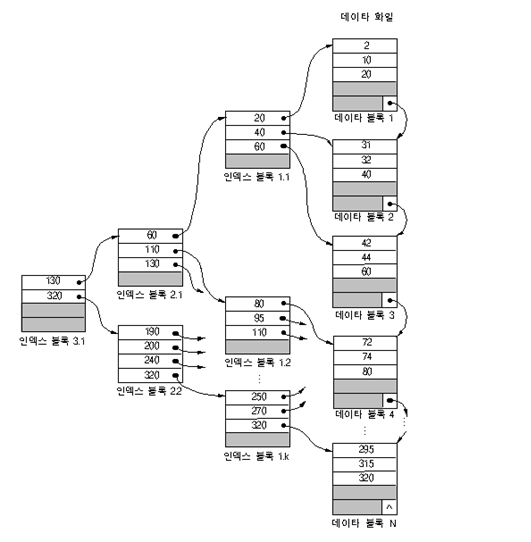
    

## 2) 직접 접근/직접 파일(Random Access/Direct File)

- 레코드가 직접 액세스 기억장치의 물리적 주소를 통해 직접 액세스
- 해싱 등의 사상함수를 통해 레코드 키에 의한 주소 계산을 통해 레코드에 접근할 수 있도록 구성(사상함수의 선정이 매우 중요해진다.)
- 특정 레코드 검색 시 효율적(key 값으로 직접 접근하니까!)
- LP판을 사용하는 방식과 동일
- 읽거나 쓰기 순서에 제약이 없으며 현재 위치를 유지할 수 있다면 순차접근도 지원가능

## 3) 색인 접근/색인 순차 파일(Indexed Sequential File)

- 파일에서 레코드를 찾기 위해 색인을 먼저 찾고, 대응되는 포인터를 얻는다. 이를 통해 직접접근하여 원하는 데이터를 얻을 수 있음.
- 순차접근방식과 직접접근방식이 결합된 형태
    
    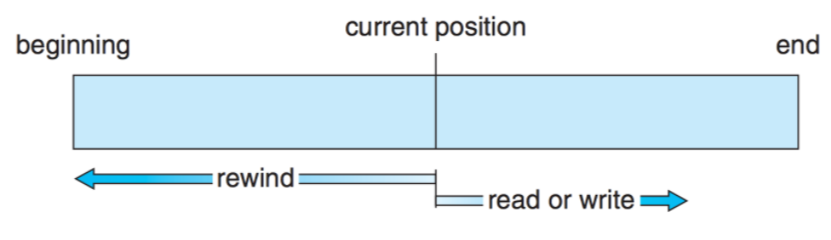
    
- 레코드를 키값으로 정렬하여 기록하고 키 항목만으로 모든 색인을 구성하여 편성.
- 효율적으로 검색하므로 삭제, 삽입, 갱신이 용이하다.
- 그래도 직접파일보다는 느리고 색인영역을 위한 기억공간이 필요하다.
- 다단계 인덱스 파일은 2단계 이상으로 index를 지정한 것으로 인덱스 탐색 과정을 줄일 수 있다.
- 아래 예시 파일 까지는 몰라도 됨.. 구정처기 범위.. 공부하려고 써둠
- ex) ISAM(Index Sequential Access Method)파일
    - 기본구역 Prime Area : 실제 레코드를 기록하는 부분 각 레코드는 키 값 순으로 저장
    - 인덱스 구역 Index Area : 기본 구역에 있는 레코드드르이 위치를 찾아가는 인덱스가 기록되는 부분.  트리인덱스 구역, 실린더 인덱스 구역, 마스터 인덱스 구역으로 구분
    - 오버플로우 구역 Overflow Area : 기본구역에 빈 공간이 없어 새로운 레코드의 삽입이 불가능할 때를 대비해 에비적으로 확보해 둔 구역
        - 실린더 오버플로우 구역 : 각 실린더마다 만들어지는 오버플로우 구역으로 해당 실린더의 기본구역에서 오버플로우된 레코드를 기록
        - 독립 오버플로우 구역 : 실린더 오버플로우 구역에 더 이상 오버플로우 된 데이터를 기록할 수 없을때 사용할 수 있는 예비 공간
- ex) VSAM(Virtual Stroage Access Method) 파일
    - 제어 구간 Control interval : 데이터 레코드가 저장되는 부분
    - 제어 구역 Control Area : 몇 개의 제어 구간을 모아 놓은 부분
    - 순차 세트 Sequential Set : 제어 구역에 대한 인덱스를 저장한 곳
    - 인덱스 세트 Index Set : 순차 세트의 상위 인덱스
    

## +4) 힙 파일 Heap file

- 파일 안에 레코드를 위한 공간만 있으면 임의의 레코드를 어디든 놓을 수 있는 구조
- 가장 단순하다. 레코드들이 삽입된 순서대로 파일에 저장된다. (= 비순서 파일구조, 순서가 필요가 없음)
- 삽입 : 맨끝이나 중간의 빈공간에 삽입가능
- 검색 : 원하는 레코드를 찾으려면 모든 레코드를 순차적으로 접근해야함
- 삭제 : 검색 후 삭제. 삭제된 레코드가 차지하던 공간을 재사용하지 않고 빈공간으로 남겨둔다. 좋은 성능을 유지하기 위해 주기적으로 빈공간을 회수하여 자유공간에 반환하는 재조직이 필요하다.
- 질의에서 모든 레코드를 참조하고 접근 순서가 중요하지 않을 때 사용하면 효율적이다.

## +5) 분할 파일

- 하나의 파일을 여러 개의 형태로 분할하여 저장하는 형태
- 분할된 파일은 여러개의 순차 서브팡리로 구성
- 백업과 같이 하드디스크 내용을 테이프와 같은 보조기억장치에 저장할 때 사용한다.
- 파일 크기가 클 경우 주로 사용한다.

# 2. Directory

- 파일 메타데이터 중 일부를 보관하고 있는 특별한 파일.
- 해당 디렉리에 담겨있는 대상의 정보를 갖고 있음
- 파일이 어디에 있는지에 대한 정보를 담은 파일
- 윈도우에서 Folder라고함
- 찾기Search, 생성Create, 삭제Delete, 디렉터리 나열LIst, 재명명Rename, 순회Traverse 기능을 제공

## 디렉터리 구조

### A) 1단계 디렉터리(Single-level Directory)

- 모든 파일들이 디렉터리 밑에 존재하는 형태.
- 파일이 서로 유일한 이름을 가지고, 서로 다른 사용자라도 같은 이름 사용 불가
- 지원(support)하고 이해하기 쉽지만, 파일이 많거나 사용자가 많아지면 시스템에 심각한 제약이 따름.
    
    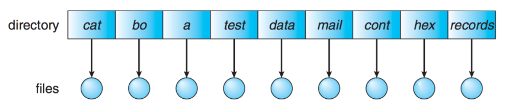
    

### B) 2단계 디렉터리(Two-level Directory)

- 각 사용자별로 별도의 디렉터리를 갖음
- UFD(user file dir) : 자신만의 사용자 파일 디렉터리
- MFD(master file dir) : 사용자의 이름과 계정 번호로 색인되어 있는 디렉터리. 각 엔트리는 사용자의 UFD를 가리킴
- 서로 다른 사용자가 같은 이름의 파일을 가질 수 있고 효율적인 탐색이 가능함.
- 그룹화가 불가능하고, 다른 사용자 파일에 접근할 경우 단점.

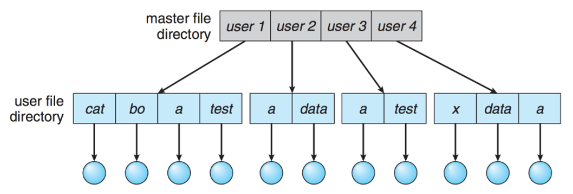

### C) 트리 구조 디렉터리(Tree-Structured Directory)

- 사용자가 자신의 서브 디렉터리를 만들어 파일을 구성할 수 있음.
- 하나의 루트 디렉터리를 가지며 모든 파일은 고유한 경로(절대경로 및 상대경로)를 가짐.
- 경로를 통해 효율적인 탐색이 가능하고 그룹화 가능
- bit를 사용하여 0이면 일반파일, 1이면 디렉터리로 구분한다.

### D) 비순환 그래프 디렉터리(Acyclic-Graph Directory)

- 디렉터리가 서브디렉터리와 파일을 공유할 수 있음. 트리 구조를 일반화한 형태.
- 단순한 트리구조보다 복잡하기 때문 문제 발생 가능성 ⬆️
- 파일을 무작정 삭제하면 현재 파일을 가리키는 포인터는 대상이 사라지므로, 참조되는 파일에 참조 계수를 두어 참조계수가 0이되면 파일을 참조하지 않는다는 의미이므로 그때 파일을 삭제할 수 있음.
    
    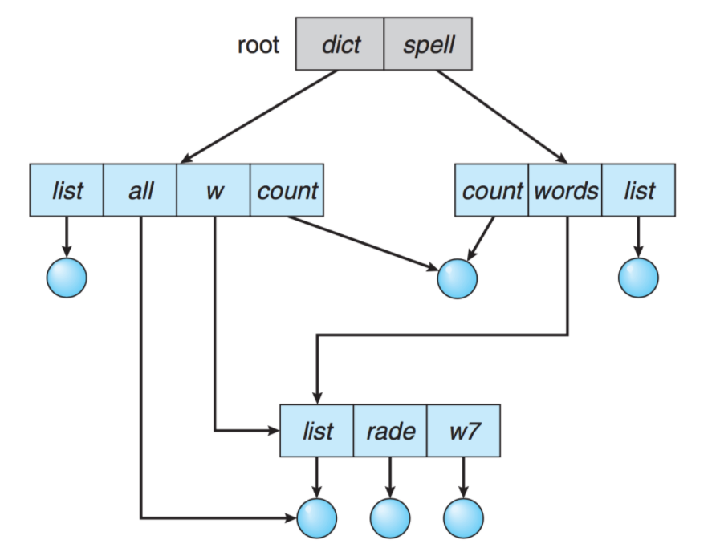
    

### E) 일반 그래프 디렉터리(General Graph Directory)

- 순환을 허용하는 그래프 구조
- 무한루프에 빠질 수 있으므로 하위 디렉터리가 아닌 파일에 대한 링크만 허용하거나 gabage collection을 통해 전체 파일 시스템을 순회하고, 접근가능한 모든 것을 표시한다.
- Garbage collection : 메모리 관리 기법. 프로그램이 동적으로 할당했던 메모리 영역 중 필요없게 된 영역을 해제하는 기능(링크 넣기)
    
    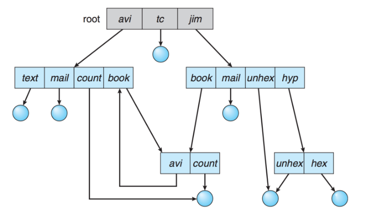
    

# 3. 파일 할당 방식 Allocation of File Data in Disk

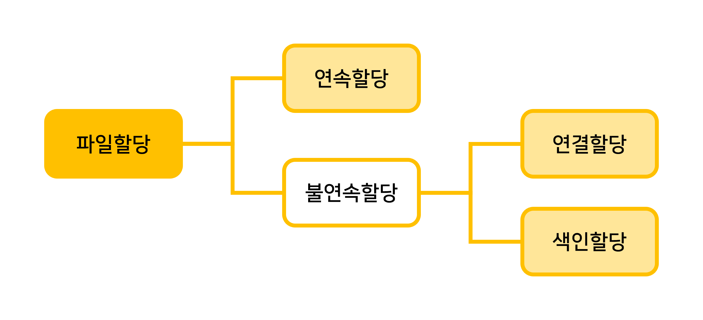

## 1) 연속할당

- 파일들을 디스크 내의 연속적으로 인접된 공간에 할당하는 방법
- 디스크 주소(블록단위)와 길이로 정의된다.
- ex) tr파일은 시작주소가 14이고 길이가 3이므로 14+0,14+1,14+2인 14,15,16을 차지함
    
    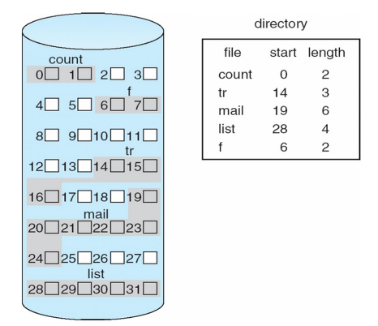
    
- 논리적으로 연속된 레코드들이 물리적으로 서로 인접하여 저장하므로 액세스 시간이 감소한다.
- 디렉터리는 파일 시작주소와 길이 정보만 있으면 되므로 단순하고 구현이 용이하다
- 새로 생성되는 파일의 기억공간의 크기를 미리 결정하여 외부 단편화 발생
- 파일 크기에 맞는 기억공간이 확보되지 않으면 그 파일은 생성되지 못함
- 공간 확보를 위해 재배치를 이용한 주기적인 압축이 필요함

## 2) 연결할당(Linked Allocation)

- 파일을 디스크 블록의 연결 리스트 모양으로 할당하는 방법
- 파일의 디스크 블록들이 흩어져 있다.
- 디렉터리는 파일의 첫번째와 마지막 블록에 대한 포인터를 갖는다.
- 각 디스크 블록에 주소를 저장하는 포인터 공간이 존재하며, 이것이 다음 블록을 가리킨다. 마지막 블록의 포인터 공간에는 끝임을 나타내는 값(-1)이 저장되어 있다.

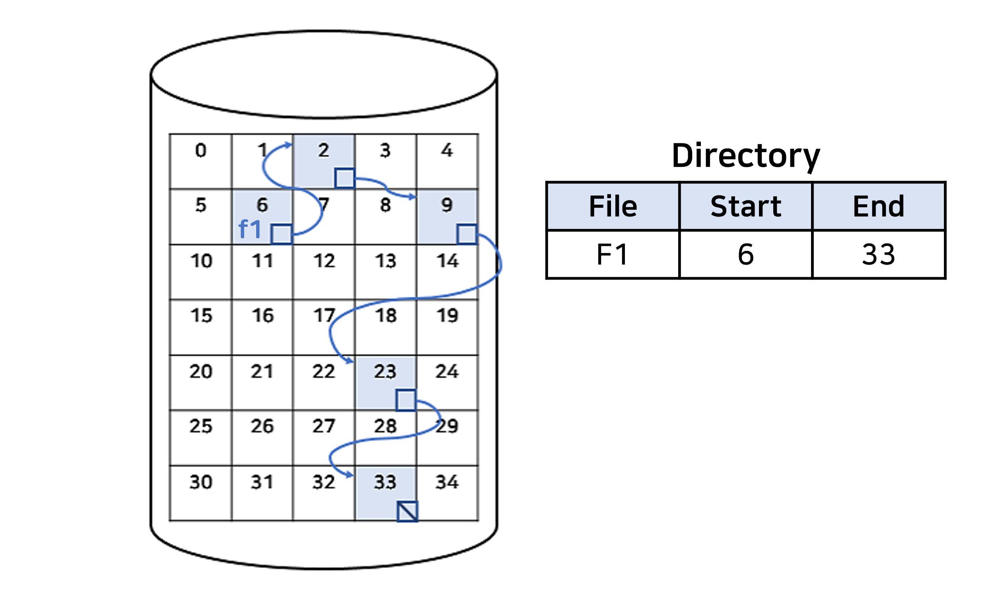

- 외부단편화가 없다.
- 모든 블록이 크기가 같기 때문에 자유공간 리스트의 어떠한 자유 블록을 이용해도 된다.
- 파일의 크기가 미리 고정될 필요가 없으므로 파일은 계속 커질 수 있다.
- 주기적으로 밀집화 할 필요가 없다.
- 순차적 접근 파일에만 효과적이다.(직접접근 방식에서는 비효율적 = 속도가 매우 느림)
- 포인터를 관리하기 위한 추가공간이 필요하다.
- 포인터를 잃어버리거나 잘못된 포인터 주소를 갖을 경우 결국 모든 자료를 잃는다.(낮은 신뢰성)

### 파일 할당 테이블 FAT(File Allocation Table)

- 연결할당을 개선한 것
- 파일이나 디렉토리의 위치정보(포인터)를 저장하는 테이블
- 디스크 헤드가 FAT정보를 읽어 임의 블록 위치를 알아내어 직접접근이 가능해진다.
- 포인터를 별도의 공간에 저장해, 신뢰성 문제를 해결한다.
    
    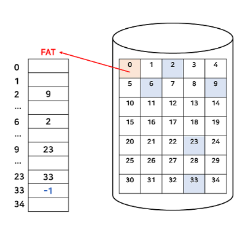
- FAT 테이블은 각 디스크마다 하나의 항목을 갖고 있고, 이 항목은 디스크 블록 번호를 색인으로 찾는다.
- 그리고 FAT는 일반적으로 메모리 캐싱을 사용하여 블록 위치를 찾는데는 빠르지만 실제 디스크 헤더가 움직는 것은 블록이 흩어져 있으므로 여전히 느리다고 볼 수 있다.
- FAT는 매우 중요한 정보이므로 **손실 시 복구를 위해 이중 저장**을 한다.
- FAT의 각 인덱스 크기는 전체 블록의 개수를 저장할 만큼의 크기를 가지고 있어야 하는데, 현재는 일반적으로 32bit 크기를 사용한다. 이를 FAT32라고 부른다. (이전에는 FAT16, FAT12 등이 있었다.)

## 3) 색인 할당(Indexed Allocation)

- 하나의 색인 블록을 두고, 이 색인 블록에 포인터를 모아두어 직접접근을 가능하게한 방법
- 각 파일은 디스크 블록 주소를 모아 높은 배열인 색인(index)블록을 가진다.
- 색인블록의 i번째 항목은 파일의 i번재 블록을 가리킨다.
- 디렉터리는 색인 블록의 주소를 갖는다.

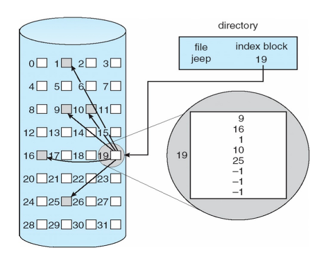

- 외부 단편화가 없다.
- 직접 접근, 순차접근이 가능하다.
- 연결할당의 포인터 오버헤드보다 더 포인터 오버헤드가 크다. (공간낭비, 작은 파일이라도 하나의 색인 블록이 할당 되고, 파일의 크기가 클 경우 인텍스 블록하나로는 모자랄 수 도 있음 - 블록크가 512bytes, 포인터4bytes라면 최대저장할 수 있는 블록 수는 128개 이므로 최대 파일 크기는 512*128 = 64KB이다.)
    - 해결방식으로 Linked, Mulilevelindex, combiled 가 있음. (궁금하면 추가 [https://velog.io/@codemcd/운영체제OS-18.-파일-할당](https://velog.io/@codemcd/%EC%9A%B4%EC%98%81%EC%B2%B4%EC%A0%9COS-18.-%ED%8C%8C%EC%9D%BC-%ED%95%A0%EB%8B%B9))

---

# 면접질문

- 파일 시스템이 필요한 이유는 무엇인가요?
    - 파일을 효율적으로 관리하고 쉽게 이용할 수 있도록 하기 위해서
- 파일 시스템의 기능은 무엇인가요?
    - 파일 할당, 접근, 보호, 일관성 유지 등이 있습니다.

# 출처

- [https://rebro.kr/181](https://rebro.kr/181)
- 파일시스템 전반 : [https://comyoung.tistory.com/109](https://comyoung.tistory.com/109)
- [https://velog.io/@codemcd/운영체제OS-18.-파일-할당](https://velog.io/@codemcd/%EC%9A%B4%EC%98%81%EC%B2%B4%EC%A0%9COS-18.-%ED%8C%8C%EC%9D%BC-%ED%95%A0%EB%8B%B9)
- [https://developerjun2.tistory.com/149](https://developerjun2.tistory.com/149)
- [https://middleware.tistory.com/entry/데이터-구조-및-파일-구조](https://middleware.tistory.com/entry/%EB%8D%B0%EC%9D%B4%ED%84%B0-%EA%B5%AC%EC%A1%B0-%EB%B0%8F-%ED%8C%8C%EC%9D%BC-%EA%B5%AC%EC%A1%B0)
- [https://jess2.tistory.com/85](https://jess2.tistory.com/85)