# 페이지 교체 알고리즘

# 정의

### 페이징 기법으로 메모리를 관리하는 운영체제에서,

### 페이지 부재가 발생하여 새로운 페이지를 할당하기 위해

### 현재 할당된 페이지 중 어느 것과 교체할지를 결정하는 방법

### 성능평가 기준

- 페이지 부재 횟수
- 페이지 성공 횟수

+유지 비용도 고려해야 함

# 종류

 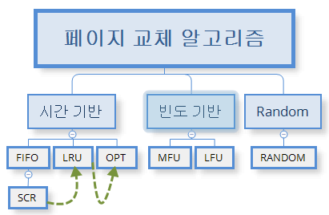

### 시간 기반

## 1. FIFO(First in First out) 선입선출

: 메모리에 가장 먼저 올라온 페이지를 먼저 내보낸다

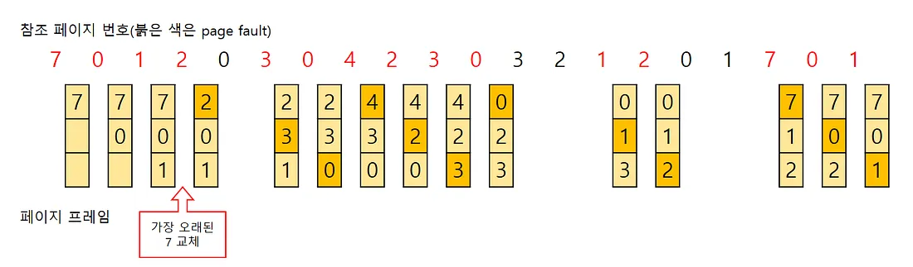
- 큐로 구현
- 메모리의 맨 위에 있는 페이지는 가장 오래된 페이지, 새로운 페이지는 항상 맨 아래
- 메모리가 꽉 차면 맨 위의 페이지가 나가고 나머지 페이지들은 위쪽으로 이동
- 새로운 페이지가 아래쪽의 남은 공간에 들어옴
- 메모리에 올라온 시간만 고려하기 때문에 자주 사용되는 페이지가 나가지면서
    
     성능이 떨어짐—>SCR 알고리즘으로 해결
    

## 1-1 SCR(Second Chance Replacement) 2차 기회 알고리즘

- FIFO와 공통점 : 큐 사용
- FIFO와 차이점
    
    : 특정 페이지에 접근하여 페이지 부재(page fault)없이 성공할 경우 
    
    해당 페이지를 큐의 맨 뒤로 이동하여 대상 페이지에서 제외한다는 것
    
    =성공한 페이지를 큐의 맨 뒤로 옮김으로써 기회를 한 번 더 줌
    

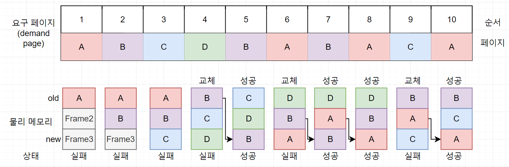

- 성능

LRU,LFU,NUR > SCR(2차 기회 알고리즘) > FIFO

- 단점
    - 큐를 유지하는 비용이 높다
    - 페이지가 성공하면 큐의 중간에 있는 값을 뒤로 이동하는 작업이 추가된다
- 2차 기회 페이지 교체 알고리즘은
    
    FIFO 페이지 교체 알고리즘을 변형한 것이기 때문에
    
    2차 기회 FIFO 페이지 알고리즘이라고도 한다
    

## 1-2 시계 알고리즘(clock algorithm)

## NUR=NRU(Not Used Recently, Not Recently Used)

- SCR와 차이점 : 원형 큐 사용
- 대상 페이지를 가리키는 포인터가 큐의 맨 바닥으로 내려가면 다음에는 다시 큐의 처음을 가리키는데, 시계처럼 한 방향으로 돈다

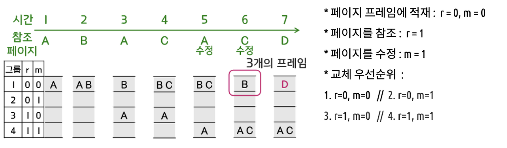

- 참조 비트 : 페이지가 참조되지 않았을 때는 0, 호출되었을 때는 1로 지정
- 변형 비트 : 페이지 내요이 변경되지 않았을 때는 0, 변경되었을 때는 1로 지정

## 2. OPT(Optimal) 최적 페이지 교체

: 앞으로 가장 오랫동안 사용되지 않을 페이지 교체

- 전제 조건 : 프로세스가 앞으로 사용할 페이지를 미리 알아야한다
    
    —> 구현이 불가능한 알고리즘
    
- 목적 : (실제 구현 목적보다) 다른 알고리즘과 비교 연구

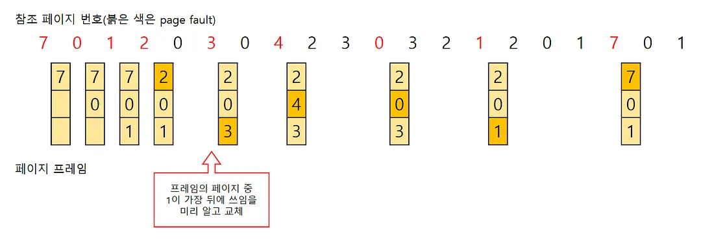

## 3. LRU(Least Recently Used)

: 가장 오랫동안 사용하지 않은 페이지를 교체

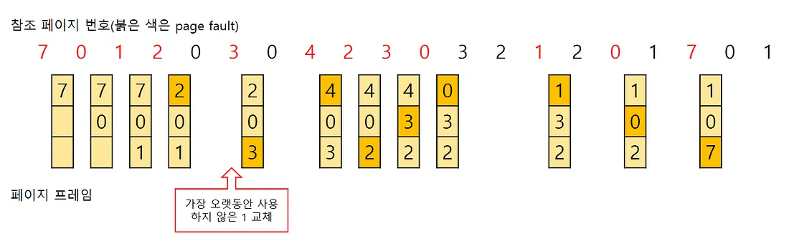

### 구현 방법

### 3-1 페이지 접근 시간에 기반한 구현

- LRU 페이지 교체 알고리즘의 가장 간단한 형태
- 페이지에 접근한 시간을 기록하여 구현

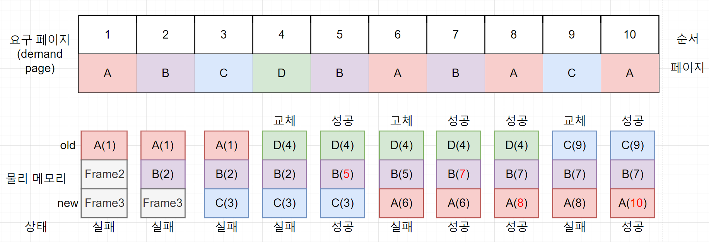

<aside>
💡 LRU 페이지 교체 알고리즘 vs FIFO 페이지 교체 알고리즘

- FIFO - 메모리에 올라온 시간을 기준으로 가장 오래된 페이지 교체
    
    LRU - 메모리에 올라온 페이지 중 가장 오래전에 사용된 페이지를 대상 페이지로
    
</aside>

- 메모리 접근 패턴을 변경하면 성능이 FIFO만큼 느려지기도 OPT만큼 좋아지기도 한다(성능 : OPT > LRU > FIFO)

### 3-2 카운터에 기반한 구현

- 페이지 접근 시간을 기록하여 구현하는 것 대신 카운터 사용
- 단점 : 추가적인 메모리 공간이 필요—>사용자가 사용할 수 있는 공간이 낭비

### 3-3 참조 비트 쉬프트 방식(reference bit shift)

: 각 페이지에 일정 크기의 참조 비트를 만들어 사용하는 것

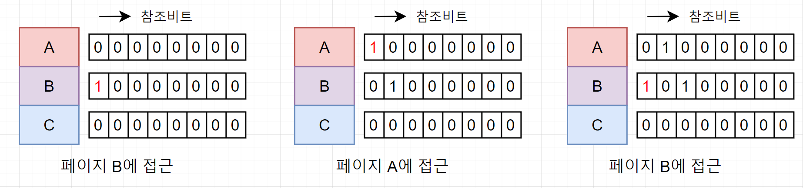

<aside>
💡 참조 비트 쉬프트 방식 vs LFU 페이지 교체 알고리즘

- LFU 페이지 교체 알고리즘은 페이지의 접근 횟수를측정하여 대상 페이지를 선정한다
- 참조 비트 쉬프트 방식은 참조한 횟수가 아니라, 참조한 시간을 기준으로 대상 페이지를 선정하므로 LRU 페이지 교체 알고리즘의 한 방식으로 분류된다

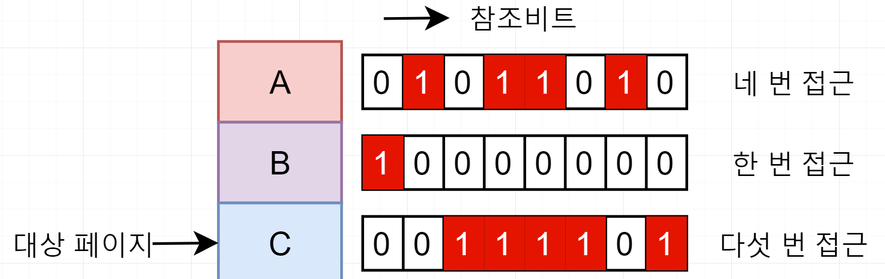
</aside>

### 반도 기반=계수 기반(Counting-****************************************Based)페이지 교체****************************************

: 페이지 참조 시마다 각 페이지가 현재가지 참조된 횟수를 카운팅하는 방법

## 4. MFU(Most Frequently Used)

: 참조 횟수가 가장 많은 페이지 교체

- 참조 횟수가 적은 페이지가 최근에 사용된 것이기 때문에 앞으로 사용될 가능성이 높다는 판단

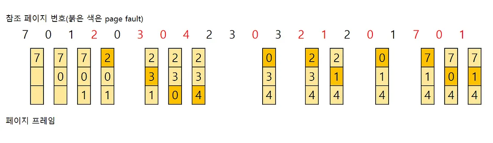
<aside>
💡 LFU와 MFU가 실제 사용에 잘 쓰이지 않는 이유

- 구현에 상당한 비용이 든다
- 최적 페이지 교체 정책을 (LRU 만큼) 제대로 유사하게 구현해내지 못한다
</aside>

## 5. LFU(Least Frequently Used)

: 참조 횟수가 가장 낮은 페이지를 교체

- 만약 교체 대상인 페이지가 여러개일 경우,
    
    LRU 알고리즘을 따라 가장 오래 사용되지 않은 페이지로 교체
    

 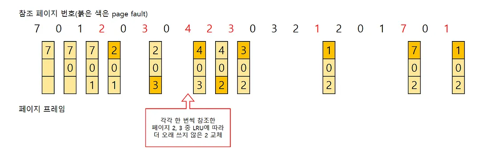

- 문제점
    
    : 초기에 한 페이지를 집중적으로 참조하다가 이후 다시 참조하지 않는 경우
    
    -앞으로 사용하지 않아도 초기에 사용된 참조횟수가 높아 메모리에 계속 남아있다
    

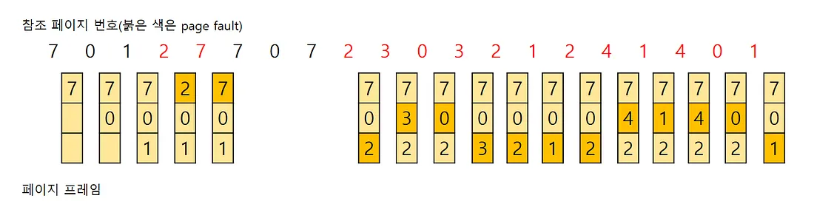

### Random 기반

## 6. 무작위 페이지 교체 알고리즘(random page replacement algorithm)

- 특별한 로직없이 무작위로 쫒아낼 페이지 선정
- 가장 간단하게 구현 가능
- 자주 사용하는 페이지가 대상 페이지로 선정되기도 함
- 성능 안 좋아서 잘 사용되지 않음

> 출처
> 

[https://velog.io/@chappi/OS는-할껀데-핵심만-합니다.-17편-페이지-교체-알고리즘FIFO-LRU-LFU-NUR-2차-기회-알고리즘-시계-알고리즘#82-시계-알고리즘clock-algorithm](https://velog.io/@chappi/OS%EB%8A%94-%ED%95%A0%EA%BB%80%EB%8D%B0-%ED%95%B5%EC%8B%AC%EB%A7%8C-%ED%95%A9%EB%8B%88%EB%8B%A4.-17%ED%8E%B8-%ED%8E%98%EC%9D%B4%EC%A7%80-%EA%B5%90%EC%B2%B4-%EC%95%8C%EA%B3%A0%EB%A6%AC%EC%A6%98FIFO-LRU-LFU-NUR-2%EC%B0%A8-%EA%B8%B0%ED%9A%8C-%EC%95%8C%EA%B3%A0%EB%A6%AC%EC%A6%98-%EC%8B%9C%EA%B3%84-%EC%95%8C%EA%B3%A0%EB%A6%AC%EC%A6%98#82-%EC%8B%9C%EA%B3%84-%EC%95%8C%EA%B3%A0%EB%A6%AC%EC%A6%98clock-algorithm)

[https://devuna.tistory.com/128](https://devuna.tistory.com/128)

> 면접 질문
> 
1. 페이지 교체 알고리즘에 대해 알려주세요
2. 페이지 교체 알고리즘 종류에는 어떤 것들이 있나요?
