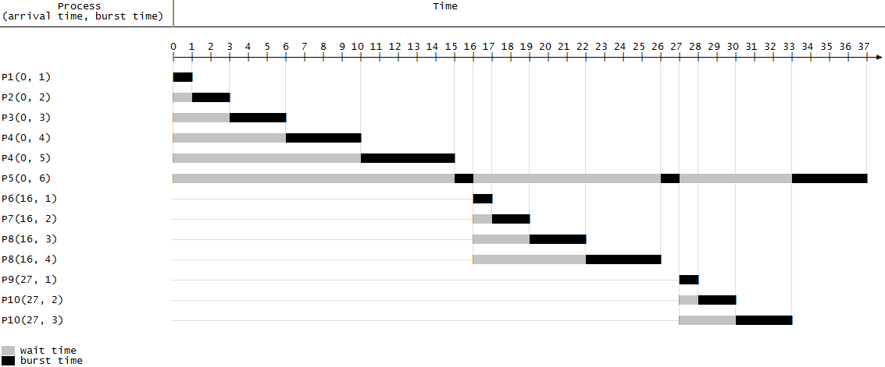
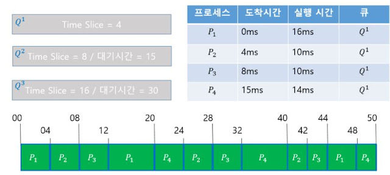
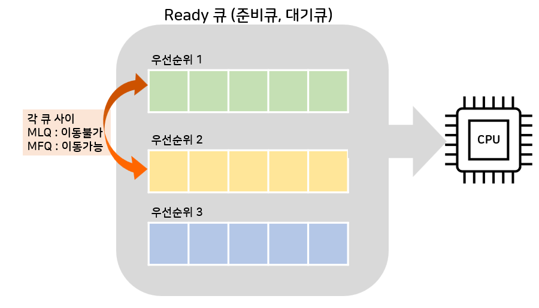

# 프로세스 스케줄링

## A. 개념

- CPU를 사용하려고 하는 프로세스들 사이의 **우선순위를 관리하는 작업**
- 프로세스 처리율과 CPU 이용률 증가
- 오버헤드, 응답시간, 반환시간, 대기시간 최소화
- 스케줄링 ‘알고리즘’이 다른 곳에서도 사용될 수 있음.
    - Task 스케줄링 (Job스케줄링) : 시스템의 전반적인 효율성과 효과적인 운영을 최적화하기 위해 작업을 사용 가능한 자원에 할당하는 과정. CPU시간 뿐만아리나, 메모리, 디스크 공간과 같은 시스템 리소스를 경쟁하는 다른 프로세스나 응용프로그램에 할당하는 데 사용.
    - FIFO알고리즘이 페이지 교체에서도 사용됨
    - RR알고리즘은 로드 밸런싱에서 사용됨.
        

            
로드 밸런싱 Load Balancing

            

                컴퓨터 네트워크 기술의 일종으로 둘 혹은 셋 이상의 중앙처리장치 혹은 저장장치와 같은 컴퓨터 자원들에게 작업을 나누는 것 = 여러 서버가 분산 처리하는 것
            

    

## B. 목적

| 목적 | 설명 | 목적 | 설명 |
| --- | --- | --- | --- |
| **공정성** | 모든 프로세스에 공정하게 할당 | **응답시간 최소화** | 작업을 지시하고, 반응 시작하는 시간 최소화 |
| **처리율 증가** | 단위시간당 프로세스 처리율 증가 | **대기시간 최소화** | *준비상태 큐에서 대기하는 시간 최소화 |
| **CPU 이동률 최대화** | CPU 낭비시간 줄임 | **반환시간 최소화** | 프로세스가 입력되어 수행하고 결과를 산출하기까지 걸리는 시간 최소화 |
| **우선순위 제어** | 우선순위가 높은 것 부터 실행 | **균형있는 자원 사용** | 메모리, 입출력 장치 등의 자원을 균형 있게 이용 |
| **오버헤드 최소화** | 시스템에 부담을 주는 오버헤드 최소화  | **무한 연기 회피** | 자원을 사용하기 위해 무한정 연기되는 상태 회피 |

~~*자료구조의 큐와 달리 스케줄링에서 말하는 큐가 반드시 FIFO로 구현되지는 않음~~

## C. 유형 및 알고리즘

### 1. 선점형 스케줄링(Preemptive)

- 하나의 프로세스가 CPU를 차지하고 있을 때, **우선순위가 높은** 다른 프로세스가 **현재 프로세스를 중단시키고 CPU를 점유**하는 스케줄링 방식
= 중간에 다른 프로세스가 빼앗는다.
- 장점 - 비교적 빠른 응답, 대화식 시분할 시스템에 적합
- 단점 - 우선순위가 높은 프로세스가 많이 들어오면 많은 오버헤드 발생
- 실시간 응답 환경, Deadline 응답환경 등에서 활용됨

### 1-1. 라운드로빈 (RR; Round Robin)

- 시분할 시스템을 위해 고안한 방식, FCFS를 선점형태로 변형한 기법     
    (시분할시스템 참고➡️[운영체제의 개념 및 특징  ](https://www.notion.so/b495d146cffe4c5abfa3fff0f21c98d1?pvs=21) )

- 같은 크기의 시간할당량을 주고, 할당된 시간 내에 완료가 안되면, 다시 준비 큐 리스트의 가장 뒤로 보내지고, CPU는 다음 프로세스로 넘어간다
* 시간할당량(Time Quantam) : 프로세스가 선점방식의 다중 작업 시스템에서 작업을 실행할 수 있는 시간대.
    
    
    
- 시간 할당량이 너무 커지면 FCFS와 비슷해지고, 너무 작아지면 오버헤드가 커짐

### 1-2. SRT (Shortest Remaining Time First;SRTF)

- 가장 짧은 시간이 소요되는 프로세스를 먼저 수행하고, 남은 처리시간이 더 짧은 프로세스가 준비 큐에 생기면 언제라도 그 프로세스가 선점됨
    
    
    
- SJF기법을 선점형으로 구성한 방식 > 오버헤드가 증가하는 단점

### 1-3. 다단계 큐 (MLQ; Multi Level Queue)

- 작업들을 여러 종류 그룹으로 분할, 여러 개의 큐를 이용하여 **상위 단계** 작업에 의해 **하위 단계** 작업이 선점 당함 = 독립된 스케줄링 큐
- 각 큐는 자신만의 독자적인 스케줄링을 함
- 작업(또는 우선순위)별로 별도의 ready큐가 생성된다
    
    
    

### 1-4. 다단계 피드백 큐 (MFQ; Multi Level Feedback Queue)

- 입출력/CPU 위주인 프로세스의 특성에 따라 큐마다 서로 다른 CPU 시간 할당량을 부여
- 준비 상태 큐들 사이를 이동할 수 있는 적응기법(시스템이 유동적인 상태 변화에 적절히 반응하도록 하는 기법) 적용
- FCFS(FIFO)와 라운드 로빈 스케줄링 방식을 혼합한 것으로 **상위 단계**에서 완료되지 못한 작업은 **하위 단계**로 전달 되어 마지막 단계는 라운드 로빈 방식을 사용
- 기본적으로 가장 우선순위가 낮은 큐를 제외하고는 RR스케줄링 사용
- 우선순위가 높은 큐일수록 짧은 Time Slice를 갖고, 한 번의 Time slice안에 프로세스의 실행이 끝나지 않으면 한단계 낮은 우선순위 큐로 이동
- 어떤 큐에서 일정시간동안 실행되지 못하고 남아 있을 경우 우선순위가 높은 큐로 이동
    
    
    
    - 자세한 과정 설명
        
        
        | Time | Q1 | Q2 | Q3 | 설명 |
        | --- | --- | --- | --- | --- |
        | 0~4 | P1 | - | - | P1) 16-4= 12ms 남음 Q2로이동 |
        | 4~8 | P2 | P1 | - | P2) 10-4= 6ms 남음 Q2로 이동 |
        | 8~12 | P3 | P1-P2 | - | P3) 10-4= 6ms 남음 Q2로 이동 |
        | 12~20(8t) | - | P1-P2-P3 | - | P1) 12-8 = 4ms 남음 Q3로 이동 |
        | 20~24 | P4(15ms도착) | P2-P3 | P1 | P4) 14-4 = 10ms 이동 Q2로 이동 / P2) 대기시간 16ms(>15ms)으로 Q1으로 이동 |
        | 24~28 | P2 | P3-P4 | P1 | P2) 6-4 = 2ms 남음, Q2로 이동 / P3) 대기시간 16ms(>15ms) Q1으로 이동 |
        | 28~32 | P3 | P4-P2 | P1 | P3)  6-4 = 2ms 남음, Q2로 이동 |
        | 32~40(8t) | - | P4-P2-P3 | P1 | P4) 10-8 = 2ms 남음, Q3으로 이동 |
        | 40~42(2t) | - | P2-P3 | P1-P4 | P2) 2-8 =0 종료 |
        | 42~44(2t) | - | P3 | P1-P4 | P3) 2-8 =0 종료 |
        | 44~48 | - | - | P1-P4 | P1) 4-16 = 0 종료 |
        | 48~50(2t) | - | - | P4 | P4) 2-16 =0 종료 |

---

### 2. 비선점형 스케줄링 (Non Preemptive)

- 한 프로세스가 CPU를 할당받으면 작업 종류 후 반환 시까지 다른 프로세스는 CPU점유가 불가능한 방식 = 뺏기 불가능
- 장점 - 응답시간 예상 용이, 모든 프로세스에 대한 요구를 공정하게 처리
- 단점 - CPU 사용시간이 짧은 프로세스들이 사용 시간이 긴 프로세스로 인해 오래 기다리는 경우 발생
- 처리시간의 편차가 적은 특정 프로세스 환경에 활용

### 2-1. 우선순위 (Priority)

- 프로세스 별로 우선순위가 주어지고, 이 우선순위에 따라 CPU를 할당함
- 동일 우선순위는 FCFS로 처리
- 주요 긴급 프로세스에 대한 우선 처리하고, 설정이나 자원 상황 등에 따라 우선순위를 선정함

### 2-2. 기한부 (Deadline)

- 작업들이 명시된 시간이나 기한 내에 완료되도록 계획 = 요청에 명시된 시간 내 처리를 보장
- EDF(Earliest Deadline First)알고리즘을 구현한 것 가장 급한 작업을 스케줄링 대상으로 선정
- 현재시간+작업량 < deadline의 조건을 만족해야하고
- Deadline을 사용하는 작업의 작업량의 합이 CPU의 최대 처리량을 넘어서면 안된다.
- 위 조건을 만족해야! Deadline 알고리즘을 사용할 수 있다.
- 선점 스케줄링 중 RM스케줄링(비율 단조 스케줄링)과 비교해서 볼 수 있음.

### 2-3. FCFS (First Come First Served; FIFO)

- 대기 큐에 도착한 순서에 따라 CPU를 할당함

### 2-4. SJF (Shortest Job First)

- 작업이 끝날 때까지의 실행시간 추정치가 가장 작은 작업을 먼저 실행
- 준비 큐 작업 중 가장 짧은 작업부터 수행, FIFO보다 평균 대기시간 감소
- CPU 요구시간이 긴 작업과 짧은 작업 간 불평등이 심하여 기아현상이 발생할 수 있음
    - **기아현상** : 시스템 부하가 많아 준비 큐에 있는 낮은 등급의 프로세스가 무한정 기다리는 현상

### 2-5. HRN(Highest Response Ratio Next)

- 우선순위 계산 공식을 이용하여 서비스(실행)시간이 짧은 프로세스나 대기시간이 긴 프로세스에게 우선순위를 주어 프로세스를 할당하는 기법
- 우선순위 = (대기시간+서비스시간) / 서비스 시간
- 우선순위를 계산하여 그 수치가 높은 순으로 우선순위를 부여
- SJF의 약점인 기아 현상을 보완한 기법으로 긴 작업과 짧은 작업 간 등의 불평등 완화

---

## 면접예상질문

1. 스케줄링이란? (프로세스 스케줄링이란?) 
    

        
예시답안

        

            프로세스는 여러 개이고 이 프로세스들이 자원(cpu등)을 동시에 요구하는데 자원이 제한되어있다. 따라서 그 제한된 자원을 어떻게 나눠 줄것인지(순서를 할당하는 등)에 대한 정책이다.
        

    

        
2. CPU 스케줄링이란?
      

          
예시답안

          

              하나의 CPU는 동시에 여러개의 프로세스를 처리할 수 없기때문에, 한 순간에 어떤 프로세스가 CPU를 사용할 수 있게 하는지 결정하는 정책이다.
          

      

      
3. CPU 스케줄링 종류에 대해 설명해보세요.
4. 선점형과 비선점형 스케줄링의 차이점을 말해보세요.

---

## 출처

- 수제비2023 전자계산기 조직응용기사 실기
- 위키백과 검색 이미지 (SRT, RR)
- 로드 밸런싱 [https://dev.classmethod.jp/articles/load-balancing-types-and-algorithm/](https://dev.classmethod.jp/articles/load-balancing-types-and-algorithm/)
- task scheduling [https://www.samsungsds.com/kr/techreport/job-scheduling.html](https://www.samsungsds.com/kr/techreport/job-scheduling.html)
- deadline [https://velog.io/@jinh2352/Linux-8-실시간-태스크-스케줄링-FIFO-RR-DEADLINE](https://velog.io/@jinh2352/Linux-8-%EC%8B%A4%EC%8B%9C%EA%B0%84-%ED%83%9C%EC%8A%A4%ED%81%AC-%EC%8A%A4%EC%BC%80%EC%A4%84%EB%A7%81-FIFO-RR-DEADLINE)
- EDF [https://ko.wikipedia.org/wiki/최단_마감_우선_스케줄링](https://ko.wikipedia.org/wiki/%EC%B5%9C%EB%8B%A8_%EB%A7%88%EA%B0%90_%EC%9A%B0%EC%84%A0_%EC%8A%A4%EC%BC%80%EC%A4%84%EB%A7%81)
- MLQ, MFQ [https://damagucci-juice.tistory.com/120](https://damagucci-juice.tistory.com/120)
- MFQ [https://haun25ne.tistory.com/55](https://haun25ne.tistory.com/55)
