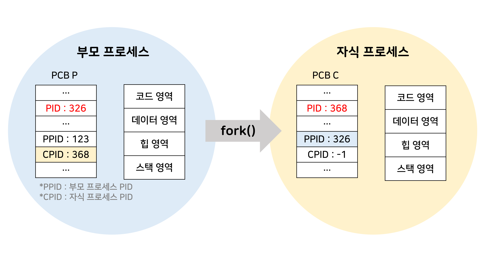
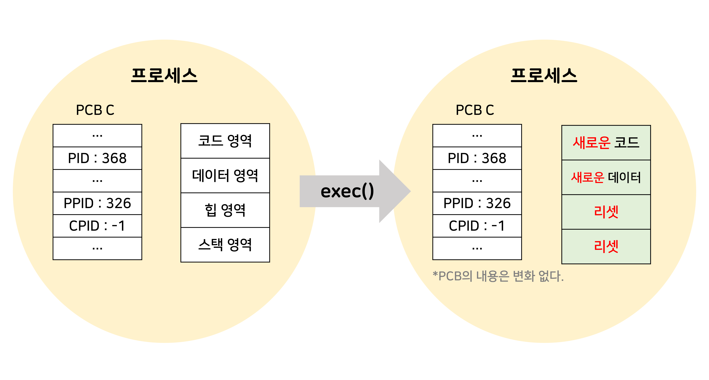
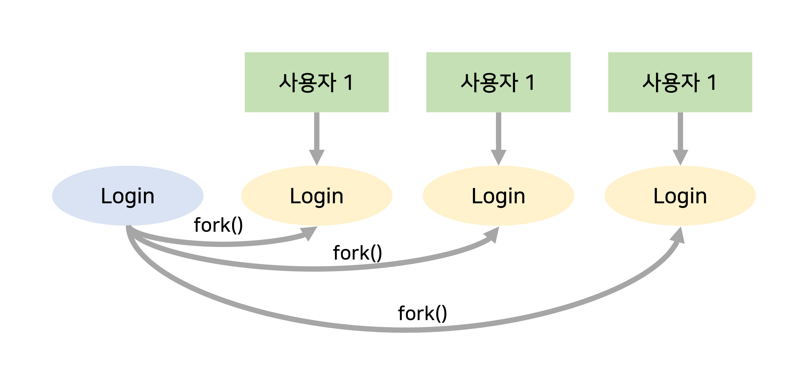
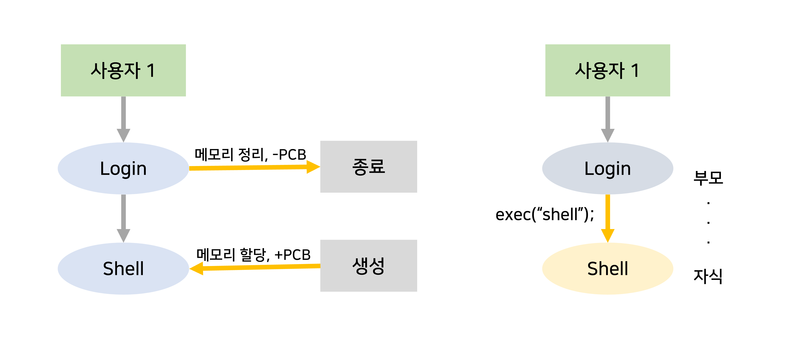

# 프로세스 계층구조, 고아&좀비 프로세스 / 기아현상

# 1. 프로세스 계층구조

프로세스가 실행도중 시스템 호출을 통해 다른 프로세스를 생성할 수 있음.

계층 구조는 동시에 여러 작업을 하는 다중 프로그래밍 시스템을 가능하게하고 종료된 자원을 회수하는데 유용함.

>💡 **용이한 자원회수**
>프로세스 계층구조를 활용하면 시스템 관리를 수월하게 할 수 있으며, 특히 자원을 회수(garbage collection)에서 편리하다.
>모든 프로세스가 독립적이라면, 각 프로세스가 종료될 때마다 운영체제가 관여해서 직접 회수해야하지만(복잡) > 부모-자식관계에 있는 프로세스는 자식이 작업을 마치면 부모가 자원을 회수한다(간단).

자식 프로세스가 다시 또 다른 자식 프로세스를 생성할 수 있다.

프로세스가 프로세스를 낳는 계층 구조(트리형태)를 통해 프로세스들을 관리할 수 있다.

## 1) 프로세스 생성기법

프로세스는 프로그램을 실행할 때마다 생성된다.

### 방법1

1. 운영체제가 프로그램(코드)를 메모리로 가져와서 코드 영역에 넣는다.
2. 프로세스 제어블록(PCB)를 생성한다.
3. 이후 필요한 메모리에 데이터 영역과 스택 영역을 확보한다.
4. 프로세스를 실행한다.

### 방법2

새로운 프로세스를 만들때 위 과정을 모두 거치는 게 아니라 완성된 프로세스를 복사하는 방식을 사용할 수 있다.

- 부모 프로세스는 fork()를 통해 자식 프로세스(자신의 복사본; 서브 프로세스라고도함)을 생성
    - fork() :  커널에서 제공하는 함수로, 실행 중인 프로세스로부터 새로운 프로세스를 복사한다.
    - PCB가 상속되고, 일부 변경되는 내용도 있다. 
    자식 프로세스를 가리키는 영역이 각자 수정된다. 
    자식프로세스의 구분자가 새로 할당된다.
    - 장점 : 프로세스 생성속도가 빠름. 추가 작업없이 자원 상속 가능. 시스템 관리에 효율적.
        
        
        
- 자식 프로세스(만들어진 복사본)는 exec()를 통해 *자신의 메모리 공간을 다른 프로그램으로 교체
* 메모리 내용, 열린 파일 목록 등 자원을 상속 했던 내용
    - exec() : 기존의 프로세스를 새로운 프로세스로 전환하는 커널함수. 일종의 프로세스 수정작업.
    기존의 코드,데이터,스택 영역의 데이터를 지우고 새로운 코드로 대체한다. PCB내용은 변화가 없다.
        
        
        

## 2) 다중 프로그래밍 시스템 (예시)

- login 프로세스가 인증을 거쳐 컴퓨터에 접속하는 과정.
    - 유닉스에서는 여러 사용자를 동시에 처리하기 위해 fork()시스템 호출로 login 프로세스를 여러 개 만든 후 사용자에게 나눠준다. 새로운 사용자가 나올 때마다 이를 반복하면 여러 사용자를 동시에 처리할 수 있다.
        
        
        
    - login 프로세스가 작업을 마치면 메모리 공간과 PCB를 exec()를 재활용하여 shell 프로세스를 생성한다. 부모-자식 관계도 그대로 상속된다.

# 2.고아&좀비 프로세스

## 고아 프로세스 Orphan Process

부모 프로세스가 자식 프로세스보다 먼저 종료되면 자식 프로세스는 고아 프로세스가 된다.

이 경우 init프로세스가 자식 프로세스의 새로운 부모 프로세스가 된다.

(프로세스 종료가 발생할 때 커널이 해당 프로세스가 어떤프로세스의 부모인지 확인후, 커널이 자식 프로세스의 PPID를 1(init 프로세스)로 바꾼다.)

*init 프로세스는 유닉스 계열에서 부팅과정 중 생성되는 최초의 프로세스로 시스템이 종료될때까지 계속 살아있다. 일반적으로 PID가 1이다.

## 좀비 프로세스 Zombie Process

자식 프로세스가 종료되었지만 부모 프로세스가 자식 프로세스의 종료 상태를 회수하지 않을 경우 이 자식 프로세스를 좀비 프로세스라고 한다.

자식 프로세스가 exit시스템 콜을 호출하면 이 프로세스에 관련된 모든 메모리와 리소스가 해제되어 다른 프로세스에서 사용될 수 있지만, 부모 프로세스가 (계속 자식 프로세스 상태를 알고 싶거나 등의 이유로) 이 종료된 프로세스를 회수를 안하면 커널은 이 자식 프로세스의 최소한의 정보(PID, 종료상태 등)을 계속 가지고 있게된다. = 좀비 프로세스

커널 입장에서 좀비프로세스는 최소한의 정보만을 갖기때문에 큰 성능 저하를 야기하지는 않지만, 프로세스 스케줄링에 있어서 큐에 대기하는 프로세스 양이 증가하고, 커널 구조체를 유지하는 비용 등을 무시할 수 없기다. 또한 리소스 유출을 발생시킬 수 있기 때문에 부모프로세스는 wait을 통해 자식 프로세스의 종료 상태를 읽어야한다.(회수해야한다.)

- wait() : 부모 프로세스가 자식 프로세스의 종료 상태를 얻기위해 사용. 
부모프로세스가 wait()을 사용하여 자식 프로세스가 종료될 때까지 기다린다.

---

# 3. 기아현상 Starvation

무기한 연기로 인해 아무리 기다려도 자신의 차례가 돌아오지 않는것.

자신보다 우선순위가 높은 프로세스 때문에 오랫동안 cpu할당을 받지 못하는 것. (결국 나~중에 실행 or 끝까지 실행못하고 소멸)

다중 프로그래밍 시스템에서 프로세스들이 한정된 시스템 자원을 차지하기 위해 경쟁할 때 발생할 수 있다. 

## 해결방안

- 에이징(Aging)기법 : 오랫동안 ready상태인 프로세스의 우선순위를 주기적으로 올려준다.
- 우선순위가 아닌 요청 순서대로 처리하는 요청 큐사용
- 프로세스의 우선순위를 수시로 변경하여 각 프로세스가 높은 우선선위를 가질 수 있는 기회를 부여.

## 기아?교착? (같이보기-교착상태페이지 링크)

교착상태(deadlock)은 결코 일어나지 않을 사건에 대해 프로세스가 기다리고 있는것.

기아상태는 현실적으로 수행할 수 있지만, 무기한 연기로 어쩔수 없이(?) 못하고 있는 것

기아상태와 교착상태는 프로세스가 작업을 수행하지 못하고 무한히 대기한다는 공통점이 있지만,

작업을 수행하지 못하는 원인이 다르다.

교착상태이면 기아상태이지만, 기아상태가 교착상태를 의미하지는 않는다.

---

## 면접 예상질문

    
프로세스의 계층 구조에 대해 설명해주세요.

    

    운영 체제에서 프로세스들을 조직화하기 위해 사용되는 구조로 프로세스들 간 부모-자식 관계를 형성합니다. 
    <ul>부모 프로세스와 자식 프로세스: 각 프로세스는 다른 프로세스를 생성할 수 있습니다. 이때, 생성된 프로세스를 부모 프로세스라고 하고, 새로 생성된 프로세스를 자식 프로세스라고 합니다. 부모 프로세스는 자식 프로세스의 생성, 실행 및 종료를 관리합니다.
    <ul>계층적 구조: 프로세스들은 계층적인 구조를 형성합니다. 즉, 여러 개의 부모 프로세스가 자식 프로세스를 생성할 수 있고, 이러한 계층은 여러 단계로 확장될 수 있습니다. 이로 인해 전체 프로세스 집합은 트리 구조를 형성하게 됩니다.
    <ul>자원 공유와 상속: 부모 프로세스와 자식 프로세스 간에는 자원 공유와 상속이 가능합니다. 부모 프로세스가 보유한 자원(파일, 메모리 등)은 자식 프로세스에게 상속되며, 자식 프로세스는 이러한 자원을 공유하거나 상속받아 사용할 수 있습니다.
    프로세스의 계층구조는 다양한 운영 체제에서 사용됩니다. 예를 들어, UNIX 및 UNIX 기반 운영 체제에서는 부모 프로세스와 자식 프로세스 간의 계층구조를 가지며, 각 프로세스는 고유한 프로세스 식별자(PID)를 가지고 있습니다. 계층적 구조는 프로세스 관리, 자원 할당, 보안 및 권한 관리 등 다양한 운영 체제 기능에 활용됩니다.
    

    
운영체제에서 기아란 무엇입니까?

    

    <b>특정 프로세스의 우선순위가 낮아서 원하는 자원을 계속 할당받지 못하는 상태이다.</b> 
    기아상태는 자원 관리 문제이다. 이 문제에서 대기 중인 프로세스는 리소스가 다른 프로세스에 할당되어 있기 때문에 오랫동안 필요한 리소스를 얻지 못한다.
    

    
 운영체제에서 에이징은 무엇입니까?

    
 에이징은 자원 스케줄링 시스템에서 기아를 방지하기 위해 사용되는 기술이다. 특정 프로세스의 우선순위가 낮아 무한정 기다리게 되는 경우, 한번 양보하거나 기다린 시간에 비례하여 일정 시간이 지나면 우선순위를 한 단계씩 높여 가까운 시간 안에 자원을 할당받도록 하는 기법을 말한다.

    
교착상태와 기아상태의 공통점과 차이점을 설명해주세요.

    

---

## 출처

- [책] 혼자공부하는 컴퓨터구조+운영체제
- 프로세스 계층구조 [https://sksnxjs.tistory.com/entry/11-프로세스의-개요-3](https://sksnxjs.tistory.com/entry/11-%ED%94%84%EB%A1%9C%EC%84%B8%EC%8A%A4%EC%9D%98-%EA%B0%9C%EC%9A%94-3)
- 좀비/고아 프로세스 [https://codetravel.tistory.com/31](https://codetravel.tistory.com/31)
- [https://dkswnkk.tistory.com/491](https://dkswnkk.tistory.com/491)
- 기아상태 [https://velog.io/@underlier12/OS-24-교착상태와-기아상태](https://velog.io/@underlier12/OS-24-%EA%B5%90%EC%B0%A9%EC%83%81%ED%83%9C%EC%99%80-%EA%B8%B0%EC%95%84%EC%83%81%ED%83%9C)
- 교착상태와 기아상태 [https://arainablog.tistory.com/276](https://arainablog.tistory.com/276)
- [https://minhamina.tistory.com/235](https://minhamina.tistory.com/235)