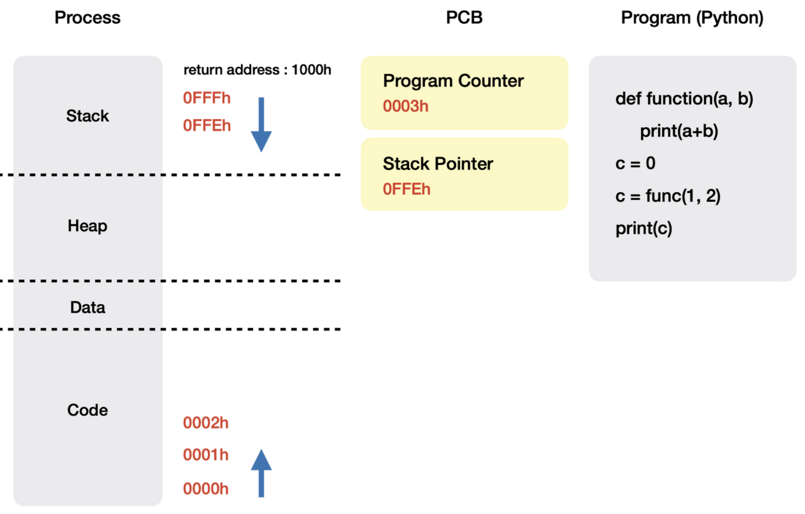
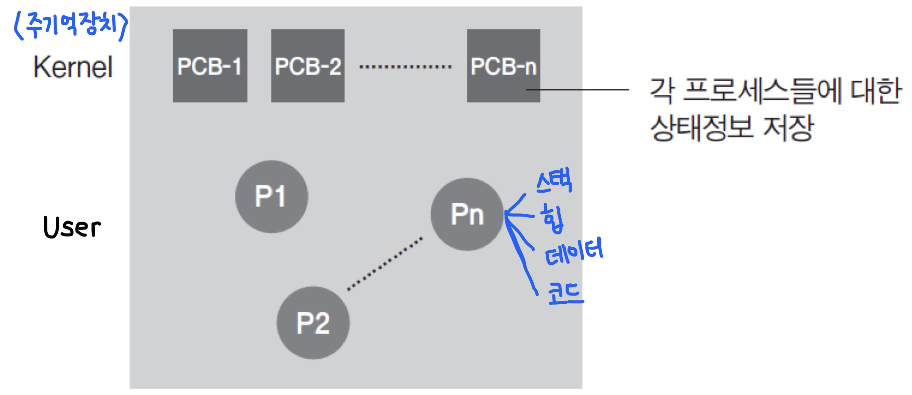
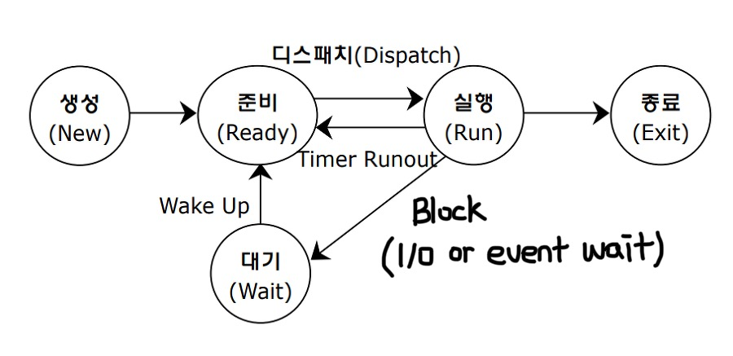

# 프로세스의 개념, 상태, 멀티 프로세스
## 프로세스의 개념
### ⭐️ 실행 중인 프로그램

- 프로그램이 실행 중이라는 것 = 보조기억장치에 저장되어 있던 프로그램을 주기억장치에 적재하여, CPU가 실행하고 있거나 실행 예정인 것
- 즉, 운영체제가 프로그램에 메모리를 할당하여 실행하면 프로세스가 됨. 이때 할당 받는 시스템 자원은 CPU 시간, **운영되기 위해 필요한 주소 공간**, 독립된 메모리 영역(code, data, heap, stack)
- 기본적으로 프로세스당 최소 1개의 스레드를 가지고 있음
- 각 프로세스는 별도의 주소 공간에서 실행되며, 한 프로세스는 다른 프로세스의 변수나 자료구조에 접근할 수 없음
- 한 프로세스가 다른 프로세스의 자원에 접근하려면 프로세스 간 통신(IPC, Inter-Process-Communication)이 필요함

  
## **PCB (Process Control Block)**

운영체제가 프로세스를 제어하기 위해 정보를 저장해놓은 곳

PCB는 Context Switching 시 사용되는데, CPU 가 여러 프로세스를 빠르게 번갈아가며 작업하기 위해서는 프로세스에 대한 정보 및 상태를 저장/복원 할 필요가 있기 때문

> **Context Switching (문맥 교환)**
> 
> *문맥 = 프로세스의 정보 및 상태 (PCB에 문맥을 저장하는 것)
> 
> 
> 하나의 프로세스가 CPU를 사용 중인 상태에서 다른 프로세스가 CPU를 사용하도록 하기 위해, 이전의 프로세스의 상태(문맥)를 보관하고 새로운 프로세스의 상태를 CPU에 적재하는 작업
> 
> **하나의 CPU에서 여러 개의 프로세스가 동시에 수행되는 것처럼 보이는 이유는 문맥 교환이 빠르게 일어나고 있기 때문!!**
> 

  
- PCB는 PID(프로세스 식별자), 프로세스 상태, 프로그램 카운트(다음 실행할 명령어 주소), 레지스터 정보(Stack Pointer, General Register 등), 프로세스 스케줄링 정보, 계정 정보, 입출력 상태 정보, 메모리 관리 정보로 구성됨
- PCB는 프로세스 생성 시 만들어지고, **주기억장치(커널 영역)에 유지**되며, 운영체제에서 한 프로세스 전체를 정의함

  
## 프로세스의 상태

1. **생성** - 사용자의 요청에 의해 PCB가 생성이 되고, 프로세스가 메인 메모리에 적재되어 실행 준비를 마친 상태
2. **준비** - 프로세스가 CPU를 얻을 때까지 자신의 차례를 기다리는 상태 (= ReadyQueue에 들어와 있는 상태) **ReadyQueue 추가설명 (준비/대기 차이)**
3. **실행** - ReadyQueue에 있던 프로세스가 자신의 차례를 부여받아 실제로 수행되는 상태
4. **대기** - 프로세스가 실행되다가 입출력 처리를 요청하거나, 바로 확보될 수 없는 자원을 요청하면 CPU를 양도하고 요청한 일이 완료되기를 기다림
5. **종료** - 프로세스가 자신의 작업을 모두 마친 뒤, 운영체제가 PCB를 제거하고 메인 메모리에서 빠져나간 상태
---
2→3  **디스패치** - ReadyQueue의 맨 앞에 있던 프로세스가 CPU를 점유하게 되는 것

3→2  **Timer Runout** - 할당받은 CPU 시간이 초과되면, CPU 반납 후 다시 준비 상태로 전이됨 

4→2  **Wake Up** - 입출력이 완료되어 CPU 할당을 기다리는 상태

  
## 멀티 프로세스

두 개 이상 다수의 프로세서(CPU)가 협력적으로 하나 이상의 작업(Task)을 동시에 처리하는 것(병렬처리)

- 장점 : 독립된 구조로 안전성이 높음 → 프로세스 중 하나에 문제가 생겨도 다른 프로세스에 영향을 주지 않음
- 단점 : 독립된 메모리 영역이기 때문에 작업량이 많을수록( Context Switching이 자주 일어나서 주소 공간의 공유가 잦을 경우) 오버헤드가 발생하여 성능 저하가 발생함

  
  
### 🎤 면접 질문

1. 프로세스란 무엇을 의미합니까?
2. 프로세스의 특징을 설명하세요
3. 프로세스와 스레드의 차이
4. 멀티 프로세스 대신 멀티 스레드를 사용하는 이유

  
### 출처

[https://dololak.tistory.com/3](https://dololak.tistory.com/3)

[https://trumanfromkorea.tistory.com/51](https://trumanfromkorea.tistory.com/51)

---

[https://80000coding.oopy.io/ef52431e-cf52-497b-824f-bcb365144c7a](https://80000coding.oopy.io/ef52431e-cf52-497b-824f-bcb365144c7a)

[https://ko.wikipedia.org/wiki/프로세스_제어_블록](https://ko.wikipedia.org/wiki/%ED%94%84%EB%A1%9C%EC%84%B8%EC%8A%A4_%EC%A0%9C%EC%96%B4_%EB%B8%94%EB%A1%9D)

[https://ko.wikipedia.org/wiki/문맥_교환](https://ko.wikipedia.org/wiki/%EB%AC%B8%EB%A7%A5_%EA%B5%90%ED%99%98)

---

[https://velog.io/@mingadinga_1234/프로세스란-프로세스의-상태](https://velog.io/@mingadinga_1234/%ED%94%84%EB%A1%9C%EC%84%B8%EC%8A%A4%EB%9E%80-%ED%94%84%EB%A1%9C%EC%84%B8%EC%8A%A4%EC%9D%98-%EC%83%81%ED%83%9C)

[https://enlqn1010.tistory.com/30](https://enlqn1010.tistory.com/30)

---

[https://livenow14.tistory.com/67](https://livenow14.tistory.com/67)
